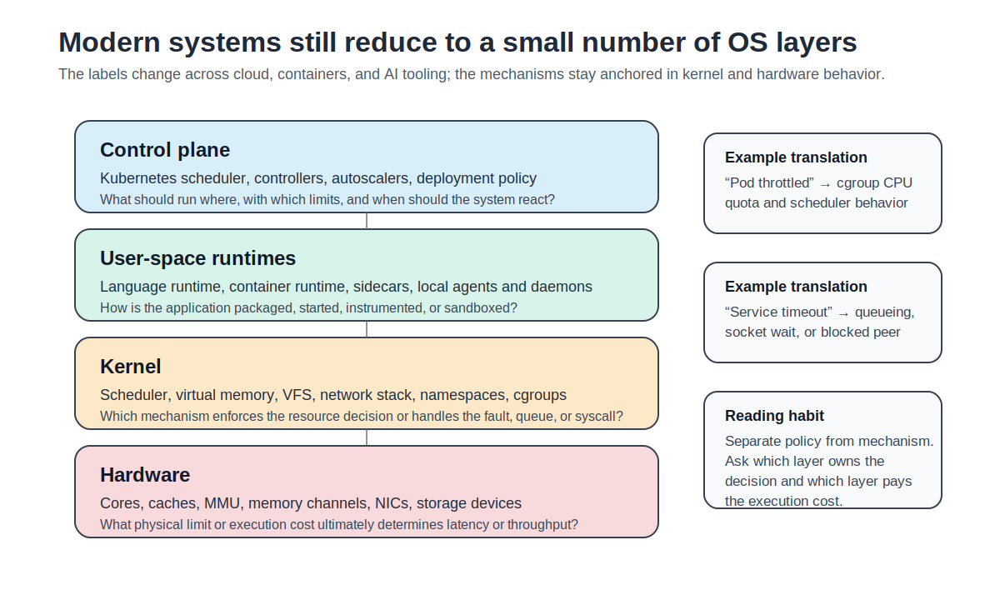
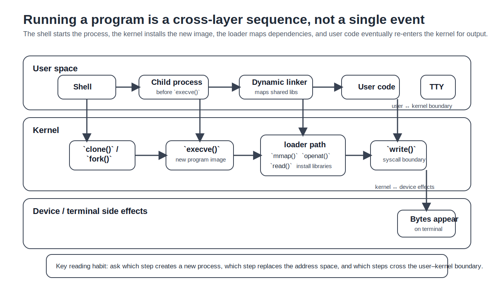

# Chapter 1: Introduction — OS in the Cloud-Native and AI Era

> **Learning objectives**
>
> After completing this chapter and its lab, you will be able to:
>
> - Explain why OS concepts remain central even when software is packaged as containers, pods, serverless functions, or AI agents
> - Describe the three core skills this book develops: Understand, Measure, Explain
> - Map a modern systems symptom to the relevant user-space, kernel, and hardware mechanisms
> - Run a first trace and a first measurement, then explain what each observation means

## 1.1 Why do OS mechanisms still explain cloud symptoms?

At 2:13 p.m., a service dashboard reports that a checkout pod is healthy.
CPU usage is below its request, memory is below its limit, and the
container has not restarted. Yet p99 latency has jumped from 8 ms to
180 ms. The platform view says the pod is running. The OS view asks
where the request waited.

That wait might be in the runqueue, where a **runnable** task is ready to
execute but not yet scheduled. It might be in **page reclaim**, where the
kernel tries to free memory under pressure. It might be in blocking I/O, a
socket queue, or a contended lock. At scale, rare component-level delays
become visible user-facing tail delays because one request often depends on
many components (Dean & Barroso, 2013). A modern incident usually arrives
with platform vocabulary, but the explanation still lives in mechanisms.

The vocabulary has changed faster than the mechanisms. Engineers now say
"the pod was throttled," "the inference server p99 regressed," or "the
agent runtime blocked a tool call." Here **p99** means the 99th-percentile
latency: 99% of requests finished no slower than this value, and the
remaining 1% took longer. A pod that is **OOM-killed** has crossed a memory
limit and was terminated by the kernel's out-of-memory path. An agent
runtime that decides whether a tool call may touch the filesystem is
solving an old protection problem: which subject may perform which operation
on which object, and who mediates that decision (Saltzer & Schroeder, 1975).

Kubernetes, container runtimes, service meshes, and agent frameworks add
policy, automation, and better control surfaces. They do not repeal
scheduling, virtual memory, protection, or I/O. This book treats modern
systems as layered compositions of older mechanisms rather than as entirely
new abstractions. If a deployment engineer says "Kubernetes throttled my
workload," we will translate that into the underlying resource-control
event. If an incident report says "tail latency increased under traffic
burst," we will ask what queue formed, where it formed, and which resource
boundary it crossed.

> **Key insight:** Modern platforms give OS mechanisms new names and new
> control surfaces. The kernel- and hardware-level cause is still where
> the explanation lives; if you can't name it, you haven't finished
> diagnosing the symptom.

## 1.2 Where is the OS boundary in a modern stack?

A classical textbook often draws a simple picture: application → system
call interface → kernel → hardware. That picture is still correct, but it
is no longer sufficient for real deployments. Most production systems add
at least two more layers above the kernel: an **execution runtime** and a
**control plane**. Large cluster managers such as Borg and Kubernetes use
that control plane to place work, enforce policy, and reconcile desired
state with observed state across many machines (Verma et al., 2015; Burns
et al., 2016). Figure 1.1 makes the boundary map explicit.


*Figure 1.1: A modern systems stack still reduces to a layered resource-management path. The important question is not which layer is “the real OS,” but which layer owns the decision and which layer pays the execution cost.*

The interesting question is which layer owns which decision. The answer
is usually more specific than students expect. The table below uses
**cgroup**, or control group, for the Linux kernel mechanism that groups
processes so their resource use can be limited, accounted, and observed
through a filesystem interface.

| Production term | OS-level analogue | Where to observe it first | Typical failure mode |
|---|---|---|---|
| container | process tree + namespaces + cgroup | `/proc`, `/sys/fs/cgroup` | wrong limit, wrong namespace view |
| pod CPU throttling | CFS bandwidth control | `cpu.stat`, `schedstat`, `top` | quota exhausted before period ends |
| service timeout | socket wait + queueing | `ss`, `sar`, app logs | backlog, retransmit, or blocked peer |
| agent tool call sandbox | `execve()` + credentials + filesystem policy | audit log, syscall trace, policy file | denied capability or path access |
| autoscaler miss | control loop acting on delayed signals | metrics pipeline + controller logs | stale measurements, slow convergence |

A Kubernetes CPU limit is policy. The mechanism is cgroup enforcement in
the kernel. A language runtime chooses when to allocate memory; the kernel
decides when virtual pages become physical pages and what happens under
pressure.

For example, if a pod reports CPU throttling, do not stop at `kubectl top`.
Find the pod's cgroup and read `cpu.stat`. If `nr_throttled` and
`throttled_usec` rise while request latency rises, the platform symptom now
has a kernel-level enforcement signal. The next question is whether the
limit is too low, the workload is bursty, or the measurement window hides
short quota exhaustion.

Two patterns recur across the rows of this table. The first separates
policy from mechanism: a Kubernetes CPU limit is a policy decision, but
cgroup enforcement in the kernel is what actually clamps the work. The
second asks where the boundary lies. A branch misprediction is owned by
hardware, a page fault by the MMU and kernel cooperating, a container
limit by the kernel even when `kubectl` is the layer that flags it.

> **Note:** This book uses the full-stack meaning of "operating system":
> the resource-management path from hardware up through the kernel, the
> runtime, and, when relevant, the control plane. That broader view is
> useful precisely because it still reduces to a small number of
> mechanisms.

## 1.3 What habits does this book train?

Every chapter in this book trains the same three skills, in this order.

**Understand** means naming the mechanism precisely. If we say Linux uses
CFS, you should know that CFS orders runnable tasks by **virtual runtime**
and picks the leftmost task in that ordering. If we say a memory limit was
exceeded, you should know which counter moved, which boundary was crossed,
and which kernel path enforces the limit.

**Measure** means producing evidence rather than repeating folklore. A
claim such as "fsync is expensive" is incomplete until it has a workload,
a baseline, a repeat count, and a number. A claim such as "the cache is the
bottleneck" is incomplete until it has a miss rate, a working-set argument,
or a controlled comparison that rules out alternatives.

**Explain** means connecting the observation back to a cause. "The service
was slow" is not an explanation. "p99 increased because requests waited on
major page faults after reclaim under a tight memory limit" is an
explanation because it names both the signal and the mechanism.

A compact way to think about the book is this:

| Question | Skill | Minimum acceptable answer |
|---|---|---|
| What is the mechanism? | Understand | A step-by-step account with the right boundary |
| How do I observe it? | Measure | A command, a counter, or a trace with reproducible output |
| Where does it matter today? | Explain in context | A real production setting with stakes |
| How does it fail? | Explain causally | A concrete slow path, edge case, or resource limit |

Every chapter in the book is held to those four questions.

## 1.4 What happens when a shell starts a program?

The earlier sections give us vocabulary; the rest of the chapter needs an
artifact. The smallest useful one is a shell starting a program. That
single event crosses every user-space, kernel, and hardware boundary the
rest of the book will revisit.

Consider a shell launching this program:

```c
#include <stdio.h>
#include <unistd.h>

int main(void) {
    printf("Hello from process %d\n", getpid());
    return 0;
}
```

If you trace the shell and the program together, you can see both process
creation and program replacement:

```bash
$ gcc -o hello hello.c
$ strace -f sh -c './hello'
```

A trimmed trace looks like this:

```text
clone(...)                                  = 12345
[pid 12345] execve("./hello", ["./hello"], ...) = 0
[pid 12345] brk(NULL)                       = 0x55...
[pid 12345] mmap(NULL, 8192, PROT_READ|PROT_WRITE, ...) = 0x7f...
[pid 12345] openat(AT_FDCWD, "/etc/ld.so.cache", O_RDONLY|O_CLOEXEC) = 3
[pid 12345] read(3, "...", 832)            = 832
[pid 12345] write(1, "Hello from process 12345\n", 25) = 25
[pid 12345] exit_group(0)                  = ?
```

Six steps appear in that trace, and each of them maps to a mechanism the
rest of the book will study in detail.

1. The shell calls `clone()` or `fork()` to create a child process.
2. The child calls `execve()` to replace its old address space with the new
   program image.
3. The kernel validates the executable, sets up a new virtual address
   space, stack, arguments, environment, and credentials.
4. The dynamic linker maps shared libraries with `mmap()` and reads loader
   metadata with `openat()` and `read()`.
5. Your program runs in user space until `printf()` eventually reaches the
   `write()` system call.
6. The kernel copies bytes into the terminal or pipe buffer and returns to
   user space.


*Figure 1.2: Even a trivial `hello` program crosses layers repeatedly. The shell creates a process, `execve()` installs a new image, the loader maps dependencies, and `write()` crosses back into the kernel to reach the terminal.*

**`fork` creates a process; `execve` replaces its image.** That separation
is a deliberate Unix design choice. It lets the parent set up file
descriptors, environment, and credentials between the two calls, which is
how shells implement redirection, pipelines, and job control (Ritchie &
Thompson, 1974).

**Virtual memory** is established before most of your code runs. `mmap()`
creates address-space regions, but pages are often backed lazily and only
become physical on first touch. That is why a tiny program can still show
page faults: the fault may be part of setting up the program image and
shared libraries, not evidence that the program allocated a large heap.

**Privilege boundaries** matter even for trivial I/O. The process cannot
write to the terminal directly; it must cross into the kernel, which owns
the device interface. The same specificity applies to failures. `execve()`
can fail with `ENOENT` or `EACCES`; `mmap()` can fail under address-space or
memory pressure; `write()` can block on a pipe, socket, or terminal buffer.

Now measure the same program:

```bash
$ sudo perf stat ./hello
```

```text
 Performance counter stats for './hello':

          0.42 msec task-clock
             1      context-switches
             0      cpu-migrations
            54      page-faults
       912,345      cycles
       456,789      instructions
```

Each counter points at a mechanism you will revisit later:

| Counter | What it means | Why it can change |
|---|---|---|
| `task-clock` | CPU time charged by the scheduler | waiting less or running more |
| `context-switches` | scheduler handoffs involving the task | blocking, preemption, contention |
| `cpu-migrations` | movement between CPUs | load balancing, affinity changes |
| `page-faults` | missing virtual-to-physical mappings | first touch, reclaim, file-backed pages |
| `cycles` | hardware time consumed | more work or worse stalls |
| `instructions` | retired machine instructions | algorithmic work done |

A single `./hello` already spans user space, kernel policy, and hardware
execution. That is why the book insists on cross-layer explanations: a
production incident almost never lives at one layer alone.

## 1.5 How should you use the rest of the book?

Part I establishes the method. Later parts apply it to processes,
scheduling, containers, Kubernetes, distributed systems, storage, and
agent runtimes. Every chapter is expected to answer the same four questions:
what is the mechanism, how do I observe it, where does it matter now, and
how does it fail?

The labs are how the book enforces that standard. A good lab asks you to
predict a result before running anything, collect raw artifacts from your
own environment, explain why the result did or did not match the
prediction, and rule out at least one plausible alternative. AI tools for
drafting and debugging make that requirement sharper rather than weaker:
a lab that can be completed convincingly without original evidence is
poorly designed.

Each lab therefore uses a three-tier structure:

- **Part A:** minimum experiment and first evidence
- **Part B:** deeper comparison, interpretation, and exclusion of alternatives
- **Part C:** optional extension or open-ended exploration

By the end of the book, the target skill is the ability to observe an OS
mechanism on a real system, explain the signal it produces, and defend
the diagnosis under questioning.

## Summary

Four points carry the rest of the book:

- Modern systems are read through mechanisms, not labels. Containers,
  pods, and agent runtimes still rest on scheduling, virtual memory,
  protection, and I/O.
- The boundary map is user space ↔ kernel ↔ hardware, with runtimes and
  control planes adding policy above it. Diagnosis depends on knowing
  which layer owns the decision and which layer pays the execution cost.
- Every chapter trains the same three habits in order: understand the
  mechanism, measure it with reproducible evidence, and explain the
  result causally.
- A trivial `hello` already exercises process creation, `execve()`,
  virtual memory setup, dynamic linking, the syscall boundary, scheduling,
  and page faults. The foundations are visible in the first trace.

## Further Reading

- Arpaci-Dusseau, R. H. & Arpaci-Dusseau, A. C. (2018).
  *Operating Systems: Three Easy Pieces.* Introduction and Chapters 4–6.
  Available at <https://pages.cs.wisc.edu/~remzi/OSTEP/>
- Ritchie, D. M. & Thompson, K. (1974). The UNIX time-sharing system.
  *Communications of the ACM*, 17(7), 365–375.
  <https://doi.org/10.1145/361011.361061>
- Saltzer, J. H. & Schroeder, M. D. (1975). The protection of information
  in computer systems. *Proceedings of the IEEE*, 63(9), 1278–1308.
  <https://doi.org/10.1109/PROC.1975.9939>
- Dean, J. & Barroso, L. A. (2013). The tail at scale.
  *Communications of the ACM*, 56(2), 74–80.
  <https://doi.org/10.1145/2408776.2408794>
- Verma, A., Pedrosa, L., Korupolu, M., Oppenheimer, D., Tune, E., &
  Wilkes, J. (2015). Large-scale cluster management at Google with Borg.
  *EuroSys*. <https://doi.org/10.1145/2741948.2741964>
- Burns, B., Grant, B., Oppenheimer, D., Brewer, E., & Wilkes, J. (2016).
  Borg, Omega, and Kubernetes. *Communications of the ACM*, 59(5), 50–57.
  <https://doi.org/10.1145/2890784>
- Gregg, B. (2020). *Systems Performance*, 2nd ed. Addison-Wesley.
  Chapters 1–2.
- Kerrisk, M. (2010). *The Linux Programming Interface.* Chapters 24–28.
- Linux documentation: *Control Group v2*; `man 7 cgroups`; `man 2 execve`;
  `man 2 fork`; `man 1 strace`; and `man 1 perf-stat`.
