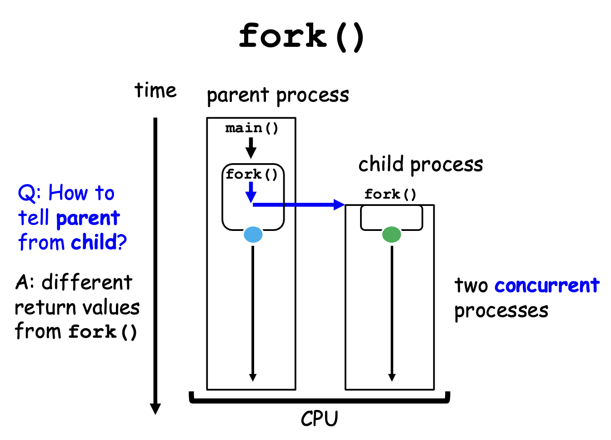
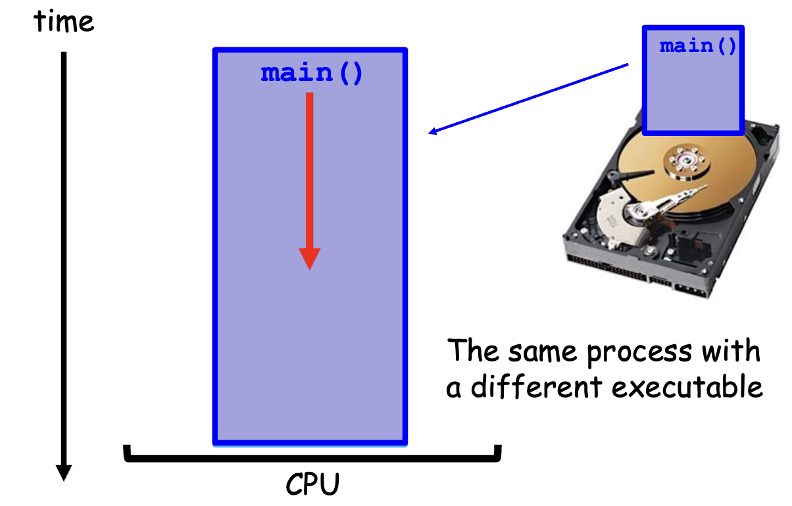
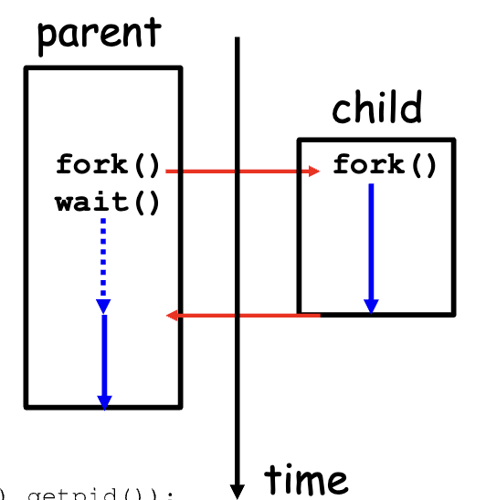
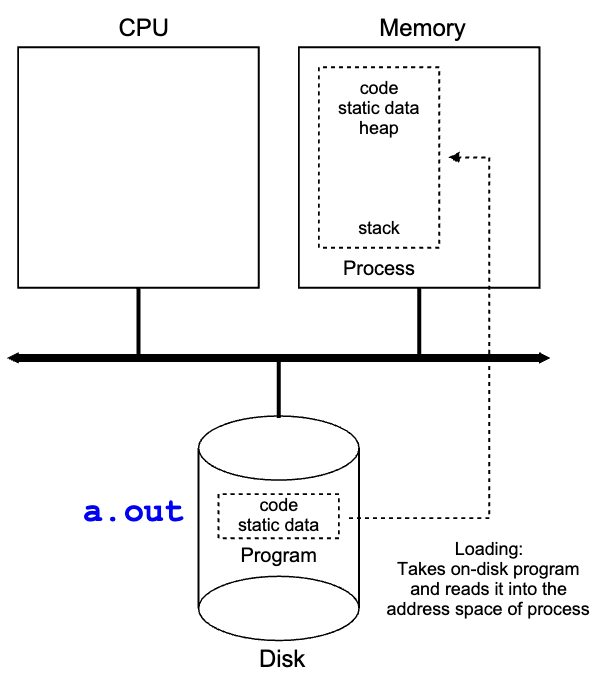

# Chapter 1: Introduction — OS in the Cloud-Native and AI Era

> **Learning objectives**
>
> After completing this chapter and its lab, you will be able to:
>
> - Explain why OS concepts remain central even when software is packaged as containers, pods, serverless functions, or AI agents
> - Describe the three core skills this book develops: Understand, Measure, Explain
> - Map a modern systems symptom to the relevant user-space, kernel, and hardware mechanisms
> - Run a first trace and a first measurement, then explain what each observation means

## 1.1 Why Operating Systems Still Matter

The vocabulary has changed faster than the mechanisms. Engineers now say
"the pod was throttled," "the inference server p99 regressed," or "the
agent runtime blocked a tool call." Those sound like platform-level
problems. Usually they are OS problems with newer names.

A pod that is OOM-killed is still a memory-accounting failure. A service
whose p99 jumps from 5 ms to 200 ms is still waiting on a slow path:
runqueue delay, page reclaim, blocking I/O, or lock contention. An agent
runtime that decides whether a tool call may touch the filesystem is still
enforcing a privilege boundary. Kubernetes, container runtimes, service
meshes, and agent frameworks add policy, automation, and better control
surfaces. They do not repeal scheduling, virtual memory, protection, or
I/O.

That is the premise of this book. We will treat modern systems as layered
compositions of older mechanisms rather than as entirely new abstractions.
If a deployment engineer says "Kubernetes throttled my workload," we will
translate that into the underlying resource-control event. If an incident
report says "tail latency increased under traffic burst," we will ask what
queue formed, where it formed, and which resource boundary it crossed.

> **Key insight:** Modern platforms rename OS mechanisms; they do not
> replace them. If you cannot explain the kernel- and hardware-level cause,
> you do not yet understand the production symptom.

## 1.2 What Counts as "the OS" Now?

A classical textbook often draws a simple picture: application → system
call interface → kernel → hardware. That picture is still correct, but it
is no longer sufficient for real deployments. Most production systems add
at least two more layers above the kernel: execution runtimes and a control
plane. Figure 1.1 makes the boundary map explicit.


*Figure 1.1: A modern systems stack still reduces to a layered resource-management path. The important question is not which layer is “the real OS,” but which layer owns the decision and which layer pays the execution cost.*

The useful question is not "which layer is the real OS?" The useful
question is "which layer owns which decision?" The answer is usually more
specific than students expect.

| Production term | OS-level analogue | Where to observe it first | Typical failure mode |
|---|---|---|---|
| container | process tree + namespaces + cgroup | `/proc`, `/sys/fs/cgroup` | wrong limit, wrong namespace view |
| pod CPU throttling | CFS bandwidth control | `cpu.stat`, `schedstat`, `top` | quota exhausted before period ends |
| service timeout | socket wait + queueing | `ss`, `sar`, app logs | backlog, retransmit, or blocked peer |
| agent tool call sandbox | `execve()` + credentials + filesystem policy | audit log, syscall trace, policy file | denied capability or path access |
| autoscaler miss | control loop acting on delayed signals | metrics pipeline + controller logs | stale measurements, slow convergence |

Two habits follow from this table.

First, always separate policy from mechanism. A Kubernetes resource limit
is policy. The mechanism is cgroup enforcement in the kernel. A language
runtime chooses when to allocate memory; the kernel decides when virtual
pages become physical pages and what happens under pressure.

Second, always ask where the boundary is crossed. If the phenomenon is a
branch misprediction, the hardware owns it. If it is a page fault, the MMU
and kernel cooperate on it. If it is a container limit, the kernel enforces
it even if the user first notices it through `kubectl`.

> **Note:** This book uses the full-stack meaning of "operating system":
> not just the kernel binary, but the resource-management path from
> hardware up through the runtime and, when relevant, the control plane.
> That broader view is useful precisely because it still reduces to a small
> number of mechanisms.

## 1.3 Three Core Skills: Understand, Measure, Explain

Every chapter in this book trains the same three skills, in the same order.
The order matters.

**Understand** means naming the mechanism precisely. If we say Linux uses
CFS, you should know that CFS orders runnable tasks by **virtual runtime**
and picks the leftmost task in that ordering. If we say a memory limit was
exceeded, you should know which counter moved, which boundary was crossed,
and which kernel path enforces the limit.

**Measure** means producing evidence rather than repeating folklore. A
claim such as "fsync is expensive" is incomplete until it has a workload,
a baseline, a repeat count, and a number. A claim such as "the cache is the
bottleneck" is incomplete until it has a miss rate, a working-set argument,
or a controlled comparison that rules out alternatives.

**Explain** means connecting the observation back to a cause. "The service
was slow" is not an explanation. "p99 increased because requests waited on
major page faults after reclaim under a tight memory limit" is an
explanation because it names both the signal and the mechanism.

A compact way to think about the book is this:

| Question | Skill | Minimum acceptable answer |
|---|---|---|
| What is the mechanism? | Understand | A step-by-step account with the right boundary |
| How do I observe it? | Measure | A command, a counter, or a trace with reproducible output |
| Where does it matter today? | Explain in context | A real production setting, not just a toy loop |
| How does it fail? | Explain causally | A concrete slow path, edge case, or resource limit |

If a chapter is readable but cannot answer those four questions, it is not
good enough for this book.

## 1.4 What Actually Happens When You Run a Program?

A foundations chapter should not stay rhetorical for long, so let us walk
through the most basic event in the subject: starting a program.

Consider a shell launching this program:

```c
#include <stdio.h>
#include <unistd.h>

int main(void) {
    printf("Hello from process %d\n", getpid());
    return 0;
}
```

If you trace the shell and the program together, you can see both process
creation and program replacement:

```bash
$ gcc -o hello hello.c
$ strace -f sh -c './hello'
```

A trimmed trace looks like this:

```text
clone(...)                                  = 12345
[pid 12345] execve("./hello", ["./hello"], ...) = 0
[pid 12345] brk(NULL)                       = 0x55...
[pid 12345] mmap(NULL, 8192, PROT_READ|PROT_WRITE, ...) = 0x7f...
[pid 12345] openat(AT_FDCWD, "/etc/ld.so.cache", O_RDONLY|O_CLOEXEC) = 3
[pid 12345] read(3, "...", 832)            = 832
[pid 12345] write(1, "Hello from process 12345\n", 25) = 25
[pid 12345] exit_group(0)                  = ?
```

This small trace already exposes the major boundaries of the subject.

1. The shell calls `clone()` or `fork()` to create a child process.
2. The child calls `execve()` to replace its old address space with the new
   program image.
3. The kernel validates the executable, sets up a new virtual address
   space, stack, arguments, environment, and credentials.
4. The dynamic linker maps shared libraries with `mmap()` and reads loader
   metadata with `openat()` and `read()`.
5. Your program runs in user space until `printf()` eventually reaches the
   `write()` system call.
6. The kernel copies bytes into the terminal or pipe buffer and returns to
   user space.


*Figure 1.2: Even a trivial `hello` program crosses layers repeatedly. The shell creates a process, `execve()` installs a new image, the loader maps dependencies, and `write()` crosses back into the kernel to reach the terminal.*

Several important OS ideas are already visible here.

- **Process creation** is not the same as program loading. `fork()` or
  `clone()` creates an execution context; `execve()` replaces its code and
  data image.


*Figure 1.3: `fork()` duplicates the parent process. Parent and child share the same code but diverge immediately: the parent receives the child's PID, the child receives zero.*


*Figure 1.4: `execve()` does not create a new process — it replaces the current one. The kernel loads the new program from disk into the same process's address space.*

The separation between `fork()` and `exec()` is a deliberate Unix design
decision. It means the parent can set up file descriptors, environment, and
credentials between the two calls. That gap is where shells implement
redirection, pipelines, and job control. After `execve()`, the old program
image is gone and the process continues with the new one.


*Figure 1.5: The parent calls `wait()` to synchronize with the child. Without it, the child becomes a zombie — finished but not yet reaped — until the parent collects the status.*


*Figure 1.6: A process is a program in execution. The kernel loads the binary from storage into a virtual address space with code, data, heap, and stack segments.*

- **Virtual memory** is established before most of your code runs. `mmap()`
  creates address-space regions, but pages are often backed lazily and only
  become physical on first touch.
- **Privilege boundaries** matter even for trivial I/O. The process cannot
  write to the terminal directly; it must cross into the kernel, which owns
  the device interface.
- **Failures are specific.** `execve()` can fail with `ENOENT` or `EACCES`.
  `mmap()` can fail under address-space or memory pressure. `write()` can
  block on a pipe, socket, or terminal buffer.

Now measure the same program:

```bash
$ sudo perf stat ./hello
```

```text
 Performance counter stats for './hello':

          0.42 msec task-clock
             1      context-switches
             0      cpu-migrations
            54      page-faults
       912,345      cycles
       456,789      instructions
```

Each counter points at a mechanism you will revisit later:

| Counter | What it means | Why it can change |
|---|---|---|
| `task-clock` | CPU time charged by the scheduler | waiting less or running more |
| `context-switches` | scheduler handoffs involving the task | blocking, preemption, contention |
| `cpu-migrations` | movement between CPUs | load balancing, affinity changes |
| `page-faults` | missing virtual-to-physical mappings | first touch, reclaim, file-backed pages |
| `cycles` | hardware time consumed | more work or worse stalls |
| `instructions` | retired machine instructions | algorithmic work done |

The crucial lesson is that a single command already spans user space,
kernel policy, and hardware execution. That is why the book insists on
cross-layer explanations. A production incident rarely lives at just one
layer.

## 1.5 How This Book Is Organized

Part I establishes the method. Later parts apply it to processes,
scheduling, containers, Kubernetes, distributed systems, storage, and
agent runtimes. Every chapter is expected to answer the same four questions:
what is the mechanism, how do I observe it, where does it matter now, and
how does it fail?

The labs are the enforcement mechanism for that standard. They are not busy
work. A good lab requires you to predict a result before running anything,
collect raw artifacts from your own environment, explain why the result did
or did not match the prediction, and rule out at least one plausible
alternative explanation. That matters even more now that students can use AI
for drafting and debugging. If a lab can be completed convincingly without
original evidence, it is poorly designed.

Each lab therefore uses a three-tier structure:

- **Part A:** minimum experiment and first evidence
- **Part B:** deeper comparison, interpretation, and exclusion of alternatives
- **Part C:** optional extension or open-ended exploration

By the end of the book, the target skill is not "I have heard of this OS
concept." It is "I can observe this mechanism on a real system, explain the
signal, and defend my diagnosis."

## Summary

Key takeaways from this chapter:

- The right way to read modern systems is through mechanisms, not labels.
  Containers, pods, and agent runtimes still rest on scheduling, virtual
  memory, protection, and I/O.
- The useful boundary map is user space ↔ kernel ↔ hardware, with runtimes
  and control planes adding policy above it. Good diagnosis depends on
  knowing which layer owns which decision.
- This book trains three skills in order: understand the mechanism, measure
  it with reproducible evidence, and explain the result causally.
- Even a trivial `hello` program exercises process creation, `execve()`,
  virtual memory setup, dynamic linking, syscall crossing, scheduling, and
  page faults. The foundations are already visible in the first trace.

## Further Reading

- Arpaci-Dusseau, R. H. & Arpaci-Dusseau, A. C. (2018).
  *Operating Systems: Three Easy Pieces.* Introduction and Chapters 4–6.
  Available at <https://pages.cs.wisc.edu/~remzi/OSTEP/>
- Gregg, B. (2020). *Systems Performance*, 2nd ed. Addison-Wesley.
  Chapters 1–2.
- Kerrisk, M. (2010). *The Linux Programming Interface.* Chapters 24–28.
- Linux manual pages: `man 2 execve`, `man 2 fork`, `man 1 strace`, and
  `man 1 perf-stat`.
