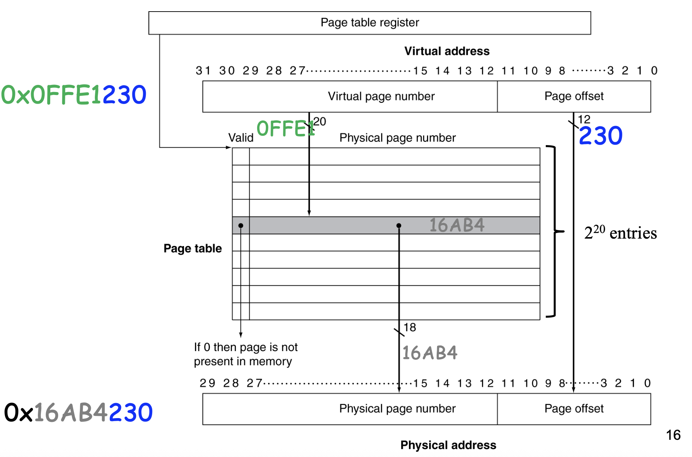
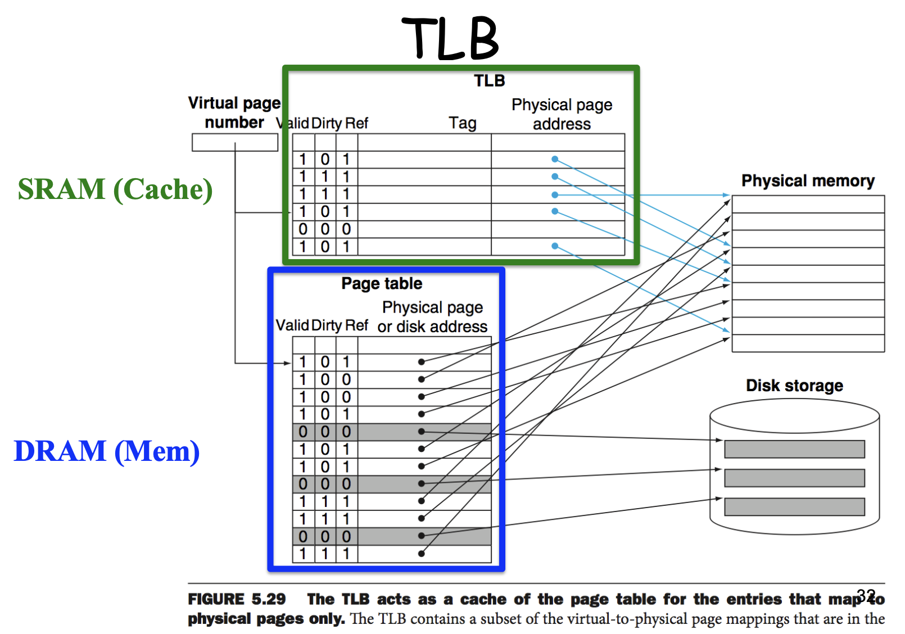
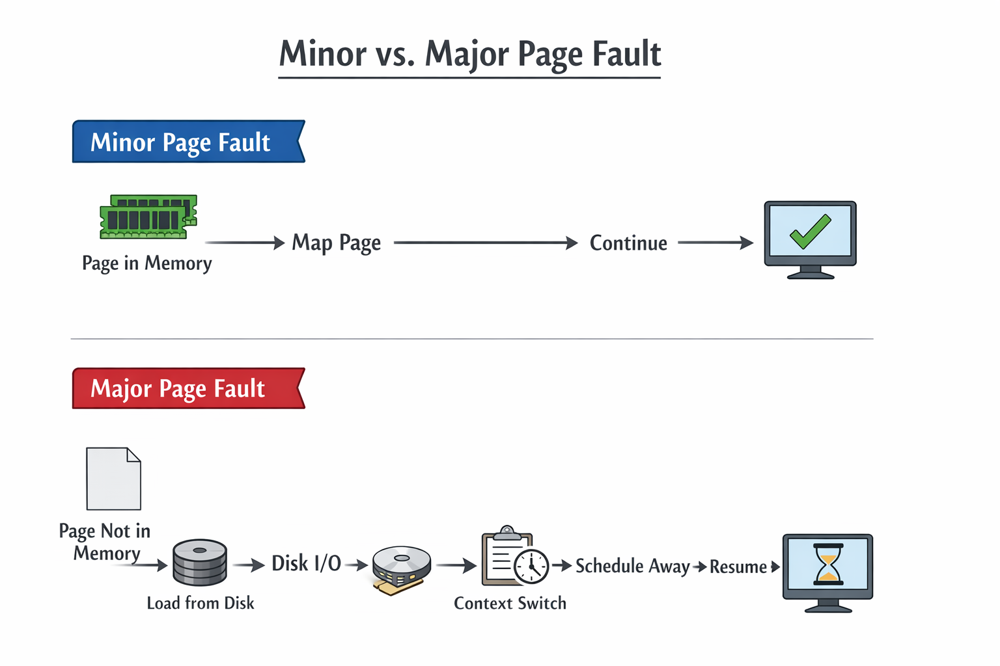

# Chapter 2: Performance Measurement Methodology — Memory, Translation, and Evidence

> **Learning objectives**
>
> After completing this chapter and its lab, you will be able to:
>
> - Explain why the same source code can run at very different speeds when
>   its working set crosses a cache, translation lookaside buffer (TLB),
>   memory, or storage boundary
> - Use classical OS ideas such as working sets, demand paging, page
>   replacement, and thrashing to reason about modern performance symptoms
> - Distinguish hardware effects such as cache misses, TLB misses, and branch
>   mispredictions from kernel effects such as page faults, reclaim, CPU
>   migration, and cgroup memory pressure
> - Use `perf stat`, `/usr/bin/time -v`, `/proc`, and Valgrind appropriately,
>   including in VM-constrained environments
> - Design a controlled experiment that survives noisy machines, shared
>   infrastructure, and AI-assisted report writing

At 9:17 a.m., a ranking service misses its latency objective after a harmless
configuration change. The code is the same. The request volume is the same.
CPU utilization is lower than before, so adding replicas does not help. A
quick profile shows nearly the same instruction count, but the instructions
retire more slowly. Last-level cache (LLC) misses are up, **translation
lookaside buffer** (TLB) misses are up, and the workload's **cgroup**, or
control group, has started to report memory pressure.

This is how many performance problems announce themselves. The symptom is a
number: p99 (99th-percentile) latency, wall time, throughput, CPU
utilization. The explanation is a mechanism: the hot working set no longer
fits, a page-table walk is on the critical path, reclaim is stealing pages,
or a branch predictor is losing on data it used to predict well.

Performance work begins with a discipline: a number is evidence, and a
mechanism is an explanation. If a report says "the program is 2× slower" but
cannot say whether it did more work, stalled more often, or waited on an OS
slow path, the report is not finished.

## 2.1 Why can the same program become slow without changing its code?

A modern core can retire billions of instructions per second. DRAM is far
slower than the core that wants to read it, and storage is slower again.
Without a hierarchy of fast, small memories above slower, larger ones, the
CPU would spend most of its time idle.

Typical order-of-magnitude latencies look like this:

| Level | Approx. latency | Typical size | What it means for software |
|---|---:|---:|---|
| registers | ~0 cycles | ~1 KB | values already in the execution core |
| L1 cache | ~4 cycles | 32–64 KB / core | hot inner-loop data |
| L2 cache | ~12 cycles | 256 KB–2 MB / core | warm working set |
| LLC / L3 | ~40–70 cycles | MBs shared per socket | cross-core shared data |
| DRAM | ~150–300 cycles | GBs | main-memory working set |
| SSD | tens of microseconds | hundreds of GB | page-in, file reads, sync writeback |

The exact numbers vary by machine. The structure does not. Crossing one
boundary in that table can dominate runtime even when the algorithmic
complexity stays the same.

A log-processing pipeline, an analytics query, an in-memory cache, a database
index, and an LLM inference server all care about the same question: does the
hot data fit in the fastest level of memory the CPU can reach cheaply? The
answer is not just an architecture fact. The operating system influences it
through virtual-memory mappings, page placement, replacement policy, cgroup
limits, **non-uniform memory access** (NUMA) placement, and scheduling.


*Figure 2.1: The memory hierarchy is a stack of trade-offs. Higher levels are smaller and faster; lower levels are larger and more expensive to touch on the critical path.*

> **Key insight:** Many "mysterious" slowdowns are working-set boundary
> crossings: L1 to L2, LLC to DRAM, TLB hit to page-table walk, RAM to swap,
> or local socket to remote memory.

## 2.2 What is a working set?

The classical OS term for "the hot data" is the **working set**. Denning's
working-set model defined it as the set of pages a computation has referenced
within a recent window of execution (Denning, 1968). That definition turned
the observation that programs have locality into an OS policy question: how
much physical memory does this process need right now to make progress?

Two related terms matter.

- The **resident set** is the set of pages currently held in physical memory
  for a process.
- The **working set** is the set of pages the process is actively using over
  a recent interval.

If the resident set covers the working set, most memory references hit in
RAM and the process makes progress. If the working set is larger than the
memory available to it, the process faults repeatedly, the kernel spends time
reclaiming and reading pages, and useful work collapses. This state is
**thrashing**.

The same idea appears at smaller and larger scales. At cache scale, the
working set might be a few arrays or hash-table buckets. At virtual-memory
scale, it is pages. At a service level, it can be the set of models, indexes,
or tenant data touched during a request burst. The unit changes; the question
is stable.

A useful mental model is:

```text
observed time = useful work
              + cache and TLB stalls
              + kernel memory-management work
              + waiting caused by I/O, scheduling, or limits
```

The purpose of measurement is to estimate which term changed.

### The traditional OS lesson

Classical memory-management papers were not just trying to make paging
faster. They were trying to prevent the system from accepting more runnable
work than memory could sustain. The working-set model, page-fault frequency
(PFF), and WSClock all ask versions of the same control question: should the
OS give this process more frames, take frames away, or reduce the number of
active processes? Denning and Schwartz (1972) related working-set size to
missing-page rates; Carr and Hennessy's WSClock (1981) translated working-set
ideas into an implementable replacement algorithm.

That lineage matters in modern systems. A Kubernetes node under memory
pressure is not just "low on RAM." It is making the same kind of admission
and replacement decision, now mediated through cgroups, reclaim, page cache,
OOM scoring, and pressure signals. The production vocabulary changed; the
memory-management problem did not.

## 2.3 How do caches turn locality into speed?

A **cache** is a small, fast store that keeps recently used data close to the
core. The unit of transfer is not a byte but a **cache line**, typically 64
bytes. When the CPU reads one byte, the hardware usually fetches the whole
line containing it.

That is why **locality** matters.

- **Temporal locality:** access the same item again soon.
- **Spatial locality:** access nearby items soon.

A textbook example is summing a matrix in row-major versus column-major
order:

```c
for (int i = 0; i < N; i++)
    for (int j = 0; j < N; j++)
        sum += arr[i][j];

for (int j = 0; j < N; j++)
    for (int i = 0; i < N; i++)
        sum += arr[i][j];
```

The arithmetic is identical. The memory path is not. In C, rows are stored
contiguously, so the first loop reuses fetched cache lines. The second loop
jumps by a stride large enough to waste most of each line and evict useful
data before it is reused.


*Figure 2.2: The row-major layout explains why sequential row traversal is cache-friendly. Column-wise access reads the same data structure through a worse memory path.*

The hardware enforces this at the cache-line level. When a CPU core requests
a single byte, the memory subsystem fetches the entire 64-byte cache line
containing it. Sequential access reuses that fetched data; strided or random
access often discards it.


*Figure 2.3: A cache miss fetches an entire 64-byte line, not just the requested byte. Sequential access exploits the remaining bytes; strided or random access discards them.*

This pattern appears constantly in real systems.

| Workload | Good locality looks like | Bad locality looks like |
|---|---|---|
| log scan / grep | sequential read through buffers | pointer chasing across fragmented structures |
| columnar analytics | batch-friendly scans | repeatedly materializing scattered rows |
| database index lookup | hot upper tree levels stay cached | random leaves and cache-line bouncing |
| inference serving | contiguous tensor and KV-cache layout | layout conversions and cache-thrashing copies |
| kernel networking | per-CPU queues and hot metadata | shared counters bouncing across cores |

You can often see the effect in `perf stat`:

```bash
$ sudo perf stat -e cache-references,cache-misses ./program
```

Interpret the **rate**, not the raw count. A million misses may be harmless
if there were a billion accesses. A 10% miss rate is expensive when the miss
sits on the critical path.

### Pricing a miss

A miss rate sounds abstract until you translate it into cycles:

```text
effective access cost = hit_rate * hit_cost + miss_rate * miss_cost
                      = 0.9 * 4 + 0.1 * 200
                      = 23.6 cycles
```

Ten percent misses turned a 4-cycle access into a 23.6-cycle access. That is
a 6× slowdown at the point of use.

## 2.4 What happens when a virtual address is used?

A process does not address physical RAM directly. It sees a **virtual address
space**. The hardware **memory-management unit** (MMU) translates virtual
addresses to physical frames using page tables, and the OS defines what those
mappings mean.

For a 4 KB page, the low 12 bits of an address are the page offset. The
remaining high bits identify the virtual page. Translation proceeds in this
order on a typical machine:

1. The CPU issues a load or store using a virtual address.
2. The MMU checks the **translation lookaside buffer** (TLB), a small cache
   of recent virtual-to-physical translations.
3. On a TLB hit, the physical frame number is available quickly and the cache
   hierarchy can be accessed.
4. On a TLB miss, hardware or a software handler walks the page table to find
   the page-table entry.
5. If the entry is present and permissions allow the access, the TLB is
   filled and execution continues.
6. If the entry is absent or the access violates permissions, the CPU traps
   into the kernel. The kernel handles a page fault or delivers a signal such
   as `SIGSEGV`.


*Figure 2.4: Address translation is a hardware–kernel handshake. The MMU raises the question, the page tables encode the answer, and faults invoke kernel policy when the answer is missing.*

The bookkeeping unit is usually a 4 KB **page**. Because page-table walks
would be too expensive on every load, CPUs cache recent translations in the
TLB.

| Event | Typical cost | Who owns it? |
|---|---:|---|
| TLB hit | ~1 cycle | hardware |
| TLB miss, page-table walk | 10–100+ cycles | hardware walk over OS-managed tables |
| minor page fault | ~1,000+ cycles | kernel creates or repairs a valid mapping |
| major page fault | microseconds to milliseconds | kernel waits for storage or swap |


*Figure 2.5: The TLB caches recent page-table entries. A TLB hit avoids the full page-table walk. A TLB miss forces a walk through page-table memory, and a missing resident page invokes the kernel fault path.*

A **minor page fault** does not mean disk I/O. It often means the kernel had
to instantiate a mapping: allocate a zero-filled anonymous page on first
touch, copy a page after a **copy-on-write** fault, or map a file page that
was already in the page cache. Copy-on-write lets processes share a physical
page until one process writes to it. A **major page fault** means the page
was not resident and the task had to wait for I/O.


*Figure 2.6: Minor faults repair mappings without storage I/O. Major faults require the kernel to issue I/O, deschedule the task, and resume it only after the page arrives.*

That is why page faults belong in an OS textbook, not just an architecture
course. The TLB is hardware. Page tables are OS-managed state. The fault path
is kernel policy in action.

Measure it with:

```bash
$ /usr/bin/time -v ./program
$ sudo perf stat -e page-faults,major-faults ./program
```

For TLB events, event names vary by CPU. On many x86 machines the first
query is:

```bash
$ perf list | grep -i 'dtlb\|itlb'
$ sudo perf stat -e dTLB-loads,dTLB-load-misses ./program
```

## 2.5 When does paging become an OS policy decision?

Demand paging gives each process the illusion of a large private address
space, but physical memory is finite. The OS must decide which pages to keep,
which pages to reclaim, and when memory pressure is so severe that a process
should be slowed, refused, or killed.

A page fault follows a policy path:

1. The MMU cannot complete a translation and traps into the kernel.
2. The kernel checks the **virtual-memory area** (VMA), the kernel record for
   a mapped address range: is this address mapped, and are the requested
   permissions legal?
3. If the access is illegal, the kernel delivers a fault such as `SIGSEGV`.
4. If the mapping is legal but no physical page is present, the kernel finds
   a frame, possibly by reclaiming another page.
5. If the needed data is file-backed or swapped out, the kernel submits I/O
   and blocks the task.
6. The page table is updated, the TLB entry is eventually filled, and the
   task resumes.

The replacement question is old and still hard. **Optimal replacement** keeps
the page whose next use lies farthest in the future; it is a benchmark, not
an implementable policy, because the future reference string is unknown.
**Least recently used** (LRU) approximates that idea but is expensive to
maintain exactly. **CLOCK** uses a reference bit to approximate recency with
lower overhead. **Working-set** and **page-fault-frequency** policies try to
control allocation by observing whether a process is faulting too often.
WSClock combines CLOCK with working-set-style load control.

| Policy idea | What it tries to infer | Practical limitation |
|---|---|---|
| FIFO | evict the oldest resident page | ignores whether the page is still hot |
| LRU | recent use predicts near-future use | exact tracking is expensive |
| CLOCK | reference bit approximates recent use | can lag under rapid phase changes |
| working set | keep pages used in a recent window | window size is workload-dependent |
| page-fault frequency | high fault rate means more memory is needed | fault rate can rise during phase changes, not only steady thrashing |
| WSClock | combine recency, dirty state, and load control | implementation depends on hardware reference/dirty bits |

The failure mode is thrashing. A process, container, or whole host can have
enough CPU but not enough memory to keep the active working sets resident.
The visible symptom is often latency: requests wait while the kernel reclaims
pages, writes dirty pages, or reads faulted pages back in.

On Linux, start with these signals:

```bash
$ /usr/bin/time -v ./program
$ vmstat 1
$ grep -E 'pgfault|pgmajfault|pgscan|pgsteal|workingset' /proc/vmstat
```

For a cgroup v2 workload, inspect the memory controller:

```bash
$ cat /sys/fs/cgroup/<group>/memory.current
$ cat /sys/fs/cgroup/<group>/memory.events
$ cat /sys/fs/cgroup/<group>/memory.pressure
$ grep -E 'pgfault|pgmajfault|workingset' /sys/fs/cgroup/<group>/memory.stat
```

`memory.events` tells you whether the cgroup crossed `high`, `max`, or
out-of-memory (OOM) boundaries. `memory.pressure` reports **pressure stall
information** (PSI): how much wall time tasks spent stalled because memory
was unavailable. These are production-grade signals because they measure
delay, not just allocation size.

> **Warning:** Do not create swap storms on a shared machine to "demonstrate"
> paging. Use modest inputs, a private VM, or a cgroup limit you can remove.
> A good memory experiment stresses the mechanism without damaging the host.

## 2.6 Why do TLB reach, huge pages, and shootdowns matter?

The TLB is small. Its coverage, sometimes called **TLB reach**, is roughly:

```text
TLB reach = number of usable TLB entries * page size
```

If a data structure touches 2 GB of memory through 4 KB pages, it spans about
524,288 pages. No ordinary TLB can cover that. The program may have good data
cache locality within a page but still suffer from translation misses as it
moves across pages.

Larger pages improve reach. A 2 MB **huge page** maps 512 times as much
memory as a 4 KB page with one TLB entry. That is why databases, JVM heaps,
virtual machines, and ML inference services often evaluate huge pages. The
trade-off is OS complexity: huge pages require aligned contiguous physical
memory, interact with fragmentation, and may trigger compaction or promotion
work. Linux **Transparent Huge Pages** (THP) can help throughput in one
workload and create latency spikes in another. Production database operators
often choose explicit huge pages or disable transparent promotion when
predictable latency matters more than automatic optimization.

A second advanced cost is the **TLB shootdown**. When the kernel changes a
mapping that may be cached by other cores, it must make those cores invalidate
the stale translation. On a multiprocessor this can require inter-processor
interrupts and synchronization. Black et al. (1989) treated TLB consistency
as a real OS scalability problem, not a footnote. The same issue still
appears when a process unmaps large regions, changes permissions, tears down
a VM, or rapidly creates and destroys address spaces.

For measurement, look for three patterns:

| Pattern | Likely mechanism | First signals |
|---|---|---|
| low IPC, high TLB-miss rate | translation overhead | `dTLB-*`, `iTLB-*`, IPC |
| latency spikes during allocation | huge-page promotion, compaction, or reclaim | kernel tracepoints, PSI, `vmstat` |
| slowdown on many-core mapping changes | TLB shootdowns or page-table contention | `perf`, kernel tracepoints, CPU migrations |

The broader lesson is that virtual memory is not free abstraction. It is a
contract among hardware translation structures, kernel page tables, and
user-space allocation behavior.

## 2.7 Where do branches fit in a memory chapter?

CPUs pipeline many instructions at once. Branches disrupt that flow because
the machine must guess which path to fetch before the branch fully resolves.
A **branch predictor** makes the guess. A correct guess is cheap. A wrong one
flushes work already in flight.


*Figure 2.7: Pipelining overlaps instruction stages for throughput. A correct branch prediction keeps the pipeline full; a misprediction flushes speculative work and costs cycles to recover.*

A predictable loop branch is easy for the hardware to learn. A branch on
random data is much harder. That difference shows up in hot inner loops,
parsers, packet filters, query operators, and threshold-based code in ML or
signal-processing pipelines.

```bash
$ sudo perf stat -e branches,branch-misses ./program
```

Branch prediction belongs in this chapter because it is a competing
explanation. If a quicksort input becomes slow, the cause might be more
comparisons, worse cache locality, worse branch predictability, deeper
recursion, or some combination. A credible report separates those stories
with evidence.

Again, use the rate. A branch-miss rate of 5% can be expensive if the branch
sits on the critical path of a tight loop.

## 2.8 Which layer owns each performance signal?

Students often blur architecture and OS boundaries in performance work. Do
not. The boundary is part of the explanation.

| Phenomenon | Hardware role | OS role | First signal to inspect |
|---|---|---|---|
| cache miss | fetch next level of hierarchy | influences layout indirectly via allocation, placement, scheduling | `cache-misses`, IPC |
| branch mispredict | speculates and flushes pipeline | none directly | `branch-misses`, IPC |
| TLB miss | walks page tables or traps to refill handler | defines mappings and permissions | `dTLB-*`, `iTLB-*`, IPC |
| minor fault | traps on missing or protected mapping | allocates, zero-fills, maps, or handles copy-on-write | `page-faults`, `/usr/bin/time -v` |
| major fault | traps, then waits on device | schedules I/O and blocks task | `major-faults`, `vmstat`, tail latency |
| reclaim | none directly | selects victim pages, writes dirty pages, updates LRU lists | `pgscan`, `pgsteal`, PSI |
| TLB shootdown | invalidates cached translations | coordinates invalidation across cores | kernel tracepoints, `perf` |
| CPU migration | executes on new core | scheduler load-balances task | `cpu-migrations`, affinity settings |
| memory cgroup pressure | executes memory references and raises faults on missing mappings | charges pages, reclaims, throttles, or kills | `memory.events`, `memory.pressure` |
| CPU throttling | hardware enforces time already charged | cgroup policy sets quota | `cpu.stat`, `schedstat` |

This table is the difference between a shallow and a defensible answer.
"The cache caused it" is incomplete if the scheduler moved the task across
cores and destroyed locality. "The OS caused it" is incomplete if the
dominant signal is a data-dependent branch predictor miss.

## 2.9 What is the first observability loop?

For Part I, you only need a short tool ladder.

### `/usr/bin/time -v`

Start here when you want OS-facing signals: wall time, user/system split,
page faults, resident-set size, and context switches.

```bash
$ /usr/bin/time -v ./program
```

Use it to answer questions such as:

- Is wall time much larger than user + system time?
- Did the run incur major faults?
- Did maximum resident set size change?
- Did context switches spike because the program blocked?

### `perf stat`

Use `perf stat` when processor performance-monitoring unit (PMU) counters
are available and you need low-overhead hardware-side evidence.

```bash
$ sudo perf stat -e cycles,instructions,cache-references,cache-misses,\
branches,branch-misses,page-faults,major-faults,cpu-migrations -r 5 ./program
```

The key reading habit is:

1. If runtime changed, did cycles change?
2. If cycles changed, was it because instructions increased or IPC fell?
3. If IPC fell, do cache misses, TLB misses, branch misses, or faults explain
   it?
4. If faults or memory pressure changed, is this first-touch allocation,
   copy-on-write, reclaim, or storage-backed paging?

### `/proc` and cgroup files

Use `/proc` and cgroup files when the mechanism is kernel policy rather than
only hardware execution.

```bash
$ grep -E 'pgfault|pgmajfault|pgscan|pgsteal|workingset' /proc/vmstat
$ cat /proc/pressure/memory
$ cat /sys/fs/cgroup/<group>/memory.events
$ cat /sys/fs/cgroup/<group>/memory.pressure
```

These files are especially useful in containers because the application may
see the symptom before the host looks globally overloaded.

### Valgrind fallback for VMs

Many student VMs expose hardware counters poorly or not at all. If `perf`
prints `<not supported>` or zeros for PMU events, do not invent an
interpretation. Switch tools.

- `cachegrind` for cache and branch trends
- `callgrind` for hot-function attribution
- `massif` for heap growth

Valgrind is slower than native execution, but it is stable and explainable.
That makes it a good teaching fallback.

## 2.10 How should a controlled experiment be designed?

A good experiment has four non-negotiable properties.

**One variable.** Change one axis at a time: input size, data layout,
compiler flag, memory limit, CPU placement, or page size. Not all of them
together.

**Baseline.** Decide what the comparison point is before you measure.
"Slower than what?" must have a precise answer.

**Repeats.** A single run is a story. Several runs let you see variance.
Three is the minimum; five is better.

**Rates, not just counts.** Report IPC, miss rates, fault rates, and pressure
rates, not just raw counters that scale with input size.

The properties above are easier to use as a checklist if you know what
failure looks like. Here are two versions of the same comparison, one weak
and one defensible.

| Step | Bad experiment | Good experiment |
|---|---|---|
| Question | "Is the new sort faster?" | "At input size N=10⁶ with random integers, does `qsort_v2` reduce p50 user-time by ≥5% versus `qsort_v1` on this CPU?" |
| Variable | unstated; "the code changed" | exactly one: the sort implementation; compiler, flags, input, and machine are fixed |
| Baseline | "the previous version" | `qsort_v1@<commit>`, with the binary archived |
| Runs | one run per side | five runs per side, alternating order, governor = `performance`, pinned to one core |
| Reported metric | wall-clock seconds | IPC, branch-miss rate, cache-miss rate, p50 user-time, min/max |
| Conclusion | "v2 is 7% faster" | "On this hardware, v2's p50 user-time is 4.8% lower; IPC unchanged; branch-miss rate dropped from 4.1% to 3.6%, consistent with the new pivot heuristic." |
| What it survives | nothing; a rerun can overturn it | another engineer can rerun it on a comparable host and check the mechanism |

The bad column is not a strawman. Many internal performance reports an
engineer reads in their first year of work look like the bad column. The goal
of this chapter is to make the good column the default.

On shared systems, add a fifth property: **hygiene**.

| Source of noise | Why it matters | Mitigation |
|---|---|---|
| frequency scaling / Turbo | same code runs at different clocks | set governor to `performance` when allowed |
| CPU migration | loses cache warmth, changes NUMA locality | pin with `taskset`, check migrations |
| page cache warmth | first run pays I/O or fault costs differently | separate cold-start from warm-cache measurements |
| container quota | task is throttled rather than CPU-bound | inspect cgroup `cpu.stat` |
| memory cgroup pressure | reclaim/fault delay masquerades as slow code | inspect `memory.events`, PSI, major faults |
| noisy neighbor | shared LLC, memory bandwidth, I/O contention | repeat runs; prefer quiet host or dedicated VM |
| PMU virtualization gaps | performance counters missing or multiplexed | use Valgrind fallback; report limitation |

Industrial practice adds one more distinction: staging measurements and
production measurements serve different goals. In staging you want control.
In production you often accept less control in exchange for realism. Good
engineers know which one they are doing.

> **Warning:** If your measurement method cannot survive background noise,
> scheduler movement, memory pressure, and unavailable counters, it is not
> robust enough for modern systems work.

### A production case: hash-table lookups on Facebook's web tier

The four-property checklist above is not aspirational. Facebook's 2015 paper
*Profiling a Warehouse-Scale Computer* (Kanev et al., ISCA '15) is a
canonical example of getting it right at scale. The team ran continuous,
fleet-wide performance-counter sampling on production web servers and
aggregated the data across millions of machine-hours. The result was concrete
and uncomfortable:

- A large fraction of fleet CPU time was concentrated in a small set of
  primitives such as memory allocation, hashing, string handling, and data
  movement.
- TLB behavior was a major source of stalls. That finding challenged the
  simpler story that data-cache misses alone dominate server performance.
- IPC was far below what a tight microbenchmark achieves, because production
  code has deep call graphs, broad instruction footprints, and large working
  sets.

The methodology mattered as much as the result. Single-machine measurements
could not have produced a stable fleet-level conclusion: hardware variance,
traffic mix, and deployment state swamp the signal. By keeping the experiment
continuous, multi-machine, and rate-based, the team produced a finding that
survived production noise.

The follow-up is equally instructive. AutoFDO and Facebook's BOLT
(Panchenko et al., CGO '19) use sampled production profiles to feed compiler
and linker optimization. This is the same loop this chapter teaches at small
scale: measure the real bottleneck, connect it to a mechanism, then change
layout or code generation so the hardware sees a better instruction and data
path.

The lab in this chapter is not fleet scale. The discipline is the same: name
the variable, fix the baseline, sample long enough, report rates instead of
raw counts, and refuse to stop until the mechanism is clearer than the noise.

## Summary

Key takeaways from this chapter:

- The memory hierarchy dominates performance because crossing a boundary in
  that hierarchy can multiply access cost even when the algorithm is
  unchanged.
- The working set is the bridge between traditional OS memory management and
  modern performance debugging: if active data does not fit in the relevant
  memory level, the system stalls, faults, reclaims, or thrashes.
- Caches, TLBs, and branch predictors are hardware mechanisms, but their
  performance consequences interact with OS decisions about mapping,
  replacement, placement, cgroup limits, and scheduling.
- `perf stat` is the fastest route to cycles, instructions, IPC, and miss
  rates. `/usr/bin/time -v` is the fastest route to OS-visible faults and
  resident-set behavior. `/proc` and cgroup files expose kernel memory
  pressure. Valgrind is the right fallback when VM counters are weak.
- A defensible experiment requires one variable, a baseline, multiple runs,
  rates rather than counts, and explicit control of major noise sources.

## Further Reading

- Denning, P. J. (1968). "The working set model for program behavior."
  *Communications of the ACM*. <https://doi.org/10.1145/363095.363141>
- Denning, P. J. (1970). "Virtual Memory." *ACM Computing Surveys*.
  <https://doi.org/10.1145/356571.356573>
- Aho, A. V., Denning, P. J., & Ullman, J. D. (1971). "Principles of
  Optimal Page Replacement." *Journal of the ACM*.
  <https://doi.org/10.1145/321623.321632>
- Denning, P. J., & Schwartz, S. C. (1972). "Properties of the working-set
  model." *Communications of the ACM*. <https://doi.org/10.1145/361268.361281>
- Bensoussan, A., Clingen, C. T., & Daley, R. C. (1972). "The Multics
  virtual memory." *Communications of the ACM*.
  <https://doi.org/10.1145/355602.361306>
- Carr, R. W., & Hennessy, J. L. (1981). "WSCLOCK — a simple and effective
  algorithm for virtual memory management." *ACM SIGOPS Operating Systems
  Review*. <https://doi.org/10.1145/1067627.806596>
- Black, D. L., Rashid, R., Golub, D., & Hill, C. R. (1989). "Translation
  lookaside buffer consistency: a software approach."
  <https://doi.org/10.1145/68182.68193>
- Navarro, J. E., Iyer, S., Druschel, P., & Cox, A. L. (2002). "Practical,
  transparent operating system support for superpages."
  <https://doi.org/10.1145/844128.844138>
- Kanev, S., Darago, J. P., Hazelwood, K. M., Ranganathan, P., Moseley, T.,
  Wei, G.-Y., & Brooks, D. M. (2015). "Profiling a warehouse-scale
  computer." *ISCA*. <https://doi.org/10.1145/2749469.2750392>
- Panchenko, M., Auler, R., Nell, B., & Ottoni, G. (2019). "BOLT: A
  Practical Binary Optimizer for Data Centers and Beyond." *CGO*.
- Gregg, B. (2020). *Systems Performance*, 2nd ed. Addison-Wesley.
  Chapters 2 and 6.
- Drepper, U. (2007). *What Every Programmer Should Know About Memory.*
  <https://people.freebsd.org/~lstewart/articles/cpumemory.pdf>
- Arpaci-Dusseau, R. H., & Arpaci-Dusseau, A. C. (2018). *Operating Systems:
  Three Easy Pieces.* Chapters 18–23.
- Linux kernel documentation: Pressure Stall Information and Transparent
  Hugepage Support. <https://docs.kernel.org/>
- Valgrind manuals: <https://valgrind.org/docs/manual/>
- Linux `perf` wiki: <https://perf.wiki.kernel.org/>
