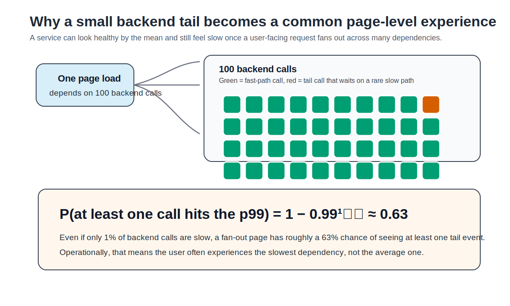
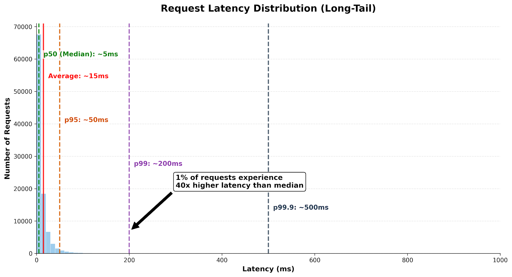
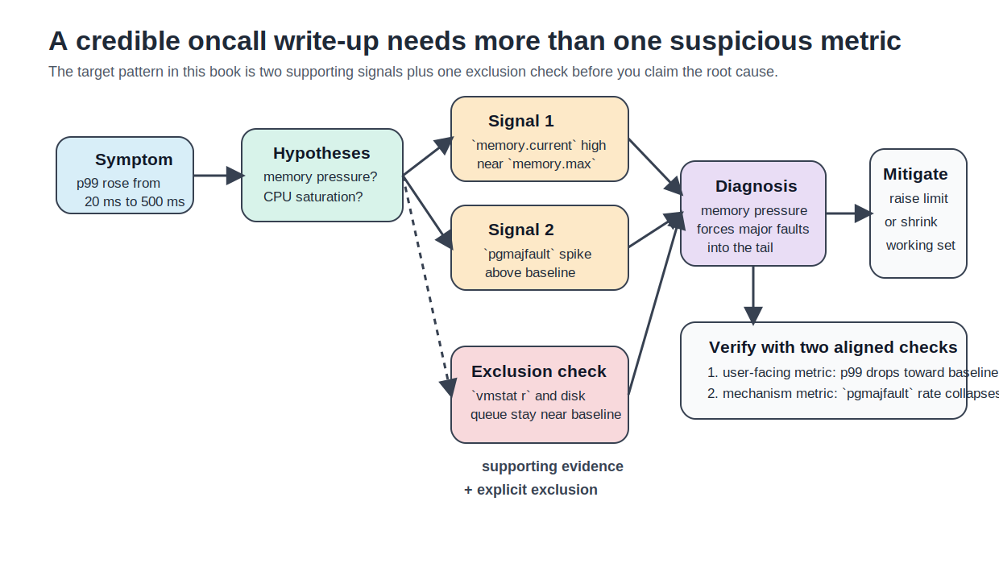

# Chapter 3: Systematic Debugging of Tail Latency — A Memory-Pressure Case Study

> **Learning objectives**
>
> After completing this chapter and its lab, you will be able to:
>
> - Explain why p99 latency matters more than average latency for production
>   services with fan-out or rare slow paths
> - Read percentile summaries, histograms, and SLO dashboards without being
>   fooled by missing samples or coordinated omission
> - Explain the memory-pressure mechanism: working-set growth, reclaim,
>   major faults, and p99 spikes with stable p50
> - Apply RED and USE as a disciplined incident workflow for a
>   memory-pressure case study
> - Build an evidence chain with supporting signals, an explicit exclusion
>   check, and a verification plan

At 01:47, an order service starts violating its latency SLO. The service is
not down. Its median request still completes in 3 ms. CPU is only moderately
busy. The dashboard looks almost boring until one line stands out: p99 has
jumped from 20 ms to 540 ms.

This chapter walks one specific path into that symptom. A service's
working set has grown close to its memory limit, the kernel reclaims
pages, and rare requests later touch pages that are no longer resident.
Those unlucky requests incur major faults and wait off-CPU, so p99 rises
while p50 holds steady. The job for the rest of the chapter is to turn
that single incident into a defensible diagnosis.

Chapter 2 taught measurement on one program and introduced working sets,
page faults, and memory pressure. Chapter 3 asks how the same mechanisms
appear during an incident. Later chapters return to other tail sources:
scheduler delay in Chapters 4–5, cgroup enforcement in Chapters 6–7,
distributed fan-out in Chapters 8–9, and storage durability in Chapters
10–11. Here the goal is narrower: turn one memory-induced p99 spike into a
defensible diagnosis.

## 3.1 Why does p99 matter more than the mean?

A **service level indicator** (SLI) is a measured property of service
behavior, such as request latency or error rate. A **service level objective**
(SLO) is the target the service promises to meet, such as "99% of requests
complete under 100 ms." In latency work, percentiles usually align better
with SLOs than averages do.

Suppose a service reports these numbers:

| Metric | Value |
|---|---:|
| mean | 6 ms |
| p50 | 3 ms |
| p90 | 8 ms |
| p99 | 150 ms |
| p99.9 | 800 ms |

The mean sounds fine. The tail does not. One request in a hundred takes at
least 150 ms. If a page load fans out to 100 backend calls, the chance that at
least one of those calls lands in the p99 is:

```text
1 - 0.99^100 ≈ 0.63
```


*Figure 3.1: Tail amplification is a fan-out effect. A dependency can be slow only rarely and still dominate the user-facing experience once each page load depends on many such calls.*

So a page composed of many individually "good" services can still feel slow
most of the time. Dean and Barroso called this problem *the tail at scale*:
large fan-out turns rare component delays into common user-visible delays.

A quick histogram makes the same point more concretely:

| Latency bucket | Requests out of 10,000 |
|---|---:|
| 0–5 ms | 8,700 |
| 5–10 ms | 1,100 |
| 10–50 ms | 120 |
| 50–200 ms | 70 |
| 200+ ms | 10 |

Most requests are fine. A small slow tail dominates the operational story.
That is the normal shape of production latency bugs.


*Figure 3.2: A typical long-tail latency distribution. The median looks healthy. The mean is already misleading. The p99 and p99.9 reveal the user-facing risk.*

> **Key insight:** Tail latency usually comes from a mostly healthy fast
> path plus a rare slow path with a large fixed cost. The average hides
> both halves of that story.

## 3.2 What do percentiles and histograms hide?

A percentile is a position in the sorted sample set. That sounds simple, but
it has consequences.

First, sample count matters. The p99 of 100 requests is just the single worst
request. The p99 of 10,000 requests is the worst 100 requests, which is much
more stable. As a rule of thumb for this course, do not quote a p99 from only
a few hundred samples unless you are explicit about the uncertainty.

Second, a percentile summary is not the whole distribution. A histogram or
cumulative distribution function (CDF) tells you whether the tail is narrow,
heavy, bimodal, or drifting over time. Those shapes often distinguish
mechanisms.

| Shape | Common interpretation | Example mechanism |
|---|---|---|
| narrow distribution | one stable path | CPU-bound handler on warm data |
| heavy tail | rare slow path | page faults, fsync, lock contention |
| bimodal distribution | two request classes or two backends | cache hit versus cache miss |
| slowly drifting tail | accumulating queue or leak | retry backlog, memory growth |
| periodic spikes | external schedule | batch job, compaction, checkpoint |

Third, many naive load generators under-report the tail because of
**coordinated omission**. The bug looks like this:

```python
while True:
    start = now()
    send_request()
    record(now() - start)
```

If one request stalls for a long time, this closed-loop benchmark stops
sending during the stall. The worst period is under-sampled, so the published
p99 looks better than what a user-facing open-loop workload would experience.

Practical fixes:

- send at a controlled arrival rate;
- use tools such as `wrk2` or HdrHistogram-backed clients;
- record the waiting-to-send time, not just the server-side service time;
- report the sample count and load model alongside the percentile.

This mistake appears in RPC benchmarks, microservice load reviews, storage
benchmarks, and autoscaling evaluations. Tail numbers are only useful if the
measurement method can see the tail.

## 3.3 Why does memory pressure turn into waiting?

Tail latency is usually queueing made visible. The queue in this
chapter's case study sits below the application: reclaim, swap or
storage-backed page supply, and the blocked request that cannot continue
until the page is resident.

A **queue** forms when work arrives faster than a resource can serve it for
some interval. The resource may be memory reclaim, a storage device supplying
faulted pages, a CPU core, a lock, a thread pool, or a remote service. The
chapter's main case is memory, but the queueing idea is the same elsewhere.

Little's Law gives the most compact relationship:

```text
L = λ W
```

Here `L` is the average number of requests in the system, `λ` is the arrival
rate, and `W` is the average time a request spends in the system. If arrival
rate rises while service capacity is fixed, either the number of in-flight
requests grows, the waiting time grows, or both.

A simple single-server queue shows why the effect is nonlinear. If service
rate is `μ`, arrival rate is `λ`, and utilization is `ρ = λ / μ`, the average
response time in the idealized M/M/1 model is proportional to:

```text
1 / (μ - λ)
```

As `λ` approaches `μ`, a small load increase causes a large latency increase.
The exact formula is model-specific; the lesson is general. High utilization
leaves little slack for bursts, variance, or rare slow operations.

For memory pressure, the "server" may be the kernel path that frees a frame
or the device path that supplies a faulted page. Most requests do not enter
that path, so p50 stays low. The few that do can wait hundreds of
milliseconds. Harchol-Balter's queueing text and Denning and Buzen's
operational analysis give the deeper theory. In incident work, the practical
question is simpler: where is the queue, and what signal shows it?

## 3.4 Where does the memory slow path fit among OS queues?

Most services have a fast path and several rare slow paths. The fast path
is computation on warm data with no blocking. The slow path in this
chapter is memory pressure: reclaim and major faults. The other OS
queues appear in the table below so you can rule them out during the
worked incident. Each of them gets its own chapter later in the book.

| Slow path | What waits? | First observations |
|---|---|---|
| CPU runqueue delay | runnable thread waits for core time | `vmstat r`, load average, scheduler traces |
| cgroup CPU throttling | task waits for the next quota period | `cpu.stat`, throttling counters |
| major page fault | thread waits for a page to be supplied | `major-faults`, `/proc/vmstat`, cgroup memory counters |
| reclaim or compaction | task waits while kernel frees or moves pages | PSI, `pgscan`, `pgsteal`, kernel traces |
| blocking storage I/O | thread waits for device completion | `iostat`, `%wa`, application logs |
| socket backlog | request waits before user code sees it | `ss`, accept queue, retransmits |
| lock or futex contention | thread waits on another thread | `perf lock`, futex traces, app lock stats |
| retry amplification | later requests wait behind earlier delays | logs, timeout counters, dependency graph |


*Figure 3.3: A request's total latency is execution time plus queue wait time. Most of the slow path is usually waiting, not processing. Each OS queue — CPU runqueue, disk I/O queue, socket buffer, lock wait queue — is a potential source of tail latency.*

The production contexts change, but the queueing logic does not. In this
chapter, the central example is an inference or order-service workload whose
working set spills and faults. In later chapters, the same table will reappear
with different dominant mechanisms: scheduler delay, cgroup throttling,
storage sync, or distributed retry amplification.

For now, the debugging question is: **what rare memory event can add this
much waiting time to only a small fraction of requests, and which competing
queue did we rule out?**

## 3.5 How do RED and USE divide the memory-pressure investigation?

Brendan Gregg's **USE method** is a resource checklist. For every resource,
check three things.

- **Utilization:** how busy is it?
- **Saturation:** is there a queue or backlog?
- **Errors:** are operations failing?

For a Linux service, the first-pass checklist often looks like this:

| Resource | Utilization | Saturation | Errors |
|---|---|---|---|
| CPU | `top`, `mpstat` | `vmstat r`, load average | throttling, involuntary context switches |
| Memory | RSS, `free -m`, cgroup usage | reclaim, PSI, swap, major faults | OOM events |
| Disk | `%util`, throughput | `await`, queue depth, `%wa` | device or filesystem errors |
| Network | bandwidth, socket counts | backlog, retransmits | resets, drops |

USE prevents tunnel vision. Engineers often jump straight to a favorite
theory: "must be CPU," "must be the database," "must be the network." USE
forces you to cover the resource surface before narrowing.

The **RED method** complements USE from the service side:

- **Rate:** how many requests arrive?
- **Errors:** how many requests fail?
- **Duration:** how long do requests take?

Use RED to start from the user's view, then USE to test whether memory
pressure is the resource path that explains it.

| Debugging question | Better method | Why |
|---|---|---|
| Did the service violate its SLO? | RED | starts with request rate, errors, duration |
| Which resource is saturated? | USE | covers CPU, memory, disk, network, locks |
| Did retries make the incident worse? | RED + dependency graph | useful preview for later distributed chapters |
| Did memory pressure explain the tail? | USE + fault counters | mechanism lives below the service metric |

A useful discipline is to write down two plausible hypotheses before diving
deeper. For example:

1. memory pressure is causing major faults;
2. CPU saturation is causing runqueue delay.

Then collect evidence for one and an exclusion check for the other.

## 3.6 How do evidence chains prevent hunches?

Metrics tell you that something changed. They do not always tell you why a
request waited. For this chapter, the trace can be minimal: the service tells
you p99 is high, and host counters tell you whether the memory fault path was
active. Later chapters use richer distributed tracing systems such as Dapper,
X-Trace, Canopy, and OpenTelemetry to reconstruct request paths across many
services.

A **trace** is a record of one request. A **span** is one timed operation
inside that request, such as an RPC call, queue commit, database query, or
cache lookup. Trace context lets spans from different services be joined into
one causal path. Here, tracing is background vocabulary. The required skill is
the evidence chain: connect a user-facing symptom to a mechanism-facing
signal and rule out a plausible alternative.

One signal is a hypothesis. Two supporting signals plus one exclusion check is
a diagnosis you can defend.

A good evidence chain has this form:

1. **Symptom:** p99 rose from 5 ms to 180 ms at 01:47.
2. **Hypothesis:** memory pressure is forcing major faults.
3. **Signal 1:** memory usage is near the cgroup limit.
4. **Signal 2:** `pgmajfault` or per-process major faults increased sharply.
5. **Exclusion:** CPU runqueue and disk queue depth stayed near baseline.
6. **Mechanism:** faulting requests block on page supply, inflating only the
   tail.
7. **Fix:** raise limit, reduce working set, or protect hot data.
8. **Verification:** tail recovers and the mechanism-aligned signal returns
   toward baseline.

The exclusion step is where many weak write-ups fail. Skip it and the
diagnosis collapses into a plausible story.

A short operational map:

| Claim | Supporting signal | Independent supporting signal | Excluded alternative |
|---|---|---|---|
| memory pressure drives the tail | `memory.current` near `memory.max` | `pgmajfault` spike | CPU saturation |
| CPU runqueue drives the tail | high `vmstat r` | scheduler delay trace | storage queueing |
| storage sync drives the tail | trace span in commit path | elevated `%wa` or device await | network timeout as root cause |
| network is not the root cause | stable retransmits | stable socket backlog | misleading timeout symptoms |


*Figure 3.4: The target structure for an incident write-up is symptom → hypotheses → two supporting signals → one exclusion check → diagnosis → mitigation and verification. The exclusion step turns a plausible story into a defensible one.*

## 3.7 Worked incident: memory pressure and p99 spikes

Imagine this alert:

```text
Service: order-service
Alert:   p99 latency > 500 ms (baseline: 20 ms)
Start:   01:47
Impact:  ~1% of requests
```

That "~1%" is already a clue. The fast path still works. A rare slow path is
firing.

### Step 1: Start from RED

The service-level view says the duration SLI is failing, but error rate and
request rate are not enough to explain the shape. The next step is a USE pass
on the host or container.

### Step 2: USE pass

A quick sweep shows memory is the suspicious resource.

```bash
$ free -m
              total   used   free   available
Mem:           1024    960     10          45
```

High utilization alone is not enough, so keep going.

### Step 3: Check the fault path

```bash
$ grep -E 'pgfault|pgmajfault' /proc/vmstat
pgfault    81219310
pgmajfault    34127
```

If baseline `pgmajfault` was roughly 3,000 for the same interval, this is a
strong signal that the slow path involves storage-backed page supply rather
than ordinary compute.

### Step 4: Exclude the obvious rival

```bash
$ vmstat 1 5
procs -----------memory---------- ---swap-- -----io---- -system-- ------cpu-----
 r  b   swpd   free   buff  cache   si   so    bi    bo   in   cs us sy id wa st
 1  0 346112  67584  18432 319488    8   12   210   120  610  980 18  3 78  1  0
```

Runqueue length is not elevated enough to make CPU saturation the primary
story. That does not prove CPU is irrelevant, but it weakens it as the root
cause.

### Step 5: State the mechanism

The causal chain is:

1. the service runs close to its memory limit;
2. the kernel reclaims pages to stay within the limit;
3. some later requests touch reclaimed pages;
4. those requests incur major faults and wait off-CPU for page supply;
5. only the unlucky requests that hit reclaimed data enter the tail.

That explains the observed shape: p50 remains acceptable while p99 spikes.

### Step 6: Mitigate and verify

A production-minded response has four parts:

- apply the least risky mitigation first, such as modestly raising
  `memory.max`;
- watch both the user-facing metric and the mechanism-aligned signal;
- confirm that p99 and `pgmajfault` move together in the expected
  direction;
- follow up with a working-set reduction, cache warmup change, or
  placement fix so the extra memory does not become permanent folklore.

Raising the limit and walking away is the version that breeds the next
incident.

A before/after table makes the verification logic explicit:

| Metric | Before | After |
|---|---:|---:|
| p50 latency | 3 ms | 3 ms |
| p99 latency | 540 ms | 18 ms |
| `pgmajfault` / min | 1,200 | 25 |
| `memory.current / memory.max` | 95% | 72% |

Numbers will differ in real incidents; the structure should hold.

## 3.8 How do memory-pressure mitigations fail?

A mitigation is another systems change. It can reduce the tail, move the
bottleneck, or create a new incident. For this chapter, judge every mitigation
against the memory-pressure mechanism.

| Mitigation | When it helps | How it fails |
|---|---|---|
| raise a memory limit | working set barely exceeds current limit | hides a leak or steals memory from neighbors |
| reduce working set | cold data or duplicated cache entries dominate | removes useful cache state or shifts cost to a dependency |
| warm critical pages | tail comes from first touch of cold data | warmup worker competes for memory and triggers reclaim |
| change placement | noisy neighbor or NUMA placement worsens memory behavior | moves the problem without reducing the working set |
| add replicas | per-replica working set fits after splitting load | does not fix a shared cache, database, or storage bottleneck |
| increase timeout | dependency is slow but recovers soon | keeps resources busy longer and worsens queues |
| retry | transient failures dominate | amplifies load during partial failure |

The verification rule is simple: a fix must move the user-facing metric and
the mechanism-facing metric. In this case, p99 should improve while major
faults, reclaim, PSI, or memory-limit pressure also move in the expected
direction. If p99 improves but the suspected mechanism does not change, you
may have masked the symptom rather than fixed the cause.

## Summary

Key takeaways from this chapter:

- Tail latency is usually a rare slow path with a large waiting cost, not a
  uniform slowdown of all requests.
- In this chapter's main mechanism, working-set growth creates memory
  pressure; reclaim and major faults affect only the unlucky requests that
  touch nonresident pages.
- Percentiles require enough samples and a measurement method that does not
  hide the worst periods through coordinated omission.
- Queueing explains why moderate average utilization can coexist with severe
  p99 latency under bursts, variance, or localized saturation.
- RED starts from request rate, errors, and duration; USE tests whether
  memory is the saturated or failing resource.
- Strong incident analysis requires two supporting signals and one explicit
  exclusion check. Without the exclusion, the write-up is still vulnerable.
- The best fixes are verified with both a user-facing metric and a
  mechanism-facing metric.

## Further Reading

- Dean, J., & Barroso, L. A. (2013). "The Tail at Scale." *Communications of
  the ACM*, 56(2). <https://doi.org/10.1145/2408776.2408794>
- Dean, J. (2012). "Achieving Rapid Response Times in Large Online Services."
- Harchol-Balter, M. (2013). *Performance Modeling and Design of Computer
  Systems: Queueing Theory in Action*. Cambridge University Press.
- Denning, P. J., & Buzen, J. P. (1978). "The Operational Analysis of
  Queueing Network Models." *ACM Computing Surveys*.
  <https://doi.org/10.1145/356733.356735>
- Sigelman, B., Barroso, L. A., Burrows, M., Stephenson, P., Plakal, M.,
  Beaver, D., Jaspan, S., & Shanbhag, C. (2010). "Dapper, a Large-Scale
  Distributed Systems Tracing Infrastructure."
- Fonseca, R., Porter, G., Katz, R. H., Shenker, S., & Stoica, I. (2007).
  "X-Trace: A Pervasive Network Tracing Framework." *NSDI*.
- Kaldor, J., et al. (2017). "Canopy: An End-to-End Performance Tracing and
  Analysis System." *SOSP*. <https://doi.org/10.1145/3132747.3132749>
- Gregg, B. (2020). *Systems Performance*, 2nd ed. Addison-Wesley.
- Gregg, B. "The USE Method." <https://www.brendangregg.com/usemethod.html>
- Grafana Labs. "The RED Method: How to Instrument Your Services."
  <https://grafana.com/blog/the-red-method-how-to-instrument-your-services/>
- Beyer, B., Jones, C., Petoff, J., & Murphy, N. R. (eds.). (2016). *Site
  Reliability Engineering*. O'Reilly. <https://sre.google/sre-book/table-of-contents/>
- Tene, G. "How NOT to Measure Latency."
  <https://www.youtube.com/watch?v=lJ8ydIuPFeU>
- HdrHistogram: <https://github.com/HdrHistogram/HdrHistogram>
- OpenTelemetry documentation: <https://opentelemetry.io/docs/>
