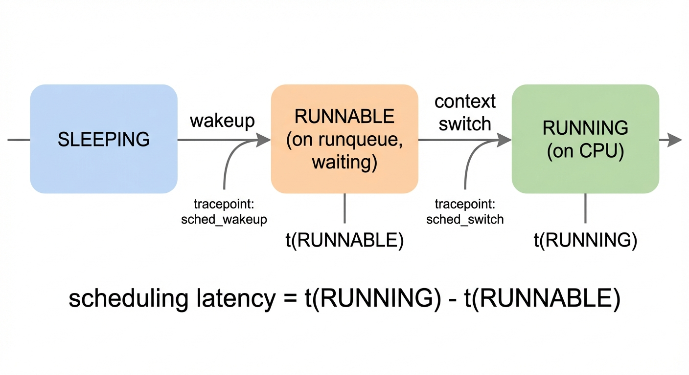
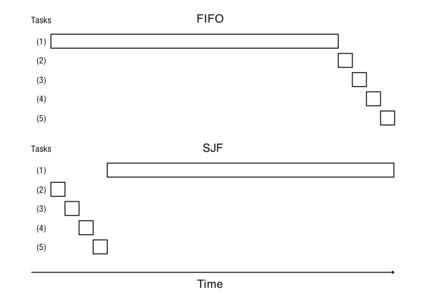
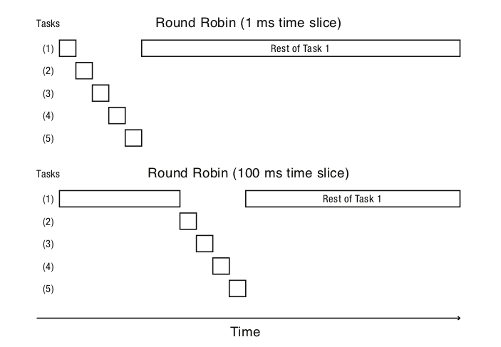
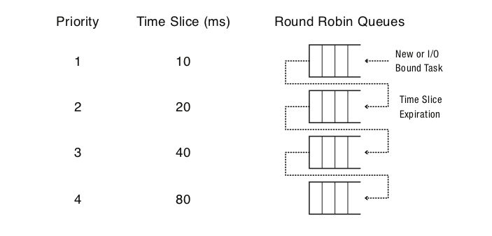
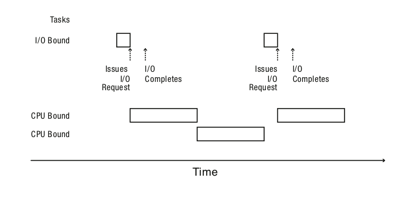
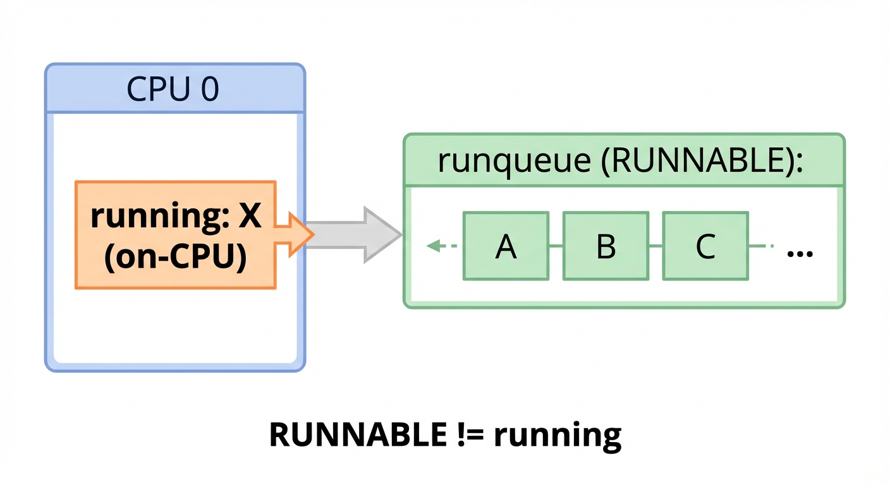

# Chapter 4: Processes, Threads, and Concurrency

> **Learning objectives**
>
> After completing this chapter and its lab, you will be able to:
>
> - Explain the process abstraction and how the kernel implements it
>   (fork, exec, wait, exit)
> - Compare kernel threads and user-level threads, including their
>   scheduling tradeoffs
> - Describe how preemption works (timer interrupts, voluntary vs
>   involuntary context switches)
> - Explain why scheduling latency is a primary source of tail latency

A web server is sitting at 55% average CPU and serving p99 requests
in 8 ms. A nightly batch job starts. Average CPU rises to 70% — still
far below any reasonable saturation threshold. The web server's p99
jumps to 120 ms. Nothing else changed: same code, same RPS, same
box. Where did the extra 112 ms go?


*Figure 4.1: The opening incident. The CPU panel never crosses any operator's alarm threshold; the p99 panel leaves its SLO 50 ms line behind within seconds. The two panels share an x-axis so the asymmetry — calm utilization, violent tail — is visible at a glance. The traces are synthetic but the shape and magnitudes are from a production microservice incident report; reproduce with `python3 scripts/figures/gen_ch04_cpu_vs_p99.py`.*

It went into a queue. Specifically, the runqueue: the kernel data
structure where threads that are ready to run wait their turn for a
CPU. Chapter 3 named this kind of slow path — a rare, expensive
event that inflates p99 while p50 stays calm. Chapters 4 and 5 take
that slow path apart. The mechanism is small: a single integer field
in a per-CPU red-black tree, decided by a few hundred lines of C in
`kernel/sched/`. The consequence is large: in a non-saturated
system, this is the dominant source of tail latency.

To talk about that mechanism precisely, we first need the vocabulary
of processes and threads, the mechanism of context switching, and
the sketch of scheduling policies that Linux descended from.
Chapter 5 then opens the scheduler itself.

## 4.1 What is a process, really?

From the user's side, a process is `./myprogram` running and
showing up in `ps`. From the kernel's side, a process is a
`task_struct` — about 10 KB of bookkeeping in Linux 6.x — plus
three categories of state that the kernel must save, restore, or
protect on every transition:

- **Machine state.** CPU registers (program counter, stack pointer,
  general-purpose registers, floating-point and SIMD state). This
  is what `switch_to` saves and restores.
- **Address space.** A private virtual memory layout — code, data,
  heap, stack — realized through page tables that map virtual
  addresses to physical frames. Two processes can call a variable
  `x` at the same virtual address and never see each other.
- **Open files and other kernel resources.** File descriptors,
  current working directory, credentials, signal handlers, mount
  namespace, and so on.

The `task_struct` is the **process control block** — the term used in
classical OS texts (Tanenbaum & Bos, 2014; Silberschatz et al.,
2018). Linux's specific layout is in `include/linux/sched.h`. The
structure is large because Linux uses the same record for processes
and threads: a thread is just a `task_struct` whose address-space
pointer (`mm_struct`) is shared with its siblings. We will return to
that in §4.3.

Task structs are linked into the kernel's runnable and wait queues,
and they carry the saved register context the scheduler uses to
resume a paused process.

### Why fork is split from exec

The Unix process API is unusual in splitting creation (`fork`) from
program loading (`exec`). Most other operating systems combine the
two: Windows' `CreateProcess` takes the executable path and a
command line, and there is no Unix-style intermediate state. The
Unix split looks redundant until you try to implement shell
redirection.

`fork()` duplicates the calling process; both parent and child
return from the same call, the parent receiving the child's PID and
the child receiving 0:

```c
pid_t rc = fork();
if (rc < 0)          { /* fork failed */ }
else if (rc == 0)    { /* child */ }
else                 { /* parent (rc = child PID) */ }
```

`exec()` then *replaces* the current process image with a new
program. On success, it does not return — control transfers to the
new program's entry point.

Between `fork` and `exec`, the child has its own PID, its own copy
of the parent's file descriptor table, but it is still running the
parent's code. That gap is where the design pays for itself. In
those few microseconds, the child can rearrange its file
descriptors, drop privileges, change directories, install signal
handlers, or join a cgroup — and only then call `exec` to run the
actual program with the prepared environment:

```c
if (fork() == 0) {
    close(1);
    open("out.txt", O_CREAT|O_WRONLY|O_TRUNC, 0644);  // dup into fd 1
    execvp("wc", argv);
}
wait(NULL);
```

Because `open` always returns the lowest available descriptor, the
new `fd 1` is `out.txt`; because open descriptors survive `exec`,
`wc` writes to the file without knowing about the redirection. This
composition — `fork` for duplication, `exec` for replacement, `wait`
for completion — is the Unix design at its most elegant (Ritchie &
Thompson, 1974). Container runtimes use the same idiom at industrial
scale: between `clone()` and `execve()`, runc and containerd switch
namespaces, mount the rootfs, drop capabilities, and apply
`seccomp` and AppArmor policy — operations that have no analogue in
the pre-`fork` world. Chapter 6 walks through this in detail.

`wait()` reaps a terminated child. Until the parent waits, the
kernel keeps a small "zombie" record with the child's exit status —
a design choice that is also the reason `ps` sometimes shows `Z` in
the status column.

### Process states

A process moves through three main states:

- **Running** — currently executing on a CPU.
- **Runnable (Ready)** — ready to execute, waiting for a CPU.
- **Blocked (Sleeping)** — waiting on an event (I/O completion,
  timer, futex, signal).


*Figure 4.2: The three main process states and the transitions between them. Scheduling latency is the time spent in the RUNNABLE state — between the wakeup event and the context switch that actually delivers the CPU.*

Two events define the boundaries of scheduling latency. A
`sched_wakeup` event marks the SLEEPING → RUNNABLE transition (an
I/O completed, a timer fired, a futex was released). A
`sched_switch` event marks the RUNNABLE → RUNNING transition. The
clock time between those two events, for the same task, is
scheduling latency. Chapter 5 measures it directly with eBPF; the
rest of this chapter explains the kernel mechanism in between.

## 4.2 What does a context switch actually cost?

A **context switch** suspends one thread's execution on a CPU and
resumes another. The kernel must, atomically, save everything that
lets the outgoing thread resume later, and restore everything the
incoming thread was holding when it last ran:

1. Transition user → kernel on the outgoing thread's kernel stack
   (either a syscall, an interrupt, or a preemption point).
2. Save the outgoing thread's CPU register state.
3. Switch to the new thread's kernel context (its stack, its
   register image).
4. Return to user mode on the new thread's kernel stack, restoring
   its user-space registers.

Linux does this in assembly via a routine conventionally called
`switch_to` or `swtch`. In pseudo-code the core looks like:

```text
context_switch(prev, next):
    switch_mm(prev->mm, next->mm)       // install next's page tables
    switch_to(prev, next):
        save prev's callee-saved registers to prev->thread
        save prev's stack pointer        to prev->thread.sp
        load next's stack pointer        from next->thread.sp
        load next's callee-saved registers from next->thread
        // execution now continues on next's kernel stack
    barrier()                            // compiler must not reorder
```

The transition looks deceptively small, but a context switch is
rarely free. The cost has two components, and the second usually
dominates:

- **Direct cost.** Saving and restoring registers plus some kernel
  bookkeeping. On modern x86-64 with the kernel-page-table
  isolation patches in place, this is hundreds of nanoseconds to a
  few microseconds. Tsafrir's classic measurement (Tsafrir, 2007)
  put a bare process switch on contemporary Linux at ~3.8 µs;
  modern hardware with PCID and ASIDs has roughly halved that.
- **Indirect cost.** The outgoing thread's working set — the L1/L2
  lines and TLB entries it had warm — is displaced by the incoming
  thread. On resumption, the thread refills caches from DRAM.
  David et al.'s (2007) measurements on a Linux desktop showed that
  switches between cache-hungry processes can extend the *effective*
  cost to tens of microseconds, with the bill paid in cache misses
  for several milliseconds after the switch.

The total cost depends on the working-set sizes of the two threads.
A tight ping-pong between two processes sharing a pipe might cost
1–2 µs end-to-end; a switch between two cache-hungry processes that
clobber each other's L3 can cost 10× more *in the next several
milliseconds* as the caches refill. Lab 1 (Part C) demonstrates the
accounting side; Chapter 5's eBPF lab lets you see the scheduler
side directly.

### Voluntary vs involuntary

Context switches fall into two categories, distinguished by who
decided to switch. The mechanism that lets the kernel switch a
thread *without* its consent is preemption, which §4.5 covers in
detail. For now, the categories are:

- **Voluntary.** The thread asked to stop: it called `sleep`, blocked
  on a futex, waited on I/O, or yielded. `/proc/<pid>/status` reports
  these as `voluntary_ctxt_switches`.
- **Involuntary.** The kernel preempted the thread — typically on a
  timer tick because its quantum expired, or because a
  higher-priority task woke. Reported as
  `nonvoluntary_ctxt_switches`.

A high *involuntary* rate means there is CPU contention; a high
*voluntary* rate usually means lots of I/O or synchronization. Both
can hurt tail latency, but for different reasons — which is why the
USE method in Chapter 3 treats them as separate signals. In
production triage, the ratio `nonvoluntary / voluntary` is a quick
proxy for "is the runqueue saturated?" — well above 1 means
preemption is the dominant scheduling event, which usually means
there are more runnable threads than cores.

## 4.3 Why threads, and which kind?

Processes are the unit of *resource ownership*. They are also too
heavy to be the unit of *concurrency*. A web server that creates one
process per request pays for a separate page-table, file-descriptor
table, and signal-handler array on every connection — megabytes of
kernel memory per request, microseconds to set it up. Apache's
original **prefork** MPM did exactly this and survived only because
the alternative — single-threaded select loops — was harder to
program correctly.

A **thread** is the unit of scheduling: a single execution sequence
— registers and a stack — that the OS can schedule independently.
Threads inside the same process share the address space, file
descriptors, and most other resources. Two consequences follow:

- Programs that need to do several things at once (handle
  connections, wait on I/O, run background work) can be written as
  separate sequential tasks and let the OS interleave them. This
  is much easier than the alternative — explicit event loops and
  callbacks — which Ousterhout (1996) argued was the wrong default
  even though it is sometimes the right tool.
- Multiple threads in one process can share data through ordinary
  memory access. That is also where concurrency bugs come from.

### Kernel threads vs user-level threads

The taxonomy of thread implementations is older than Linux — it
comes from Anderson, Bershad, Lazowska, and Levy's (1992)
"Scheduler Activations" paper, which laid out the three models still
in use today:

- **Kernel threads (1:1).** Each user thread corresponds to a kernel
  scheduling entity. Linux uses this model: `pthread_create` calls
  `clone()` with `CLONE_VM | CLONE_FS | CLONE_FILES | CLONE_SIGHAND`
  to create a new kernel task that shares its creator's address space.
  Context switches go through the kernel, so they are heavier than
  pure user-space switches, but blocking syscalls only block the
  calling thread. NPTL — the Native POSIX Thread Library shipped in
  glibc since 2003 (Drepper & Molnar, 2003) — is the 1:1
  implementation.
- **User-level threads (N:1).** Implemented in a library without
  syscalls. Switches are fast (no kernel transition), but one
  blocking syscall blocks the whole process. Early Solaris and
  FreeBSD pthreads implementations did this; it is rarely the right
  choice today, with one exception we will name in a moment.
- **Hybrid (M:N).** A user-level scheduler multiplexes N user
  threads onto M kernel threads. Go's `goroutine` runtime is the
  prominent modern example: goroutines are scheduled in user space
  by the Go runtime on top of a pool of kernel threads in the
  *G/M/P* model (Vyukov, 2012). Java 21's **virtual threads** (JEP
  444, Project Loom) brought the same idea to the JVM after almost
  a decade of design, with the explicit motivation of making
  thread-per-request servers viable again on modern hardware.
  Erlang/OTP processes, Rust's Tokio tasks, and Python's
  `asyncio` coroutines are variations.

The practical takeaway is that the threading model decides what your
runqueue depth looks like under load, and runqueue depth decides your
p99 — the topic of §4.6. No model wins universally; each is a
different point on the same tradeoff curve. For the rest of this book,
"thread" means Linux kernel thread unless we say otherwise.

### POSIX threads in a page

```c
pthread_create(&t, NULL, worker, arg);
pthread_join(t, NULL);
pthread_exit(status);   // terminates only this thread
exit(status);           // terminates the whole process
```

`pthread_create` spawns a thread running `worker(arg)`.
`pthread_join` waits for it and collects its return value. The
lifecycle is intentionally similar to `fork`/`wait` — the difference
is that threads share the address space, so the parent and child can
communicate through memory directly.

### Why concurrency bugs are hard

Two threads reading and writing the same variable can observe each
other's partially completed updates. A **race condition** is a
situation where the result depends on the interleaving. The fix is
to make the critical section **atomic** — typically with a mutex,
which puts contenders onto a wait queue until the holder releases.
This is the topic of any OS textbook's concurrency chapters
(Arpaci-Dusseau & Arpaci-Dusseau, 2018, chs. 26–34; Herlihy & Shavit,
2020), and we will not repeat it here. What matters for this book is
that *every lock is another queue*, and queues are where tail latency
lives. Each `pthread_mutex_lock` on a contended mutex enqueues the
caller on a futex wait list; each `sync.Mutex` in a Go program does
the same with a Go-runtime semaphore. Lock contention shows up in
`/proc/<pid>/sched` as voluntary switches and in `perf lock` as
wait-time histograms; both are measurements of queueing inside the
process.

## 4.4 What does a scheduler actually optimize for?

A scheduler is a *policy* (the rules for picking who runs next)
implemented by a *mechanism* (the code that enqueues, picks, and
switches). Lampson (1983) gave the field the language to keep these
separate; the distinction is what makes Linux 6.12's `sched_ext`
possible — we will see in Chapter 5 that you can replace the policy
with eBPF code while leaving the mechanism untouched.

Before Chapter 5 opens Linux's Completely Fair Scheduler, it is
worth sketching the classical policies. None of them is quite right
by itself; a modern scheduler is a negotiation among them.

The optimization goals conflict, which is why no single classical
policy wins:

- **Response time.** How quickly does a newly runnable task get to
  run? This is what an interactive shell or a request handler
  cares about most.
- **Turnaround time.** How long until a task completes? Batch jobs
  measure themselves in this.
- **Throughput.** How much work per unit time? A datacenter
  operator paying for cores cares.
- **Fairness.** Does every task get a share proportional to its
  weight? No starvation?
- **Overhead.** How cheap is the decision itself? On a 64-core
  host with millions of context switches per second, even 100 ns
  per decision is 6 % of a CPU spent picking who runs next.

### Classical policies

Four policies form the conceptual backbone every modern scheduler
is assembled from. Each is presented in the standard texts
(Tanenbaum & Bos, 2014; Silberschatz et al., 2018; Arpaci-Dusseau &
Arpaci-Dusseau, 2018, chs. 7–9). The reason to revisit them here is
that CFS still produces each one as a special case under the right
load.

**FIFO / First-Come First-Served.** Run tasks in arrival order. Cheap
and starvation-free, but a short job stuck behind a long one pays
the convoy's price — bad average response time. CFS exhibits
FIFO-like behavior at the bottom of a deep runqueue when all tasks
have equal weight and the runqueue depth exceeds `sched_latency /
min_granularity`: with too many tasks, every slice clamps to
`sched_min_granularity` and the order becomes round-robin in arrival
order.

**Shortest Job First (SJF).** Optimal for average response time if
you know job length. Starves long jobs; requires an oracle for
length. Modern datacenter schedulers (Borg, Mesos) approximate it
by letting users *declare* job class; the cluster scheduler then
functions like SJF on the latency-sensitive class. Chapter 7 picks
this up under the name *QoS class*.


*Figure 4.3: The convoy effect under FIFO. Short tasks wait behind a long one, inflating average turnaround time. SJF reverses the order and minimizes average wait — but only if job lengths are known in advance.*

**Round Robin (RR).** Give each task a time quantum. Preempt when
the quantum expires and rotate. Cures starvation; the quantum choice
is a tradeoff between context-switch overhead (short quantum = many
switches) and responsiveness (long quantum = bad for I/O-bound
tasks that only need a short burst of CPU). Modern Linux exposes
the quantum indirectly as `sched_min_granularity_ns` — typically
0.75 ms on desktops, 4 ms on server tunings.


*Figure 4.4: The quantum tradeoff in Round Robin. A 1 ms slice gives every task quick access but multiplies context switches. A 100 ms slice amortizes switch cost but delays short tasks behind long ones — converging toward FIFO behavior.*

**Multi-Level Feedback Queue (MLFQ).** Multiple priority levels,
first described by Corbató et al. (1962) in CTSS. New tasks start
high; tasks that use a full quantum drop a level; tasks that yield
quickly stay high (rewarding interactivity). Most real-world
schedulers — Windows NT through Windows 11, macOS, pre-CFS Linux —
are MLFQ variants. The Completely Fair Scheduler replaced MLFQ in
Linux 2.6.23 (Molnar, 2007) with a different idea — virtual runtime
— that Chapter 5 covers.


*Figure 4.5: A four-level MLFQ. New or I/O-bound tasks start at priority 1 with short slices. CPU-hungry tasks that consume their quantum drop to lower levels with progressively longer slices. The result is automatic classification of interactive vs batch work.*

A scheduler must also handle the common case where CPU-bound and
I/O-bound tasks share the same machine. I/O-bound tasks use short
CPU bursts between blocking waits; CPU-bound tasks consume their
full quantum. A good scheduler lets the I/O-bound task run quickly
when it wakes, then gives the CPU-bound task the remaining time.


*Figure 4.6: A mixed I/O-bound and CPU-bound workload. The I/O-bound task gets quick access on wakeup; CPU-bound tasks fill the remaining time. MLFQ and CFS both handle this well, but for different reasons.*

### Multi-CPU: per-CPU runqueues

A single global runqueue does not scale. Every CPU looking at the
same data structure contends for the lock that protects it. Modern
kernels maintain a **per-CPU runqueue**, with periodic **load
balancing** that migrates tasks when queue lengths diverge.


*Figure 4.7: One CPU, one runqueue. Task X is on-CPU; tasks A, B, C are RUNNABLE but waiting. Each additional CPU gets its own runqueue; load balancing migrates tasks between them.* This
introduces a new axis of tension: migrations improve fairness but
destroy cache locality. Pinning a latency-sensitive thread to a CPU
(`taskset`, `sched_setaffinity`) reduces migrations at the cost of
flexibility.

### Practical knobs for experiments

Three knobs we use repeatedly in labs:

- **nice.** A classic UNIX priority hint. Lower nice = higher
  priority. `nice -n 19 ./batch_job` drops the background job almost
  to the floor. No privilege needed for `+` values; `-20` requires
  root.
- **CPU affinity.** `taskset -c 0 ./probe` pins the probe to CPU 0;
  `sched_setaffinity` is the syscall. Useful for isolating
  latency-sensitive work from background load.
- **cgroup CPU controllers.** `cpu.weight` and `cpu.max` bound a
  cgroup's CPU share. Chapter 7's Kubernetes lab turns this into a
  resource-management story.

## 4.5 How does the kernel take the CPU back?

**Preemption** is the mechanism that lets the kernel switch threads
without cooperation. Without it, a CPU-bound thread that never
yields would hold the CPU until it terminated, and a single
infinite loop in user code could starve the entire system. With it,
even the most uncooperative thread loses the CPU on a timer.

The trigger is a periodic timer interrupt — typically 100–1000 Hz on
Linux, configurable via `CONFIG_HZ` (most modern distributions ship
at 250 or 1000 Hz). The interrupt handler does not switch threads
directly; instead, it sets a per-CPU `TIF_NEED_RESCHED` flag. On
the next preemption point — the kernel's own check, which happens on
return to user space, on syscall return, on interrupt return, and
at explicit `cond_resched()` calls inside long-running kernel code
— the scheduler is invoked and switches if the flag is set.

The `voluntary` / `nonvoluntary` counters from §4.2 are exactly the
two paths through this machinery. A thread that calls `sleep` or
waits on a futex schedules itself voluntarily; a thread that gets
preempted on a timer-tick `TIF_NEED_RESCHED` is counted as
nonvoluntary.

Preemption is also why atomicity matters in threaded code. Between
two consecutive C statements, a timer interrupt can arrive, the
scheduler can run, and a different thread can execute arbitrary
code. If the first thread was in the middle of updating a data
structure, the second thread may observe it half-updated. That is
what a mutex, spinlock, or atomic instruction exists to prevent.

Inside the kernel itself, the problem is worse. The scheduler's
own data structures (run queues, wait queues) are shared across
CPUs and modified from interrupt context. Linux uses a combination
of spinlocks, interrupt-disable regions, and RCU (McKenney &
Slingwine, 1998) to keep them consistent. The details are beyond
this book; what matters here is the consequence: because the
scheduler's hot path runs with interrupts off and holds runqueue
locks, *observing* it (Chapter 5's eBPF lab) is a non-trivial
exercise that has to use stable tracepoints rather than direct
inspection.

## 4.6 Why scheduling latency is the tail

With the vocabulary in place, we can return to the question the
chapter opened with: where did the missing 112 ms go? Most of it
went into the runqueue. Now we can name that precisely.

> **Scheduling latency** is the time a thread spends in the
> **Runnable** state — between the moment it becomes ready to run
> and the moment the kernel actually dispatches it to a CPU.

In Linux kernel tracing terms, this is the interval between the
`sched:sched_wakeup` event (thread becomes runnable) and the
`sched:sched_switch` event in which that same thread becomes the
`next` task. Chapter 5 measures this directly with eBPF.

The claim is that in any system that is not 100 % loaded,
scheduling latency is the *dominant* source of tail latency. The
argument has three parts:

1. On an idle CPU, a woken thread runs almost immediately —
   scheduling latency is a few microseconds.
2. On a contended CPU, a woken thread waits behind however many
   runnable threads are already on the runqueue. Even at 60 %
   average CPU utilization, **micro-bursts** — short windows where
   several threads become runnable together — regularly push
   runqueue depth to 3–5. At 1 ms per quantum, that is milliseconds
   of queueing for something that takes microseconds to compute.
3. p99 latency sees those micro-bursts. p50 does not. This is the
   same Little's-Law / M/M/1 argument from §3.3, applied to the
   CPU rather than to memory reclaim or storage.

The consequence is the classic "CPU utilization is fine, but p99 is
terrible" incident pattern that Dean and Barroso (2013) catalogued in
*The Tail at Scale*. The opening scene of this chapter — the one
Figure 4.1 visualizes — is one specific instance:

> **Incident sketch.** A payment service runs on 4-core nodes at ~55 %
> average CPU. A nightly log-compaction job starts at 02:00 and
> consumes 2 full cores. Average CPU rises to ~70 % — still below
> alarm threshold. But the payment service's p99 jumps from 8 ms to
> 120 ms. The cause: on the two shared cores, the payment handler
> now shares a runqueue with compaction threads. Each time the
> handler wakes from a network read, it waits behind a compaction
> thread's quantum. The fix: `nice -n 19` the compaction job so the
> scheduler gives it leftover CPU without blocking the payment
> handler's wakeups.

The average is fine; the variance is the problem. The symptom is
latency; the mechanism is runqueue queueing; the fix is to reduce
the queue (by nicing background work, pinning the latency-sensitive
task to its own CPU, or isolating it in a cgroup with guaranteed
CPU). The Chapter 4 lab reproduces exactly this incident in 30
minutes.

### A second production context: thread-per-request vs async I/O

The payment-service sketch above shows queueing on a shared core.
A second pattern is worth naming because every microservice fleet
eventually hits it: how many *runnable* threads are there per
core in the first place? The answer depends on which concurrency
model the service is built on, and that decision propagates
directly into p99.

Web tiers historically used a **thread-per-request** model: one
worker thread serves one HTTP request from accept to response.
Apache's prefork MPM, Tomcat's default executor, classical Java
servlet containers, Python `gunicorn --workers`, and Ruby's Puma in
thread mode are all variants of the same idea. With 200 concurrent
requests and a thread-per-request server, you have 200 threads. On
a 4-core box that is up to 50 runnable threads per CPU when traffic
spikes. CFS round-robins them; each request pays scheduling-latency
that scales with the runqueue depth; p99 deteriorates exactly as
the payment-service incident describes.

The modern alternative is **async I/O on a small thread pool**.
Node.js (one event-loop thread plus a libuv worker pool), Go (M:N
goroutines on `GOMAXPROCS` OS threads), Rust's Tokio, Python's
`asyncio`, and the JVM's virtual threads (JEP 444, Java 21+) all
keep the OS-thread count small (typically equal to core count) and
multiplex many in-flight requests onto each thread, suspending
whenever a request blocks on the network or disk. Runqueue depth
stays close to one regardless of concurrency, so scheduling-latency
does not inflate.

This is why the same service rewritten from threaded Python to
async Python, or from blocking JDBC to a reactive driver, often
shows a 3–10× reduction in p99 with no algorithmic change. The
mechanism is the one we just named: fewer runnable threads per
core means shorter runqueues, which means lower scheduling-latency
variance, which means lower p99. Three documented industrial moves
follow this script:

- Netflix's API tier was rewritten between 2014 and 2018 from
  blocking Servlets to RxJava and then to Project Reactor, with the
  Netflix Tech Blog citing tail latency under fan-out as the
  primary motivation.
- LinkedIn's *Rest.li* framework moved from synchronous request
  handling to a non-blocking Netty-based runtime for the same
  reason (LinkedIn Engineering, 2015).
- Java 21's *virtual threads* (JEP 444, Pressler & Goetz, 2023)
  exist precisely so that thread-per-request code can keep its
  programming model while paying goroutine-class scheduling cost.

Thread-per-request has real virtues. It is simpler to debug, easier
to reason about under failure, and on hardware where requests are
CPU-bound (image transcoding, ML inference) it can win because
runtime overhead per task is zero. The question to ask in a code
review is not *"is this async?"* but *"what is the steady-state
runnable-thread count per core, and does its variance explain my
p99?"* That question maps directly to the Chapter 5 lab.

A cheat sheet for the three concurrency models you will see in
practice:

| Property | pthread (one OS thread per request) | Goroutine (M:N green threads, Go) | Async I/O (single-threaded event loop, e.g. Node.js, Python `asyncio`, Rust Tokio) |
|---|---|---|---|
| Thread of execution | OS thread, kernel-scheduled | green thread, multiplexed onto N OS threads (`GOMAXPROCS`) | callback / coroutine, multiplexed onto 1–few OS threads |
| Stack | fixed, ~1–8 MiB per thread | growable, starts at 2–8 KiB | none per task; one shared call stack |
| Context-switch cost | ~1–3 µs (kernel `__switch_to`) | ~200–500 ns (Go runtime swap) | ~50–100 ns (function-call return into the loop) |
| Concurrency ceiling on a 4-core box | ~10³ threads before runqueue depth hurts p99 | ~10⁶ goroutines per process | ~10⁴–10⁵ in-flight I/Os per loop |
| Blocking I/O behavior | thread parks; CFS picks another | runtime parks the goroutine, picks another on the same OS thread | task suspends; loop runs the next ready callback |
| CPU-bound workloads | wins (no runtime overhead per task) | OK; runtime preempts at function calls | hurts (one slow task blocks the loop) |
| Debuggability | excellent (each request is one thread, one stack) | good (`pprof` traces per goroutine) | painful (callback / await chains hide causality) |
| Failure mode | runqueue depth → scheduling-latency tail (this chapter's lab) | scheduler-runtime contention; "`runtime: too many sleeping goroutines`" | one CPU-bound task starves the loop; latency spikes everywhere |
| Real systems | Apache prefork, Tomcat, Java pre-21, gunicorn `--workers` | Kubernetes control plane, Docker, etcd, CockroachDB, most Go services | Node.js, Nginx, Envoy data plane, Python `asyncio`, Rust Tokio |

Each row of the table is a *consequence* of the stack-and-scheduling
choice rather than a ranking. When you tune the wrong knob — trying
to lower a Goroutine-runtime contention spike with kernel schedtune,
or fixing an event-loop CPU-bound stall with more OS threads — you
are reading the wrong row for your workload.

The lab at the end of this chapter is a minimal scheduling-latency
experiment: a periodic probe that measures how late it wakes up,
a background load generator that creates contention, and a
mitigation (nice or affinity) that visibly restores p99. You will
see the theory and the numbers agree.

> **Key insight:** Tail latency is often scheduling latency. If you
> see a p99 spike on a service whose average CPU is far below
> 100 %, runqueue contention is the first place to look.

## Summary

Key takeaways from this chapter:

- A process is the unit of resource ownership; a thread is the unit
  of scheduling. Linux implements threads as lightweight processes
  sharing an address space (`clone` with `CLONE_VM`).
- `fork`/`exec`/`wait`/`exit` compose cleanly: `fork` duplicates,
  `exec` replaces, `wait` reaps. The split is what makes shell
  redirection and job control possible.
- Context switches are the mechanism that enables time-sharing, but
  they have real cost — direct (register save/restore) and indirect
  (cache/TLB refill).
- Scheduling policies navigate competing goals (response,
  turnaround, throughput, fairness, overhead). MLFQ-style ideas
  dominated until Linux 2.6.23 replaced them with the Completely
  Fair Scheduler (Chapter 5).
- **Scheduling latency** — runnable-but-not-running time — is the
  dominant source of tail latency on systems that are not 100 %
  loaded. The lab shows it directly.

## Further Reading

### Foundational texts

- Arpaci-Dusseau, R. H., & Arpaci-Dusseau, A. C. (2018). *Operating
  Systems: Three Easy Pieces.* Chapters 4–9 (Processes and
  Scheduling), Chapters 26–34 (Concurrency).
  <https://pages.cs.wisc.edu/~remzi/OSTEP/>
- Tanenbaum, A. S., & Bos, H. (2014). *Modern Operating Systems*,
  4th ed. Pearson. Chapter 2 (Processes and Threads).
- Silberschatz, A., Galvin, P. B., & Gagne, G. (2018). *Operating
  System Concepts*, 10th ed. Wiley. Chapters 3–6.
- Love, R. (2010). *Linux Kernel Development*, 3rd ed.
  Addison-Wesley. Chapters 3–4.
- Bovet, D. P., & Cesati, M. (2005). *Understanding the Linux
  Kernel*, 3rd ed. O'Reilly. Chapter 7 (Process Scheduling).

### Threading models and concurrency

- Anderson, T. E., Bershad, B. N., Lazowska, E. D., & Levy, H. M.
  (1992). "Scheduler Activations: Effective Kernel Support for the
  User-Level Management of Parallelism." *ACM TOCS*, 10(1), 53–79.
  <https://doi.org/10.1145/146941.146944>
- Ousterhout, J. (1996). "Why Threads Are A Bad Idea (for most
  purposes)." Invited talk, USENIX ATC.
- Drepper, U., & Molnar, I. (2003). *The Native POSIX Thread Library
  for Linux.* Red Hat technical white paper.
- Vyukov, D. (2012). *Scalable Go Scheduler Design Doc.*
  <https://golang.org/s/go11sched>
- Pressler, R., & Goetz, B. (2023). "JEP 444: Virtual Threads."
  OpenJDK. <https://openjdk.org/jeps/444>
- Herlihy, M., & Shavit, N. (2020). *The Art of Multiprocessor
  Programming*, 2nd ed. Morgan Kaufmann.

### Context-switch cost

- Tsafrir, D. (2007). "The Context-Switch Overhead Inflicted by
  Hardware Interrupts (and the Enigma of Do-Nothing Loops)." *ACM
  ExpCS*. <https://doi.org/10.1145/1281700.1281704>
- David, F. M., Carlyle, J. C., & Campbell, R. H. (2007). "Context
  Switch Overheads for Linux on ARM Platforms." *ACM ExpCS*.
- McKenney, P. E., & Slingwine, J. D. (1998). "Read-Copy Update:
  Using Execution History to Solve Concurrency Problems."

### Scheduling theory

- Lampson, B. W. (1983). "Hints for Computer System Design."
  *SOSP*. <https://doi.org/10.1145/800217.806614> (mechanism vs
  policy separation).
- Corbató, F. J., Merwin-Daggett, M., & Daley, R. C. (1962). "An
  Experimental Time-Sharing System." *Spring Joint Computer
  Conference* (origin of MLFQ ideas in CTSS).
- Dean, J., & Barroso, L. A. (2013). "The Tail at Scale."
  *Communications of the ACM*, 56(2).
  <https://doi.org/10.1145/2408776.2408794>

### Manual pages and kernel docs

- `man 2 fork`, `man 2 clone`, `man 2 execve`,
  `man 2 sched_setaffinity`.
- `man 7 sched` — Linux scheduling policies and APIs.
- `perf sched` documentation: <https://perf.wiki.kernel.org/>
