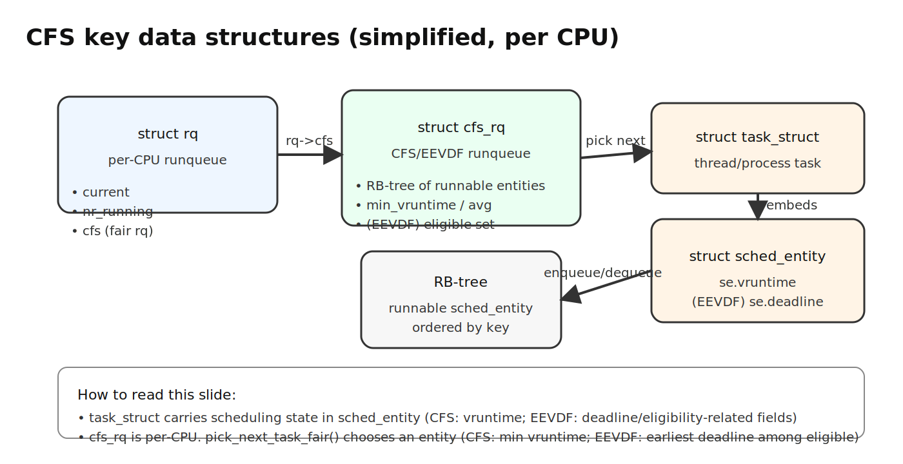
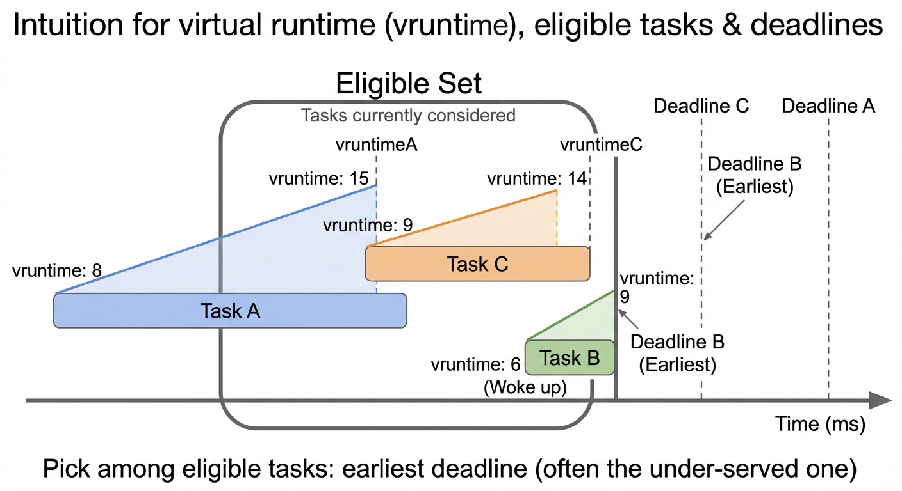
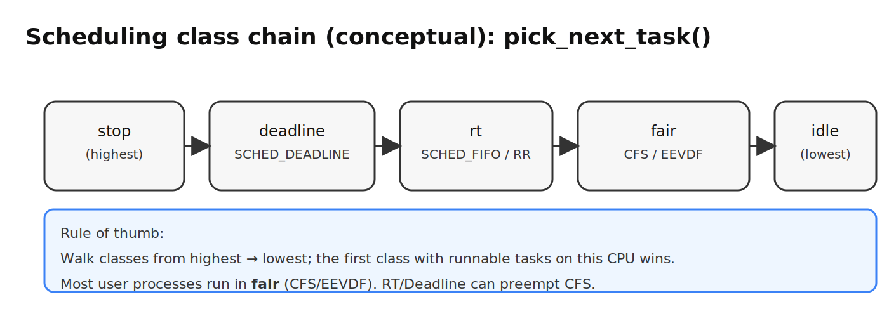
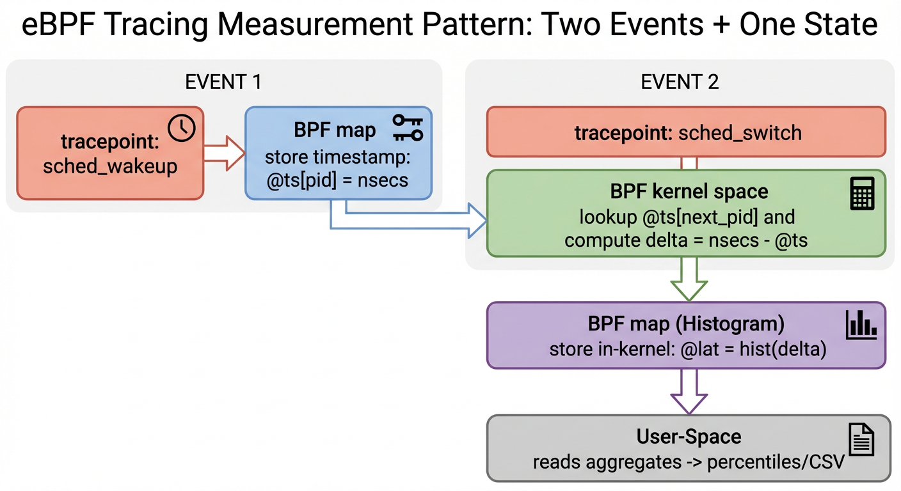

# Chapter 5: Linux Scheduler Internals and Observability

> **Learning objectives**
>
> After completing this chapter and its lab, you will be able to:
>
> - Explain how CFS / EEVDF works: weights, virtual runtime,
>   eligibility, and task selection
> - Describe the critical path from wakeup to running and identify
>   the tracepoints that observe it
> - Write small eBPF programs (bpftrace one-liners and a libbpf tool)
>   that measure scheduling latency
> - Reason about the observer effect and when eBPF overhead matters

Chapter 4 ended with a claim: tail latency is often scheduling
latency. This chapter makes that claim investigable. We open the
scheduler itself — enough to reason about why a particular task
waits — and then introduce eBPF, the standard Linux way to observe
kernel behavior from outside the kernel. By the end, you should be
able to look at any p99 latency problem and know which tracepoints
to ask.

## 5.1 CFS: The Completely Fair Scheduler

Linux 2.6.23 replaced the older O(1) multilevel-feedback scheduler
with the **Completely Fair Scheduler (CFS)**. In one sentence:

> CFS gives each runnable task CPU time proportional to its weight,
> and keeps tasks from falling too far behind.

The mechanism it uses to do that is **virtual runtime**.

### `vruntime` and weighted fairness

Each `task_struct` carries a `vruntime`, a scalar counter measured in
nanoseconds. When a task runs for `runtime` nanoseconds of real time,
its `vruntime` advances by

```text
Δvruntime = runtime × (weight_0 / weight_task)
```

where `weight_0` is the weight at `nice=0`. Two consequences:

- A task with a higher weight (lower nice value) has its `vruntime`
  advance more slowly for the same real time. It "gets credit" for
  doing less work per wall-clock second.
- A task with a lower weight (higher nice value) has its `vruntime`
  advance faster. It earns its time share in fewer real-world
  nanoseconds.

The scheduling rule is then trivially simple: at each decision point,
**run the runnable task with the smallest `vruntime`**. Smaller
`vruntime` means "most under-served relative to weight"; running it
is how CFS catches the task up.

Linux stores runnable tasks in a per-CPU **red-black tree** ordered
by `vruntime`. "Smallest `vruntime`" is the leftmost node — an O(log
n) lookup, fast enough for the scheduling hot path.


*Figure 5.1: CFS data structures. Each CPU's `rq` contains a `cfs_rq` with a red-black tree of scheduling entities ordered by `vruntime`. The leftmost node — the most under-served task — is the next to run.*

### Nice, weight, and CPU share

The `nice` values you can set correspond to a lookup table of
weights. A small slice of it:

| nice | weight (approx) | share vs nice=0 |
|---|---|---|
| −20 | 88 761 | ~86× |
| 0 | 1 024 | 1× |
| +19 | 15 | ~1/68× |

If three tasks with weights `w_A`, `w_B`, `w_C` share one CPU,
CFS allocates each a share proportional to `w_i / Σ w`. Lab 3
(Chapter 4) used `nice -n 19` to starve a background hog; the
numbers above are why it worked.

### Target latency and minimum granularity

CFS picks a **target latency** — a period over which every runnable
task should get at least one chance to run — and divides it among
runnable tasks by weight. Tunables:

- `sched_latency_ns` (default ~6 ms on desktops)
- `sched_min_granularity_ns` (lower bound per slice, default ~0.75 ms)
- `sched_wakeup_granularity_ns` (preemption threshold on wakeup)

Each task's time slice is `sched_latency × weight / Σ weights`,
clamped below by `min_granularity` to avoid pathological tiny slices
when the runqueue is long. These knobs are exposed under
`/sys/kernel/debug/sched/` on kernels with `CONFIG_SCHED_DEBUG`.

### From CFS to EEVDF

Starting with Linux 6.6, CFS was reworked into an **EEVDF**-style
scheduler (Earliest Eligible Virtual Deadline First). The high-level
model is a small generalization of classical CFS:

- **Eligibility.** A task is *eligible* to run once it has not been
  "paid" more service than it was owed. A task that was just running
  and consumed its slice becomes ineligible for a brief period; a
  task that just woke is eligible immediately.
- **Virtual deadline.** Each eligible task carries a deadline
  computed from its weight and the current virtual time. The
  scheduler picks the eligible task with the **earliest deadline**.

`vruntime` still represents "service received"; EEVDF just adds the
deadline as a more principled way to pick among eligible tasks.
Practical consequences for this book:


*Figure 5.2: EEVDF intuition. Three tasks with different vruntime values. Task B just woke with the lowest vruntime and the earliest virtual deadline, so the scheduler picks it next. The eligible set excludes tasks that have been over-served relative to their weight.*

- Existing scheduler tracepoints (`sched_wakeup`, `sched_switch`,
  `sched_migrate_task`) continue to work — they observe events, not
  internal function names.
- The "run the most under-served eligible task" intuition from CFS
  still explains most of what you see in the lab.

## 5.2 The Critical Path: Wakeup → Run

When a task becomes runnable, four things happen:

1. **Wakeup.** The task transitions from `Blocked` to `Runnable` —
   an I/O completed, a timer fired, a lock was released. The kernel
   generates `sched:sched_wakeup` (or `sched_wakeup_new` for newly
   forked tasks).
2. **Enqueue.** The task is placed in a per-CPU runqueue. The choice
   of which CPU depends on the wakeup's source CPU, affinity mask,
   cache topology, and idle-balance hints; the kernel tries to wake
   a task on a CPU that is already warm for it.
3. **Pick.** On the target CPU, the scheduler picks the next task to
   run. EEVDF/CFS walks a small chain of scheduling classes —
   Deadline (`SCHED_DEADLINE`), Realtime (`SCHED_FIFO`/`SCHED_RR`),
   Fair (normal tasks), Idle — and the first class with a runnable
   task wins. Almost everything in userspace is Fair.


*Figure 5.3: The scheduling class chain. `pick_next_task` walks the classes in strict priority order. Deadline and Realtime always preempt Fair; almost all user-space work lives in the Fair class.*
4. **Switch.** A context switch delivers CPU to the chosen task,
   generating `sched:sched_switch`.

Why does step 4 lag step 1? A few typical reasons, in roughly
decreasing order of impact:

- The CPU is busy and the current task has not reached a preemption
  point.
- The runqueue is long: multiple tasks are ahead.
- The wakeup landed on the "wrong" CPU and a migration is needed.
- A higher-priority class (RT, Deadline) is running and Fair does
  not get a chance.
- Interrupt work, kernel threads, or RCU callbacks are occupying the
  CPU briefly.

The simplest first-order predictor of scheduling latency is **how
many runnable tasks share the CPU, weighted by their weights**. That
is exactly the number you can estimate from the tracepoints in the
next section.

### sched_ext: eBPF-based scheduling classes (Linux 6.12+)

Starting with Linux 6.12 (late 2024), the kernel supports
**sched_ext** — a framework for writing entire scheduling policies
as eBPF programs. Instead of observing the scheduler from outside,
sched_ext lets you *replace* the Fair class's pick logic with a BPF
program that the verifier checks at load time.

Why this matters for this book:

- It validates the chapter's separation of policy and mechanism.
  sched_ext keeps the kernel's context-switch and runqueue
  mechanism intact; only the pick-next-task policy is pluggable.
- Production users (Meta, Google) are already deploying sched_ext
  policies for workload-specific scheduling: latency-sensitive
  front-ends get one policy, batch GPU jobs get another, all on the
  same kernel.
- The tracepoints this chapter teaches (`sched_wakeup`,
  `sched_switch`) still work under sched_ext, so nothing in the
  lab changes.

We will not write a sched_ext scheduler in this book, but
understanding CFS/EEVDF is a prerequisite for understanding what
sched_ext replaces and why.

## 5.3 Tracing the Scheduler with eBPF

**eBPF** (extended Berkeley Packet Filter) is the Linux mechanism for
loading small, verifier-checked programs that run in response to
kernel events. It is the standard way to observe kernel behavior in
production without patching or tracing tools that recompile parts of
the kernel.

Two kinds of attachment points matter for this chapter:

- **Tracepoints** are *stable* instrumentation sites deliberately
  placed in the kernel source. Their field layouts are part of the
  kernel's observable API. Scheduler tracepoints — `sched_wakeup`,
  `sched_switch`, `sched_migrate_task`, and others — have been
  stable for a decade and are the right first choice.
- **kprobes** attach to arbitrary kernel function entries. They are
  more flexible and more fragile: an inline or a rename in a new
  kernel can silently break your probe. Use tracepoints when you
  can, kprobes only when you have to.

You can list scheduler tracepoints and their fields with `bpftrace`:

```bash
$ sudo bpftrace -l 'tracepoint:sched:*'
tracepoint:sched:sched_wakeup
tracepoint:sched:sched_wakeup_new
tracepoint:sched:sched_switch
tracepoint:sched:sched_migrate_task
...

$ sudo bpftrace -lv tracepoint:sched:sched_switch
tracepoint:sched:sched_switch
    char prev_comm[16]
    pid_t prev_pid
    int prev_prio
    long prev_state
    char next_comm[16]
    pid_t next_pid
    int next_prio
```

The fields tell you what `args->...` can read inside a bpftrace
handler.

### bpftrace in one page

bpftrace is "awk for the kernel": pick an event, write a handler,
aggregate in-kernel. Four idioms are enough for most scheduler
investigations.

**Filters.** Only run the handler under a condition.

```bpftrace
tracepoint:sched:sched_switch / comm == "bash" / { @c = count(); }
```

**State.** Store per-PID or per-TID information in a BPF map.

```bpftrace
tracepoint:sched:sched_wakeup { @ts[args->pid] = nsecs; }
```

**Aggregation.** `count()`, `sum()`, `avg()`, `hist()` build the
result in kernel memory without streaming every event to userspace.

```bpftrace
@lat_us = hist($d_us);
```

**Cleanup.** `delete(@map[key])` removes one entry; `clear(@map)`
empties the whole map.


*Figure 5.4: The "two events + one state" eBPF recipe. `sched_wakeup` records a timestamp; `sched_switch` computes the delta and pushes it to an in-kernel histogram. User space reads the aggregated result — no per-event streaming required.*

Together those idioms express the canonical scheduler-latency
script, which is small enough to memorize:

```bpftrace
tracepoint:sched:sched_wakeup {
    @ts[args->pid] = nsecs;
}

tracepoint:sched:sched_switch / @ts[args->next_pid] / {
    $d_us = (nsecs - @ts[args->next_pid]) / 1000;
    @lat_us = hist($d_us);
    delete(@ts[args->next_pid]);
}
```

Two events, one piece of state: record the wakeup timestamp, look it
up when the task actually runs, push the delta to a histogram. This
is the recipe. Every measurement in this chapter's lab is a variation
on it.

### More useful one-liners

**Who is switching out the most?**

```bpftrace
tracepoint:sched:sched_switch { @sw[args->prev_comm] = count(); }
interval:s:5 { print(@sw, 20); clear(@sw); }
```

High switch-out counts reveal short CPU bursts — typically
I/O-bound work or lock contention. Note that this does *not* mean
"uses the most CPU"; for that you need runtime accounting.

**Latency broken down by program.**

```bpftrace
tracepoint:sched:sched_wakeup { @ts[args->pid] = nsecs; }
tracepoint:sched:sched_switch / @ts[args->next_pid] / {
    $d_us = (nsecs - @ts[args->next_pid]) / 1000;
    @lat_by_comm[args->next_comm] = hist($d_us);
    delete(@ts[args->next_pid]);
}
```

Produces one histogram per `comm`, so you can see which program is
living in the tail.

### A production debugging example

A concrete use of the recipe above: an inference-serving team sees
p99 latency spike from 12 ms to 80 ms on a 64-core host at ~40 %
average CPU. They attach a one-liner:

```bash
sudo bpftrace -e '
  tracepoint:sched:sched_wakeup /comm == "infer-worker"/ {
      @ts[args->pid] = nsecs;
  }
  tracepoint:sched:sched_switch /comm == "infer-worker" && @ts[args->next_pid]/ {
      @lat_us = hist((nsecs - @ts[args->next_pid]) / 1000);
      delete(@ts[args->next_pid]);
  }
  interval:s:10 { exit(); }
'
```

The histogram shows a bimodal distribution: most wakeups land in
1–5 µs, but ~2 % land in 2–8 ms. Cross-referencing with
`sched:sched_migrate_task`, those slow wakeups correlate with
cross-NUMA migrations triggered by a log-shipping cgroup that
periodically saturates one socket. Pinning the inference workers to
NUMA node 0 via `numactl --cpunodebind=0` eliminates the tail.

The point: the recipe (two events, one piece of state) is not a
classroom exercise. It is the standard first step in production
scheduler debugging.

### A second debugging vignette: cpuset isolation at cloud-provider scale

The NUMA-pinning story above shows what one team did on one
host. The platform-level version of the same problem is what
hyperscalers do across millions of cores. Three documented
patterns are worth naming:

- **AWS Nitro / Firecracker hypervisor pinning.** AWS publishes
  that each Nitro hypervisor reserves dedicated CPUs for the
  platform (network, storage, telemetry) and exposes only the
  remaining cores to the guest VM. The reservation uses
  `cpuset` cgroups to fence the platform threads off the guest
  cores. Without it, every guest's p99 would carry the variance
  of every host-side packet interrupt and EBS I/O completion.
  The published Nitro performance numbers (sub-millisecond IO
  jitter on a c7i instance) are unreachable without this
  isolation.

- **Google Borg / Kubernetes static CPU manager.** Borg's
  scheduler reserves whole physical cores for *latency-sensitive*
  jobs and leaves the *batch* jobs to share the remainder via
  CFS. Kubernetes copied the design as the kubelet's
  `--cpu-manager-policy=static`: a Pod with `Guaranteed` QoS and
  integer CPU requests gets pinned to specific cores via
  `cpuset.cpus`, while every other Pod runs on the shared pool.
  This is the production interpretation of Chapter 7's QoS
  classes — they are not just a billing tier; they are a cgroup
  membership decision that changes which CFS runqueue your
  workload competes on.

- **NUMA-aware pinning for ML inference.** Meta's published
  inference stack (the *Meta AI Research SuperCluster* and the
  Llama serving fleet) pins inference workers per NUMA node so
  that the model weights, the KV cache, and the worker thread
  all live on one socket. Cross-socket access on a modern Xeon
  costs ~2–3× the memory latency of local access; for
  bandwidth-bound decode loops, that ratio is the difference
  between meeting and missing TTFT SLO. The kernel-side support
  is straightforward (`numactl`, `cpuset.mems`); the discipline
  is in keeping the binding correct as the worker pool resizes.

Three platforms, one mechanism: `cpuset` cgroups plus NUMA
binding turn a shared multi-tenant box into something that
behaves like a private one for the tenants that need it. The
lab's eBPF tracing is the same observation tool the platform
teams used to validate that the binding actually had the
intended effect — "we set `cpuset.cpus = 0-3`" and
"`sched_migrate_task` no longer fires across the boundary" are
two independent signals that together close the evidence loop
(Chapter 3 §3).

### When bpftrace is not enough

bpftrace is perfect for exploration — a one-liner gets you a
histogram in seconds. For longer investigations you usually want:

- a stable output format (CSV for later analysis)
- precise field selection
- the ability to build up state across many probes

That is where a **libbpf**-based program comes in: C code with BPF
sections, a user-space loader, a ring buffer for events. The
`schedlab` tool in the lab is exactly this — a minimal libbpf
program that attaches to the scheduler tracepoints and writes
per-event CSV. Its `.bpf.c` file is less than a hundred lines, and
its two attachment points are the same `sched_wakeup` /
`sched_switch` pair you just saw in bpftrace.

## 5.4 Measuring Scheduling Latency

Putting it together, the measurement looks like:

1. Attach to `sched_wakeup`; store `nsecs` keyed by `pid` in a BPF
   map.
2. Attach to `sched_switch`; when the `next_pid` has a stored
   wakeup time, compute `nsecs - wakeup_time` and emit it (via
   histogram or ring buffer).
3. Delete the map entry so the wakeup is only counted once.

In user space you aggregate percentiles from the stream of latencies.
`schedlab --mode latency --duration 20 --output latency.csv` produces
one row per observed scheduling event.

Cross-check with the probe from Chapter 4's lab: the p99 reported by
`schedlab` should agree with `wakeup_lat`'s percentile to within
measurement noise. If they disagree sharply, either the eBPF tool is
misattributing events (common if the task's wakeups coalesce
faster than `sched_switch` fires) or the probe is not the only
runnable task on the CPU.

### Fairness: comparing tasks directly

The same tracepoints give you a fairness view. `sched_switch` tells
you which task got each scheduling slot. Tracking runtime per task
(time it spent as the `prev` task in each switch) and wait time
(time between a wakeup and the matching switch-in) lets you compute

```text
CPU share ≈ run_time / (run_time + wait_time)
```

for each task. In a CFS world, CPU shares should be proportional to
weights. If you launch two `stress-ng --cpu 1` workers with `nice=0`
and `nice=10`, their shares should come out roughly `1 : (1024/110) ≈
9.3 : 1`. The lab walks through this experiment.

## 5.5 Observer Effect and Measurement Overhead

Every tracing tool costs something. Three sources of overhead in
eBPF tracing:

- **Running on a hot path.** `sched_switch` fires every context
  switch — potentially millions per second on a busy machine.
- **Map operations.** Storing and loading per-PID state uses hash
  maps; a full miss is a few hundred nanoseconds.
- **Emitting events.** Streaming every event to userspace via perf
  ring buffer is strictly more work than aggregating in-kernel.

Two practical rules keep the observer effect small:

1. **Aggregate in-kernel whenever possible.** `hist()`, `count()`,
   and `sum()` are free compared to a ring-buffer event per switch.
2. **Keep per-event logic minimal.** No printing from the hot path.
   No userspace callouts. No expensive map lookups.

In this lab, with in-kernel histograms and no streaming, you should
see less than ~1 µs per event of added cost and less than a few
percent total CPU overhead even on a busy system. The optional Part D
measures this directly.

> **Warning:** Streaming scheduler events without any filter on a
> busy host can easily consume 5–20 % of a CPU and distort the very
> p99 you are trying to measure. Always start with filters (`pid`,
> `comm`, cgroup) or aggregations.

### VM reality check

In a VM, hardware PMU events are often unavailable or wrong — but
**tracepoints are not PMU events**. They are stable kernel
instrumentation that works in VirtualBox, VMware, KVM, or on bare
metal. That is why the lab uses eBPF tracepoints as its primary
measurement tool: cache-miss numbers may be zero in your VM, but the
scheduler tracepoints will be real.

## Summary

Key takeaways from this chapter:

- CFS (and its EEVDF successor since Linux 6.6) runs the most
  under-served eligible runnable task. Weight determines how fast
  `vruntime` accumulates; the red-black tree keeps "smallest
  `vruntime`" selectable in O(log n).
- The critical path from wakeup to run has four steps (wakeup,
  enqueue, pick, switch), each observable through a stable
  tracepoint.
- eBPF plus two tracepoints (`sched_wakeup` and `sched_switch`) is
  enough to measure scheduling latency precisely. The pattern —
  "two events plus one piece of state" — is small enough to write
  as a bpftrace one-liner and extend into a libbpf tool for
  production.
- The observer effect is real but manageable: aggregate in-kernel,
  keep per-event work minimal, filter early. Tracepoints work in
  VMs where hardware PMU events do not.

## Further Reading

- Molnar, I. (2007). *CFS Scheduler Design.*
  <https://www.kernel.org/doc/Documentation/scheduler/sched-design-CFS.rst>
- EEVDF paper: Stoica, I. & Abdel-Wahab, H. (1995). *Earliest
  Eligible Virtual Deadline First: A Flexible and Accurate Mechanism
  for Proportional Share Resource Allocation.*
- Gregg, B. (2019). *BPF Performance Tools.* Addison-Wesley.
  Chapters 1–3, Chapter 6: CPUs.
- Linux kernel source: `kernel/sched/fair.c`, `kernel/sched/core.c`.
- bpftrace reference:
  <https://github.com/iovisor/bpftrace/blob/master/docs/reference_guide.md>
- libbpf documentation: <https://libbpf.readthedocs.io/>
- BPF CO-RE and BTF overview:
  <https://nakryiko.com/posts/bpf-portability-and-co-re/>
