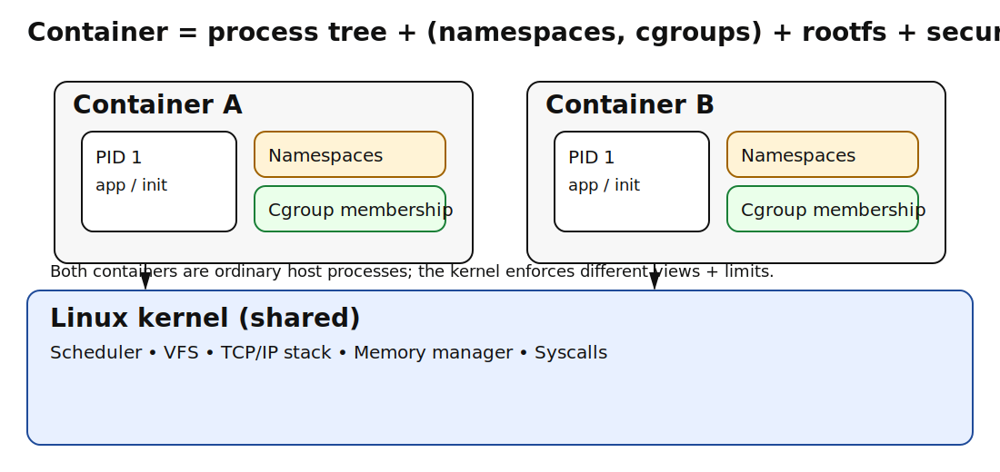
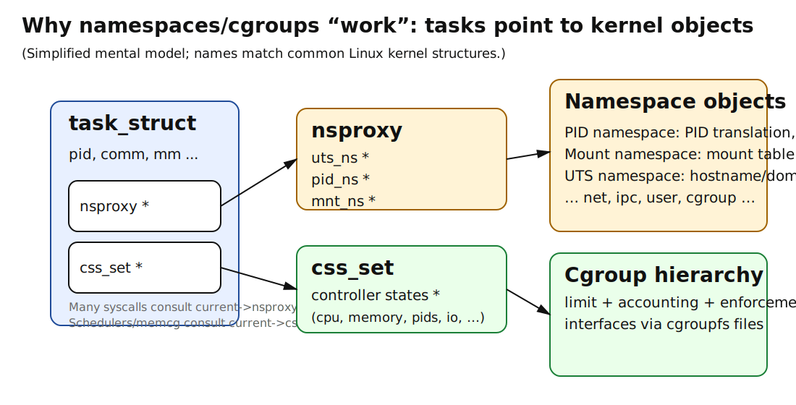
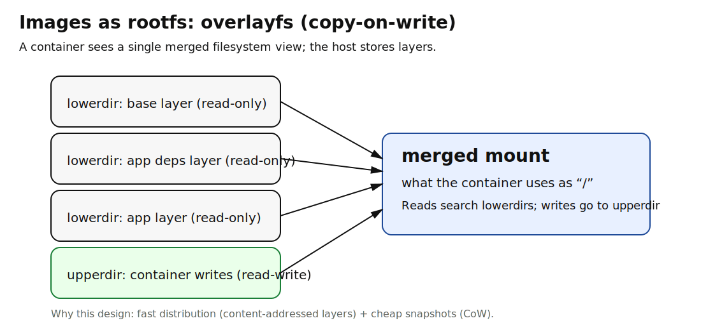
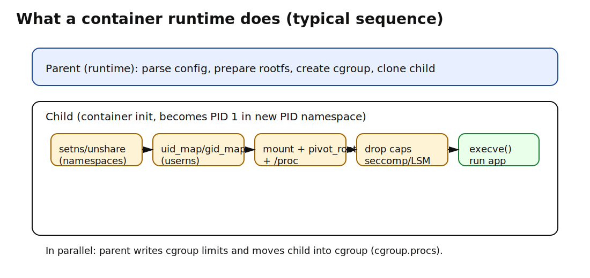

# Chapter 6: Container Foundations — Namespaces and Cgroups

> **Learning objectives**
>
> After completing this chapter and its lab, you will be able to:
>
> - Name the seven Linux namespace types and explain what each
>   isolates
> - Describe how `task_struct` fields implement container identity
> - Use cgroup v2 controllers to enforce CPU, memory, and I/O limits
> - Explain how rootless containers work via user namespace UID
>   mapping
> - Describe the role of `pivot_root` and OverlayFS in filesystem
>   isolation

Solomon Hykes demoed Docker on a hotel-room laptop at PyCon US in
March 2013, in five minutes that changed how an industry packaged
software (Hykes, 2013). What he was demonstrating was not new
technology — every primitive he used had shipped in the Linux
kernel by 2008. What was new was the idea that the existing
primitives, composed by a small userspace runtime and a layered
image format, were enough to give every developer a private
userspace on a shared kernel.

So: what *are* those primitives, and how does composing them turn
an ordinary Linux process into something a developer recognizes as
a container? The surprise, if you have not seen it before, is that
a container is *not* a new kind of object. It is an ordinary Linux
process that has been given two things: a restricted view
(namespaces) and a resource budget (cgroups). The container runtime
is a small program that composes them.

## 6.1 What is a container, and where did it come from?

The one-line answer is that a container is an ordinary Linux
process given (a) a restricted view of kernel resources and (b) a
resource budget. It is not a VM. A VM emulates hardware and runs
its own kernel; a container shares the host kernel. The boundary
of a container is not a hypervisor — it is a collection of kernel
mechanisms applied to the processes inside.

Two mechanisms do almost all of the work:

- **Namespaces** control **what the process can see**. Each namespace
  type (PID, network, mount, user, …) gives the process a private
  view of a kernel resource.
- **Cgroups** control **what the process can use**. Each controller
  (CPU, memory, I/O, pids) caps or accounts for a specific resource.

Everything else — images, registries, image layers, Kubernetes —
builds on top of those two primitives. Liz Rice's "Containers from
Scratch" talk makes the point with a hundred lines of Go (Rice,
2020); the lab at the end of this chapter makes the point with a
few hundred lines of C. When you can build a container runtime from
`clone()` and cgroup writes, you stop thinking of containers as
magic.

### A short history of one idea

The history matters because it shows that containers are the
latest stop on a long lineage of "private system view" mechanisms,
not a Docker invention. Five waypoints:

- **`chroot` (1979).** Bell Labs Version 7 Unix introduced
  `chroot` to give a process a private root directory. It is still
  the primitive that the modern `pivot_root` is built on.
- **FreeBSD jails (2000).** Kamp and Watson's *Jails: Confining the
  omnipotent root* (Kamp & Watson, 2000) extended `chroot` with
  process-table and network isolation — the first system to call
  the resulting unit a "container" in spirit.
- **Solaris Zones (2004).** Price and Tucker's design (Price &
  Tucker, 2004) generalized jails into a full multi-tenant
  abstraction with resource controls.
- **Linux namespaces (2002–2013).** Eric Biederman's *Multiple
  Instances of the Global Linux Namespaces* (Biederman, 2006) and
  Pavel Emelyanov's PID-namespace work brought Linux into
  parity. The user namespace, the trickiest one, landed in Linux
  3.8 in 2013 — the same year Docker shipped, which is not a
  coincidence.
- **Cgroups (2007).** Paul Menage's *Adding Generic Process
  Containers to the Linux Kernel* (Menage, 2007) added the resource
  side of the equation. Tejun Heo's cgroup v2 unification
  (Linux 4.5, 2016) is what we use today.

Docker's contribution was not the kernel mechanism. It was a
packaging format (image layers), a distribution model (registries),
and a developer-facing CLI that made the assembled stack accessible
to people who had never read `man 7 namespaces`. The Open Container
Initiative's runtime and image specs (OCI, 2015) later codified the
result so that runc, containerd, CRI-O, and Podman could
interoperate.


*Figure 6.1: A container is an ordinary process. Namespaces restrict what it can see; cgroups restrict what it can use. There is no "container" kernel object — the isolation is built from the same process mechanisms Chapter 4 introduced.*

The kernel's record of "which container is this process in" is
three pointers in `task_struct`: `nsproxy` (which namespaces),
`cred` (UID, GID, capabilities), and `cgroups` (which cgroup).
When `clone()` creates a child with `CLONE_NEW*` flags, the kernel
copies the parent's `nsproxy`, swaps in the new namespace objects,
and attaches the result to the child. Different tasks sharing
`nsproxy` see the same namespaces; different tasks with different
`nsproxy`s do not. That is the entire mechanism. Two processes are
"in the same container" iff their `nsproxy`, `css_set`, and
relevant `cred` all match — a property you can verify by reading
`/proc/<pid>/ns/` and `/proc/<pid>/cgroup`.


*Figure 6.2: The kernel's view of a container is just three pointers in `task_struct`. `nsproxy` determines which namespaces the process sees; `cred` determines its capabilities; `cgroups` determines its resource budget. Docker, Kubernetes, and Podman all use these same three pointers; they differ in how they arrange the runtime, not in what the kernel sees.*

> **Key insight:** Containers do not add new OS abstractions; they
> partition existing ones. PID namespaces partition the process
> table. Mount namespaces partition the mount tree. cgroup memory
> partitions physical RAM. Once you see the pattern, every "new"
> container feature becomes "oh, a new namespace" or "oh, a new
> cgroup controller".

## 6.2 What does each namespace isolate?

Linux currently has **seven namespace types** that matter in
practice (eight if you count `time`, added in Linux 5.6, which is
rarely relevant to this book). Each landed in a different kernel
release over the decade-long buildout that Biederman (2006)
started; `man 7 namespaces` carries the full history. For
operational work, the one-line summaries are enough:

| Namespace | What it isolates |
|---|---|
| **UTS** | Hostname and domain name |
| **PID** | Process IDs — each namespace has its own PID 1 |
| **Mount (MNT)** | Mount table — `/proc/mounts` is per-namespace |
| **Network (NET)** | Network interfaces, routing tables, sockets, ports |
| **User (USER)** | UIDs and GIDs — plus the kernel-visible "am I root?" |
| **IPC** | System V IPC, POSIX message queues |
| **Cgroup** | The root of the cgroup tree a process sees |

A container typically enters all of these at once. A "container" as
the user understands it is the set of processes sharing those seven
namespaces plus a cgroup.

### Creating namespaces: `clone` and `unshare`

Two syscalls do the work. `clone()` creates a new process (like
`fork`) with additional flags that put the new process into new
namespaces:

```c
#define _GNU_SOURCE
#include <sched.h>

int flags = CLONE_NEWUTS | CLONE_NEWPID | CLONE_NEWNS
          | CLONE_NEWUSER;
pid_t child = clone(child_fn, stack_top, flags | SIGCHLD, arg);
```

`unshare()` is `clone`'s cousin: it detaches the *calling* process
from its current namespace(s) and puts it into new ones. Useful at
the command line:

```bash
# Create a new PID namespace in a new process (needs root by default)
sudo unshare --pid --fork --mount-proc /bin/bash

# Create a new user namespace — unprivileged!
unshare --user --map-root-user /bin/bash
# Inside: `id` reports uid=0, but you are not really root on the host.
```

The last example is the heart of rootless containers, which
§6.5 covers.

### Inspecting namespaces: `/proc/<pid>/ns/`

Every process has a small directory of symlinks that identify which
namespace it currently inhabits:

```bash
$ ls -la /proc/$$/ns/
total 0
lrwxrwxrwx 1 dong dong 0 cgroup -> 'cgroup:[4026531835]'
lrwxrwxrwx 1 dong dong 0 ipc    -> 'ipc:[4026531839]'
lrwxrwxrwx 1 dong dong 0 mnt    -> 'mnt:[4026531840]'
lrwxrwxrwx 1 dong dong 0 net    -> 'net:[4026531969]'
lrwxrwxrwx 1 dong dong 0 pid    -> 'pid:[4026531836]'
lrwxrwxrwx 1 dong dong 0 user   -> 'user:[4026531837]'
lrwxrwxrwx 1 dong dong 0 uts    -> 'uts:[4026531838]'
```

Two processes are in the same namespace iff their symlinks point at
the same inode number. This is also how `nsenter` works: it opens
one of these files, calls `setns()` to join the namespace, and
leaves you inside the container with no Docker daemon involved.
This is the operational definition of "running a process inside a
container" — it has nothing to do with Docker as such.

## 6.3 Cgroups v2

Namespaces handle visibility. The other half of the container story
is quantity: how much CPU, memory, or I/O is the process allowed to
consume? That is the **cgroups** subsystem. A cgroup is a node in a
tree; controllers attached to the tree enforce resource limits and
collect accounting data for every process in the subtree rooted at
that node.

Cgroups began in 2007 as Paul Menage's *generic process containers*
at Google (Menage, 2007), driven by Borg's need to bin-pack jobs
onto shared machines. The original v1 design grew separate
hierarchies per controller — a permissive structure that turned out
to be a maintenance disaster, with controllers fighting over how to
delegate, account, and migrate. Tejun Heo led a multi-year
redesign that culminated in **cgroup v2**: one unified hierarchy
under `/sys/fs/cgroup`, merged into Linux 4.5 in 2016. Cgroup v2 is
the only version this book uses; v1 still exists in the kernel for
backward compatibility, but every modern container runtime
(systemd, containerd, CRI-O, Docker on systemd-cgroup) defaults to
v2.

### The filesystem interface

```bash
$ mount | grep cgroup2
cgroup2 on /sys/fs/cgroup type cgroup2 ...

$ cat /sys/fs/cgroup/cgroup.controllers
cpu io memory pids cpuset hugetlb rdma

$ cat /proc/$$/cgroup
0::/user.slice/user-1000.slice/session-5.scope
```

To make a cgroup, create a directory; to destroy it, `rmdir`. To add
a process, write its PID to `cgroup.procs`. Everything else is
reading and writing files.

### The five files you will touch most

Assume a cgroup at `/sys/fs/cgroup/mylab`:

- **`cgroup.procs`** — list of PIDs in this cgroup. Write a PID to
  add it.
- **`cpu.max`** — `"<quota_us> <period_us>"`. `"50000 100000"` means
  50 ms of CPU per 100 ms — half a CPU. `"max <period>"` means
  unlimited.
- **`memory.max`** — maximum memory usage in bytes. Writing `max`
  removes the limit.
- **`memory.current`** — current usage. Read-only.
- **`memory.events`** — counters: `oom`, `oom_kill`,
  `max`-breaches, `low`-pressure events. Read-only.

A complete example of a 512 MiB memory cap:

```bash
sudo mkdir /sys/fs/cgroup/mylab
echo $((512 * 1024 * 1024)) | sudo tee /sys/fs/cgroup/mylab/memory.max
echo $$ | sudo tee /sys/fs/cgroup/mylab/cgroup.procs
# Your shell (and everything it launches) is now capped at 512 MiB.
```

You will recognize this pattern from Lab 2 in Chapter 3, which used
cgroup memory limits to reproduce a p99 spike.

### How the kernel enforces limits

The mechanism differs per controller:

- **CPU.** The `cpu` controller uses **CFS bandwidth control**. The
  cgroup has a quota and a period; when the quota for the current
  period is exhausted, tasks in the cgroup are **throttled** (moved
  off-runqueue) until the next period. You will see this as spiky
  tail latency in Chapter 7.
- **Memory.** The `memory` controller accounts every page charged
  to tasks in the cgroup. Exceeding `memory.max` triggers reclaim
  first (writing dirty pages, freeing clean cache) and the OOM
  killer if reclaim cannot find enough. `memory.events` increments
  `oom_kill` when a task is killed.
- **I/O.** The `io` controller rate-limits block device I/O via
  `io.max` (bandwidth caps) or `io.weight` (proportional share).
- **PIDs.** The `pids` controller caps the number of processes in
  the cgroup — useful against fork bombs in multi-tenant settings.

All of this is kernel code. The runtime is just a userspace program
that arranges the right writes.

## 6.4 How does a container get its own filesystem?

Mount namespaces give a process a private mount tree, but that is
not enough to make a container. The container also needs:

1. A **rootfs** — a directory that looks like a miniature Linux
   root filesystem (`/bin`, `/lib`, `/etc`, …).
2. A way to make the rootfs the container's root directory.
3. A `/proc` mount that reflects the PID namespace, not the host's.

### `chroot` vs `pivot_root`

`chroot(new_root)` changes the current process's notion of `/` to
`new_root`. It is simple and ancient. It is also escapable — a
process with capabilities can fairly easily break out of a chroot
— and does not detach the old root.

`pivot_root(new_root, put_old)` swaps the current root with
`new_root` and moves the old root to `put_old` (a directory under
the new root). After `pivot_root`, you can `umount` and `rmdir` the
old root, leaving the container's only visible filesystem as the
new one. `pivot_root` is what production runtimes use.

The minimal sequence, adapted from the lab:

```c
// 1. Make mounts private so the container does not disturb the host.
mount(NULL, "/", NULL, MS_REC | MS_PRIVATE, NULL);

// 2. Bind-mount the rootfs onto itself (pivot_root requires this).
mount(rootfs, rootfs, NULL, MS_BIND | MS_REC, NULL);

// 3. Make a place to stash the old root.
mkdir(rootfs "/old_root", 0755);

// 4. Perform the swap.
pivot_root(rootfs, rootfs "/old_root");
chdir("/");
umount2("/old_root", MNT_DETACH);
rmdir("/old_root");

// 5. Mount a fresh /proc (needed for PID namespace correctness).
mount("proc", "/proc", "proc", 0, NULL);
```

### OverlayFS and image layers

A container image is typically a stack of read-only layers plus a
thin writable layer on top. **OverlayFS** is the Linux kernel
filesystem that composes these: a *lowerdir* (read-only, possibly
many stacked), an *upperdir* (writable), and a *merged* view that
reads from the upper layer when present and falls back to the
lowers. Writes copy the modified file into the upper layer
(copy-on-write).

The idea predates OverlayFS. Plan 9 had union directories in the
1990s; Linux had several earlier attempts (UnionFS, AUFS) that
Docker initially used but never made it into the mainline kernel.
Miklos Szeredi's OverlayFS was merged in Linux 3.18 (December 2014)
and quickly became the standard storage driver for every major
container runtime. The reason starting a container feels instant is
this layer reuse: the lower layers have been cached on the host
since the previous `docker pull`, so the per-container cost is
just the upper layer plus the cgroup setup.


*Figure 6.3: OverlayFS composes read-only image layers with a writable upper layer. Reads fall through to the first layer that has the file; writes copy the file into the upper layer (copy-on-write). This is why starting a container is fast: the lower layers are shared and cached.*

For this book, the important observation is that OverlayFS is a
regular Linux filesystem. You can `mount -t overlay` it yourself
without Docker. Image distribution (registries, content-addressable
layers) is a userspace convention built on top.

### Putting it all together: the container creation timeline

The full sequence — `clone` with namespace flags, write UID/GID
maps, set up mounts and `pivot_root`, write cgroup limits, `exec`
the user program — is what a container runtime does on every
`docker run` or `kubectl create pod`. Figure 6.4 shows the timeline
end-to-end.


*Figure 6.4: The container creation timeline. The parent process orchestrates namespace and cgroup setup; the child enters the isolated environment and exec's the workload. The entire sequence is ordinary syscalls — no hypervisor, no special kernel module.*

## 6.5 What does "rootless" actually buy you?

A container whose processes think they are root but are not actually
root on the host is called **rootless**. It is a dramatic security
improvement: if the container escapes any of its namespaces, the
damage is bounded by the *host* UID the namespace maps to, not by
host root.

The mechanism is **user namespaces with UID mapping**. Inside the
new namespace, UID 0 is mapped to (say) host UID 1000. From the
container's perspective:

```bash
$ unshare --user --map-root-user /bin/bash
# id
uid=0(root) gid=0(root) groups=0(root),65534(nobody)
```

From the host's perspective, that `bash` is still running as UID
1000. The kernel enforces operations based on the *host* UID, so
"root" inside the namespace cannot, for example, read
`/etc/shadow` on the host.

The mapping is written to `/proc/<pid>/uid_map` and
`/proc/<pid>/gid_map`:

```c
// inside the parent after clone()
snprintf(path, sizeof(path), "/proc/%d/uid_map", child_pid);
snprintf(content, sizeof(content), "0 %d 1", getuid());
int fd = open(path, O_WRONLY);
write(fd, content, strlen(content));
close(fd);
```

`"0 1000 1"` means "inside the namespace, UID 0 maps to host UID
1000; exactly one UID is mapped". Writing `gid_map` works the same
way, with one quirk: on modern kernels you must also write
`"deny"` to `/proc/<pid>/setgroups` before `gid_map` for an
unprivileged caller.

### What rootless does not buy you

User namespaces do not remove the shared-kernel threat. A kernel bug
that bypasses the namespace check — and several such bugs have been
CVE'd over the years (CVE-2022-0185, CVE-2022-0492, CVE-2023-0386
are recent examples) — gives an attacker whatever privilege the
kernel allows. Rootless containers also expand the kernel's attack
surface to unprivileged callers, and every few years a new class of
user-namespace-escape vulnerability appears. Walsh (2019) is the
standard practitioner reference on the resulting threat model.

The net verdict from the security community is still "yes, use
rootless when you can". But it is not a substitute for a hypervisor
for high-assurance isolation. Three projects fill the gap when you
need stronger separation than Linux namespaces alone provide:

- **gVisor** (Young, 2019). A user-space kernel written in Go that
  intercepts container syscalls and re-implements them, so the
  host kernel sees only a small attack surface. Used in Google
  Cloud Run and App Engine.
- **Kata Containers** (Intel × Hyper.sh, 2017–). Runs each
  container in a lightweight VM with a real kernel. Slightly
  heavier startup than runc, but full hardware-level isolation.
- **Firecracker** (Agache et al., 2020). AWS's microVM monitor,
  the substrate underneath Lambda and Fargate. Boots a guest
  kernel in ~125 ms and exposes a 4 KB attack surface to the
  guest — dramatically smaller than a general-purpose VMM.

All three present an OCI-compatible container interface to the
user, so they are drop-in replacements for runc when the
threat model demands it. The tradeoff is the usual one: stronger
isolation costs CPU, memory, and startup latency.

## 6.6 Beyond namespaces and cgroups: seccomp and capabilities

Namespaces and cgroups are the two primary isolation axes, but
production runtimes add a third: **syscall filtering**. Without it,
a compromised process inside a container has the entire kernel
system-call surface to attack from — several hundred syscalls,
including obscure ones that have been the source of repeated
privilege-escalation CVEs.

**Linux capabilities** split the traditional root/non-root binary
into ~40 fine-grained permissions (Hallyn & Morgan, 2008). A
container runtime typically drops all capabilities except a small
allow-list — Docker's defaults include `CAP_NET_BIND_SERVICE`,
`CAP_CHOWN`, `CAP_SETUID`, `CAP_SETGID`, and a handful of others.
This limits what even UID 0 inside the container can do: a process
with `CAP_NET_BIND_SERVICE` dropped cannot bind to port 80 even as
root.

**seccomp-bpf** (Drewry, 2012) goes further: it installs a Berkeley
Packet Filter program that runs on every syscall and decides
whether to allow it, deny it with `EPERM`, kill the process, or
trap to a userspace handler. Docker's default seccomp profile
blocks roughly 40–50 syscalls that containers almost never need
(`mount`, `reboot`, `kexec_load`, various kernel-module
operations); Kubernetes applies its own default profile starting
with v1.27 (KEP-2413).

The structural observation is the one the chapter has been
driving at: namespaces restrict *which resources* a process sees,
cgroups restrict *how much* it can use, and seccomp restricts
*what operations* it can perform. Together, they form a
defense-in-depth stack — each layer catching things the others
miss.

## Summary

Key takeaways from this chapter:

- A container is an ordinary process with restricted visibility
  (namespaces) and a resource budget (cgroups). Nothing more.
- Seven namespaces partition distinct kernel resources: UTS, PID,
  Mount, Network, User, IPC, Cgroup. `clone()` and `unshare()`
  create them; `/proc/<pid>/ns/` inspects them.
- Cgroup v2 is a unified filesystem hierarchy at `/sys/fs/cgroup`.
  Controllers enforce CPU (via CFS bandwidth control), memory (via
  OOM), I/O (via `io.max`), and PID limits. Adding a process is
  `echo $PID > /cgroup/path/cgroup.procs`.
- Filesystem isolation uses mount namespaces plus `pivot_root`. A
  typical rootfs is an OverlayFS stack of read-only image layers
  with a writable upper layer.
- Rootless containers map container UID 0 to an unprivileged host
  UID via user namespaces. They reduce risk but do not eliminate
  the shared-kernel threat.
- Production runtimes add a third axis: syscall filtering via
  capabilities and seccomp-bpf, restricting what operations a
  container can perform.

## Further Reading

### Lineage and historical papers

- Kamp, P.-H., & Watson, R. N. M. (2000). "Jails: Confining the
  omnipotent root." *SANE 2000.*
  <https://www.usenix.org/legacy/events/sane2000/full_papers/kamp/kamp_html/>
- Price, D., & Tucker, A. (2004). "Solaris Zones: Operating System
  Support for Consolidating Commercial Workloads." *USENIX LISA.*
- Biederman, E. W. (2006). "Multiple Instances of the Global Linux
  Namespaces." *Linux Symposium.*
- Menage, P. (2007). "Adding Generic Process Containers to the
  Linux Kernel." *Linux Symposium.*
- Hykes, S. (2013). "The future of Linux containers." Lightning
  talk, PyCon US 2013. (The original Docker public demo.)
- Open Container Initiative (2015–). *Runtime and Image Format
  Specifications.* <https://opencontainers.org/>

### Tutorials and references

- Kerrisk, M. (2013–2016). *Namespaces in Operation.* LWN.net series.
  Start at <https://lwn.net/Articles/531114/>.
- Linux kernel documentation: `Documentation/admin-guide/cgroup-v2.rst`.
- Rice, L. (2020). *Container Security.* O'Reilly Media.
  Companion talk: *Containers from Scratch* (KubeCon).
- Walsh, D. (2019). *Container Security.* O'Reilly Media.
- Julia Evans. *What even is a container?*
  <https://jvns.ca/blog/2016/10/10/what-even-is-a-container/>
- `man 7 namespaces`, `man 7 cgroups`, `man 2 clone`,
  `man 2 unshare`, `man 2 pivot_root`.

### Stronger isolation

- Young, E., et al. (2019). "The True Cost of Containing: A gVisor
  Case Study." *HotCloud.*
- Agache, A., Brooker, M., et al. (2020). "Firecracker: Lightweight
  virtualization for serverless applications." *NSDI.*
  <https://www.usenix.org/conference/nsdi20/presentation/agache>
- Manco, F., et al. (2017). "My VM is Lighter (and Safer) than your
  Container." *SOSP.* (Unikernels and lightweight VMs as a
  container alternative.)
- Kata Containers project. <https://katacontainers.io/>

### Syscall filtering

- Drewry, W. (2012). "Dynamic seccomp policies (using BPF
  filters)." LWN.net. <https://lwn.net/Articles/475043/>
- Hallyn, S., & Morgan, A. G. (2008). "Linux Capabilities: Making
  Them Work." *Linux Symposium.*
