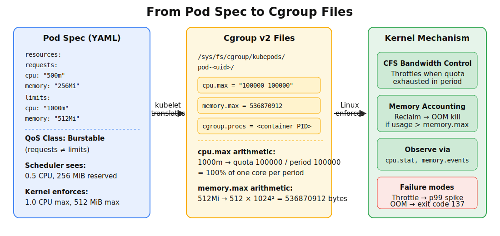
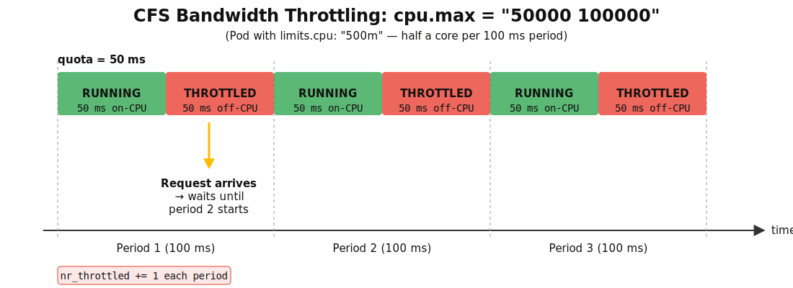

# Chapter 7: Kubernetes as a Resource Manager

> **Learning objectives**
>
> After completing this chapter and its lab, you will be able to:
>
> - Distinguish between Kubernetes requests (used for scheduling)
>   and limits (used for enforcement via cgroups)
> - Explain the three QoS classes (Guaranteed, Burstable,
>   BestEffort) and their eviction priority
> - Diagnose CPU throttling using CFS bandwidth control and
>   `nr_throttled` counters
> - Explain memory OOM behavior and kubelet eviction signals

Chapter 6 ended with cgroups and namespaces — the Linux primitives
for isolation. Kubernetes is the next layer up: a declarative
interface for expressing which processes should run, on which node,
with which resource budget. From the kernel's perspective, nothing
new happens; `kubelet` translates Pod specs into exactly the cgroup
writes you performed by hand in the previous lab. What Kubernetes
adds is a cluster-wide control plane that decides *where* to
enforce, not *how*. This chapter walks the translation, and the lab
lets you watch it happen.

## 7.1 From Cgroups to Kubernetes

Kubernetes works with three abstractions, in order of granularity:

- A **container** is a packaged process, the same thing Chapter 6
  built by hand.
- A **Pod** is a co-scheduled group of containers sharing a network
  namespace, a loopback interface, and selected volumes.
- A **Deployment** (or other controller) is a reconciler that keeps
  the desired number of Pods alive.

The important observation for this book is that **a Pod is a
cgroup**. When the scheduler assigns a Pod to a node, `kubelet`
creates a cgroup for it under `/sys/fs/cgroup/kubepods.slice/...`,
writes the Pod's resource fields into the cgroup's control files,
and asks the container runtime (containerd, CRI-O) to launch the
containers inside. Everything else — networking, volumes, service
discovery — is orchestration on top of those cgroup writes.


*Figure 7.1: The translation chain from Pod spec to kernel enforcement. The YAML resource fields become cgroup control files; the kernel mechanisms Chapter 6 introduced do the actual work. "Kubernetes decides, kubelet translates, Linux enforces."*

A useful sentence to repeat: **Kubernetes decides, `kubelet`
translates, Linux enforces.** Each layer has its own job, and most
incident investigations can be categorized by which layer owns the
problem.

## 7.2 Requests, Limits, and QoS Classes

Every container in a Pod spec can declare two resource numbers per
resource type (CPU and memory, at minimum):

```yaml
resources:
  requests:
    cpu: "100m"      # 0.1 CPU
    memory: "64Mi"
  limits:
    cpu: "200m"
    memory: "128Mi"
```

They play different roles, and confusing them is the most common
Kubernetes resource mistake.

- **`requests`** are what the *scheduler* uses. "Does this Pod fit
  on that node?" means "is the node's remaining request capacity
  enough for this Pod's requests?" The scheduler never looks at
  limits.
- **`limits`** are what the *kubelet* enforces after placement. They
  become `cpu.max` and `memory.max` on the Pod's cgroup. A container
  cannot exceed them without being throttled (CPU) or killed
  (memory).

One sentence to memorize: **request answers "may this Pod be placed
here?"; limit answers "how far may this Pod go after it is
running?"**.

### The three QoS classes

Based on requests and limits, Kubernetes assigns each Pod one of
three **QoS classes**:

| QoS class | Rule | Behavior |
|---|---|---|
| **Guaranteed** | Every container has `requests == limits` for CPU *and* memory | Last to be evicted under pressure; predictable performance |
| **Burstable** | At least one container has a request, but not all match limits | Can exceed requests if CPU is idle; second to be evicted |
| **BestEffort** | No requests or limits specified | First to be evicted; uses whatever is available |

QoS class is computed automatically — you do not set it — and it
determines two things:

1. The **OOM score adjustment** the kubelet applies to the Pod's
   processes. BestEffort Pods get a high `oom_score_adj`, making
   them the kernel's first OOM victims under node memory pressure.
2. The **order in which the kubelet evicts Pods** when node-level
   resources run low. BestEffort → Burstable → Guaranteed.

> **Key insight:** QoS is not a priority knob you tune. It is a
> *label computed from your resource fields.* To get Guaranteed,
> set `requests == limits`. Nothing else.

You can verify a Pod's class:

```bash
kubectl get pod mypod -o custom-columns=NAME:.metadata.name,QOS:.status.qosClass
```

## 7.3 CPU Throttling

When a Pod's `cpu` limit is below what it actually wants, the kernel
enforces it through **CFS bandwidth control**. The mechanism is
already familiar from Chapter 6: two numbers, `quota` and `period`,
written to `cpu.max`. A Pod with `limits.cpu: "500m"` gets roughly

```text
cpu.max = "50000 100000"
```

meaning "50 ms of CPU per 100 ms period". Any CPU use above the
quota during the current period is **throttled**: the scheduler
takes the Pod's threads off-runqueue for the rest of the period and
resumes them at the next boundary.

### Why this hurts latency

Throttling is not rate-limiting in the graceful sense. The Pod
consumes its quota, hits the wall, and stops *hard* until the next
period. A request that arrives during the throttled window sees the
process go off-CPU for up to 100 ms at a time — a classic tail-
latency killer.


*Figure 7.2: CFS bandwidth throttling in action. A Pod with `limits.cpu: "500m"` gets 50 ms of CPU per 100 ms period. When it exhausts the quota, it stops hard. A request arriving during the throttled window pays the full remaining wait — this is where the tail latency comes from.*

The kernel exposes the pain through `cpu.stat`:

```bash
$ cat /sys/fs/cgroup/kubepods.slice/.../cpu.stat
usage_usec 182410000
user_usec  170000000
system_usec 12410000
nr_periods 2431
nr_throttled 287       # number of periods in which the cgroup was throttled
throttled_usec 8420000 # cumulative throttled time
```

Two signals matter:

- **`nr_throttled`** — how many periods ended with the cgroup
  exhausting quota. If this is rising, you are being throttled right
  now.
- **`throttled_usec / nr_periods`** — how long per period, on
  average, the cgroup was off-CPU.

A good first diagnostic for "Kubernetes pod p99 is bad" is to look
at `cpu.stat` on the Pod's cgroup. If `nr_throttled` is climbing,
raise `limits.cpu` or tune the workload's concurrency. If it is not,
the bottleneck is elsewhere (memory, I/O, or scheduling contention
with other Pods on the node).

### Common traps

- **Multi-threaded programs with tight CPU limits.** A Pod with
  `limits.cpu: "1000m"` (one CPU) running an 8-threaded JVM will
  burn its quota in 1/8 of a period and throttle for 7/8. The fix
  is either to raise the limit or to reduce thread count.
- **`GOMAXPROCS` / runtime heuristics.** Many language runtimes
  autosize their thread pool from the number of host CPUs, not from
  the cgroup's limit. On old kernels, a Go program in a 500 m CPU
  cgroup on a 32-core node would spawn 32 worker threads and
  ceaselessly throttle. Newer Linux and newer runtimes (Go 1.22+)
  read the cgroup limit; if you are stuck on old code, set
  `GOMAXPROCS` explicitly.
- **"I am not CPU-bound."** The shape of a CPU-throttled workload
  is that average CPU utilization is *low*, because the Pod spends
  most of its time off-CPU. `nr_throttled` is the signal, not
  `cpu.usage`.

## 7.4 Memory Limits and OOM

Memory enforcement is more brutal. `limits.memory` becomes
`memory.max`, and when the cgroup's usage would exceed it, the
kernel:

1. Attempts to reclaim pages (write dirty ones back, drop clean
   cache).
2. If reclaim cannot find enough, invokes the cgroup OOM killer,
   which kills a process in the cgroup.
3. Updates `memory.events`: `oom` increments whenever the OOM
   killer runs in this cgroup; `oom_kill` increments per
   process killed.

From a Pod's perspective, this appears as:

```text
State:       Terminated
  Reason:    OOMKilled
  Exit Code: 137        # SIGKILL = 128 + 9
Last State:  Terminated
  Reason:    OOMKilled
```

and `Restart Count` increments if the Pod has a restart policy.

### cgroup OOM vs node OOM

Two levels of OOM exist, and they behave differently:

- **cgroup OOM** (per-Pod). Triggered by a single Pod exceeding its
  own `memory.max`. Kills *a process in that cgroup*; other Pods
  are not affected. Visible in Pod status as `OOMKilled`.
- **Node OOM** (per-host). Triggered by the kernel running out of
  memory system-wide. Kills the process with the highest effective
  `oom_score` — which, as §7.2 noted, is biased toward BestEffort
  Pods. Visible in `dmesg` as `Out of memory: Killed process ...`.

`kubelet` also evicts Pods before node OOM when it detects node-
level pressure (see §7.5). Eviction is the orderly path; node OOM
is the kernel's last resort when eviction is too slow.

### Typical investigation

```bash
# From inside the Pod or kubectl describe:
kubectl describe pod mypod           # look for OOMKilled in status
kubectl logs mypod --previous        # last logs before the kill

# On the node:
sudo dmesg -T | grep -i "oom\|kill"  # kernel OOM record
cat /sys/fs/cgroup/kubepods.slice/.../memory.current  # current usage
cat /sys/fs/cgroup/kubepods.slice/.../memory.events    # OOM counters
```

A Pod that was `OOMKilled` during a traffic burst almost always
tells the same story: `memory.current` climbed to `memory.max`,
`memory.events:oom` incremented, the kernel killed the largest
process in the cgroup. Raise the limit or reduce the working set.

## 7.5 Kubelet Eviction

Before the kernel OOM killer runs, `kubelet` tries to handle memory
pressure proactively. It monitors **node-level signals** and, when
thresholds are crossed, evicts Pods in order of QoS class and
resource usage.

Key signals (all exposed by `kubelet --v=4` and by summary metrics):

- `memory.available` — free memory on the node
- `nodefs.available` — free disk on the node's filesystem
- `imagefs.available` — free disk on the container image store
- `pid.available` — PID headroom

Each has **soft** and **hard** eviction thresholds:

- A **soft** threshold triggers eviction after a grace period,
  allowing Pods to shut down cleanly.
- A **hard** threshold evicts immediately — less graceful, but
  avoids sliding into node OOM.

Eviction order:

1. BestEffort Pods using the most of the pressured resource.
2. Burstable Pods exceeding their request for the pressured
   resource.
3. Burstable Pods below their request (last among Burstable).
4. Guaranteed Pods — evicted only as a last resort, typically
   because of a `system-reserved` overrun.

Understanding this ordering lets you design capacity planning:
workloads that must survive pressure should be Guaranteed;
background batch work can be BestEffort and stay cheap.

## 7.6 Where the Scheduler Fits (Forward Pointer)

QoS, throttling, and OOM all act on a Pod *after* it has been
placed on a node. The placement decision itself — the Filter →
Score → Bind pipeline that picks the node — is the subject of
Chapter 9. For this chapter you only need one fact about it: the
scheduler's `NodeResourcesFit` filter compares each Pod's *requests*
(not limits) against the node's remaining *request budget*. That
is why a Pod that fits comfortably under a node's actual idle
CPU can still be reported as `0/3 nodes are available: 3
Insufficient cpu`. The node has free CPU; what it does not have
is free *request capacity* to promise the new Pod.

The diagnostic command is the same one you have used throughout
this chapter:

```bash
kubectl describe pod mypod | grep -A 10 Events
# 0/3 nodes are available: 3 Insufficient cpu.
```

"Insufficient cpu" is a *filter* failure, not an enforcement
failure. The fix is to free request capacity (delete or rightsize
other Pods) or to lower this Pod's `requests`. Raising `limits`
does not help, because filter math does not look at limits.

Chapter 9 covers the rest: how Filter and Score plugins are
wired together, how Taints / Tolerations / Affinity layer onto
the pipeline, how `MostAllocated` vs `LeastAllocated` choose
packing vs spreading, and how Priority + Preemption let urgent
Pods evict less important ones. The Chapter 9 lab
(`scheduler-sim`) implements three of these policies (FIFO,
Backfill, DRF) as a Python simulator so you can see the
placement decisions side-by-side.

## Summary

Key takeaways from this chapter:

- Kubernetes does not replace cgroups — it *declares* them. A Pod
  is a cgroup; its resource fields become `cpu.max`,
  `memory.max`, and so on. "Kubernetes decides, kubelet
  translates, Linux enforces."
- `requests` and `limits` do different jobs.
  Requests drive scheduling; limits drive enforcement. QoS class
  is computed from how the two relate, and it governs eviction
  order.
- CPU throttling is CFS bandwidth control in disguise. The signal
  is `cpu.stat:nr_throttled`, not `cpu.usage`. Latency-sensitive
  Pods should either have headroom in their CPU limit or use
  Guaranteed QoS.
- Memory OOM comes in two flavors: cgroup OOM (per-Pod) and node
  OOM (per-host). Kubelet eviction is the orderly path; node OOM
  is what happens when eviction is too slow.
- The scheduler pipeline (Filter → Score → Bind) is where
  Pending Pods get stuck. `kubectl describe pod` events tell you
  which phase blocked, and the fix depends on the phase.

## Further Reading

- Kubernetes documentation: *Managing Resources for Containers.*
  <https://kubernetes.io/docs/concepts/configuration/manage-resources-containers/>
- Kubernetes documentation: *Configure Quality of Service for Pods.*
  <https://kubernetes.io/docs/tasks/configure-pod-container/quality-service-pod/>
- Kubernetes documentation: *Node-pressure Eviction.*
  <https://kubernetes.io/docs/concepts/scheduling-eviction/node-pressure-eviction/>
- Gregg, B. (2020). *Systems Performance*, 2nd ed. Chapter 11:
  Cloud Computing.
- kube-scheduler framework: <https://kubernetes.io/docs/concepts/scheduling-eviction/scheduling-framework/>
