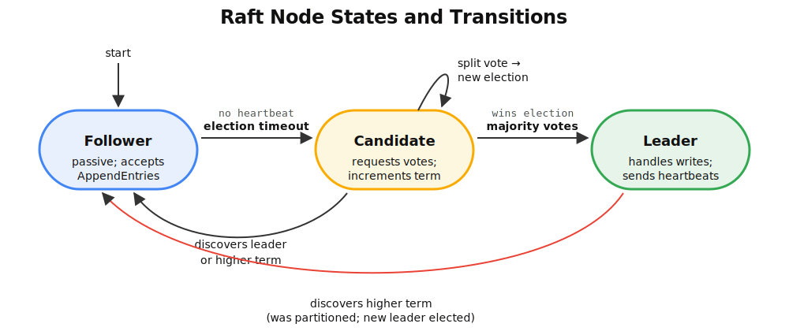
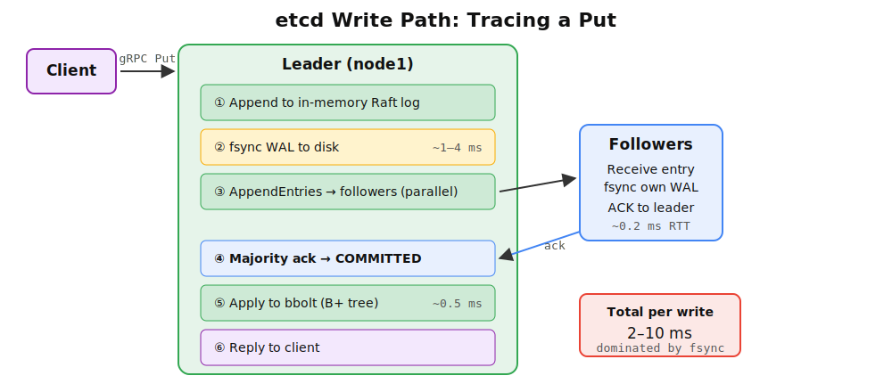

# Chapter 8: Distributed Consensus — Paxos, Raft, and etcd

> **Learning objectives**
>
> After completing this chapter and its lab, you will be able to:
>
> - Explain why consensus is necessary for replicated state
>   machines
> - Describe Paxos safety guarantees (quorum overlap, proposal
>   ordering)
> - Walk through Raft's leader election, log replication, and
>   commit rules
> - Trace a write through etcd's implementation (WAL, follower
>   replication, majority ack, commit)
> - Explain the latency cost of strong consistency

A two-line snippet from a Kubernetes incident report:

```text
14:23:07  etcd-2: lost leader, election in progress
14:23:07  apiserver: ETCDCTL_TIMEOUT=5s exceeded; serving stale reads
14:23:11  etcd: new leader = etcd-3, term=47
14:23:11  apiserver: writes resumed
```

For four seconds, every `kubectl apply`, every Pod scheduling
decision, every Deployment update in the entire cluster blocked.
Nothing was wrong with the API server, the scheduler, the
kubelet, or the network. The cluster simply had no quorum on
which machine got to write the next entry to its replicated log.

That is the question this chapter answers: how do three or five
machines agree on a sequence of values, even when some crash,
some messages are dropped, and the network occasionally splits?
The problem is called **consensus**, and the answer was refined
over fifty years by Lamport, Schneider, Liskov, Lynch, Ongaro,
Ousterhout, and many others. We walk the classical protocol
(Paxos, 1989), the engineered protocol (Raft, 2014), and the
production implementation (etcd, 2013–) in one story — because
etcd is exactly the component whose four-second outage held up
the Kubernetes cluster above. Without Chapter 8, Chapter 7's
control plane has no foundation.

## 8.1 What problem is consensus solving?

A single kernel on a single machine has no consensus problem. The
process table is one `task_struct` list; the filesystem has one
superblock; the cgroup hierarchy is one tree. Concurrency is real,
but every shared structure has a single source of truth protected
by a lock. If the machine dies, *everything* dies together —
simple, but brittle.

Distributed systems change the question. "How does a thing survive
the failure of any individual machine?" requires replication. But
replicating state is only half the problem; the other half is
keeping replicas in sync.

### Replicated state machines

The standard abstraction is the **replicated state machine (RSM)**
(Schneider, 1990). Every consensus-based system — etcd, ZooKeeper,
CockroachDB — is an RSM:

1. Clients send commands to a service that has several replicas.
2. A **consensus protocol** agrees on the *order* of commands.
3. Each replica applies the commands in the agreed order.
4. Because every replica starts from the same state and applies
   the same commands in the same order, all replicas reach the
   same state.

The hard part is (2). If two replicas disagree on the order — if
they end up with different commands at log index 7 — their state
machines diverge, and the whole system stops being a reliable
abstraction of one machine.

### Three enemies

Consensus protocols have to survive three things that do not exist
in a single kernel:

| Enemy | What it means |
|---|---|
| **Network delay** | Messages arrive late, reordered, or never |
| **Node failure** | A replica crashes and may recover with stale state |
| **Network partition** | Some nodes can talk, others cannot |

A correct protocol must preserve two properties:

- **Safety.** All deciding nodes decide the same value. Violation
  example: two leaders both serving writes produce a split-brain
  that silently diverges.
- **Liveness.** The system eventually decides something. Violation
  example: two proposers endlessly pre-empt each other, forever.

### The FLP impossibility

Fischer, Lynch, and Paterson proved in 1985 that in a purely
asynchronous system — no bound on message delay — with even one
faulty process, no deterministic protocol can guarantee both
safety and liveness. Every real consensus protocol works around
FLP by using **timeouts**, a weak form of synchrony. In practice:

- **Safety is never violated**, even during failures.
- **Liveness is only guaranteed "eventually"**, when timeouts are
  tuned correctly.

That asymmetry is the rule of thumb. If your Raft cluster stops
making progress for a few seconds, you are seeing a liveness
hiccup; the system will recover. If your Raft cluster commits two
conflicting values, you have found a bug.

### Linearizability

The strongest consistency guarantee useful in practice is
**linearizability** (Herlihy & Wing, 1990): every operation
appears to take effect atomically at some point between its
invocation and its response. This is exactly what a single-node
kernel provides naturally and what a consensus protocol provides
across nodes — at a latency cost we will measure in the lab.

Linearizability is the consistency end of the famous CAP
tradeoff. Brewer's CAP conjecture (Brewer, 2000) and Gilbert and
Lynch's proof (Gilbert & Lynch, 2002) show that under a network
partition, a system must choose between **consistency**
(linearizable answers) and **availability** (answers at all). etcd,
like every consensus-based system, picks consistency: a
partitioned minority returns errors rather than stale data. The
four-second outage in this chapter's opener is exactly that
choice surfacing in production.

## 8.2 What consensus is *not*: atomic commit

Before Paxos, it is worth separating consensus from a cousin
problem it is often confused with: **atomic commit** (2PC / 3PC).

| | 2PC / 3PC | Paxos / Raft |
|---|---|---|
| What is decided? | `COMMIT` or `ABORT` for **one transaction** | The next **log entry** |
| Who participates? | Heterogeneous participants with private local state | Replicas of **one service** |
| Can one participant veto? | Yes — any can `VOTE_ABORT` | No vetoes — replicas choose one history |
| Progress condition | Needs all participants | Needs only a **majority** |
| Failure pain | Coordinator crash → **block** | Leader crash → **re-elect in ~seconds** |

They are complementary, not interchangeable. *Within* a replica
group, Paxos/Raft keeps the group available through failures.
*Across* replica groups, 2PC makes a multi-group transaction
all-or-nothing. Kubernetes, which stores all its state in a single
etcd cluster, only needs consensus; distributed databases like
CockroachDB use both.

## 8.3 Paxos: how a majority remembers history

Lamport circulated *The Part-Time Parliament* (Lamport, 1998) for
several years before it was accepted; the paper's parable framing
was notoriously hard to read, and Lamport republished the result
in clearer form as *Paxos Made Simple* (Lamport, 2001). The
protocol it describes was the first proven-correct consensus
algorithm for crash-stop failures. It solves *single-value*
consensus: N nodes must agree on one value. The replicated-log
generalization, Multi-Paxos, runs many single-value instances,
one per log slot.

### Three roles

| Role | Job |
|---|---|
| **Proposer** | Suggests a candidate value |
| **Acceptor** | Votes on proposals and remembers accepted state |
| **Learner** | Learns the decided value |

In practice each server plays all three roles. We talk about them
separately to keep the protocol's logic clean.

### Proposal numbers and the two-phase protocol

Each proposal carries a **unique, ordered proposal number** `n`.
A common scheme is `(round, server_id)`, with the round part
persisted so a restarted proposer never reuses an old number.
Proposal numbers create a global ordering among attempts; higher-
numbered proposals take priority.

Basic Paxos then has two phases:

**Phase 1 — Prepare.**

1. A proposer picks a new proposal number `n` and broadcasts
   `Prepare(n)` to a majority of acceptors.
2. An acceptor that has not seen a higher number **promises** not
   to accept lower-numbered proposals. It returns the highest-
   numbered pair `(n_a, v_a)` it has ever accepted, if any.

**Phase 2 — Accept.**

3. If the proposer received Prepare-replies from a majority, it
   picks a value: the value from the highest-numbered prior
   acceptance reported in the replies, or its own preferred value
   if no prior acceptance exists.
4. The proposer broadcasts `Accept(n, v)`.
5. An acceptor that has not promised to a higher number accepts
   the proposal.
6. A value is **chosen** when accepted by a majority.

### Why it is safe

Step 3 is the heart of the protocol. If some value `X` was already
chosen (accepted by a majority), then any majority the proposer
contacts during Prepare *must* intersect that earlier majority —
because any two majorities of N overlap by at least one node. That
overlapping acceptor will report `X`, and the proposer will
propagate `X` instead of its own value. A later proposer thus
*discovers* the already-chosen value and carries it forward.

> **Key insight:** Paxos's safety rests on **quorum intersection**.
> Two majorities out of N overlap. That overlap is how history
> survives, without any node needing a global view.

### A worked Paxos trace: how a partition gets healed

Paxos's safety argument is easier to see when the protocol is
actually fighting for it. A scenario with three acceptors
(A1, A2, A3) and two competing proposers (P1, P2). The setup:
P1 has briefly partitioned away from A3 and is unaware of P2.
Proposal numbers are written `(round, proposer_id)`, lexicographic
order.

```text
t0  P1 → Prepare(n=(1,P1))         broadcast
       A1, A2 receive; A3 partitioned away
       A1 promises (1,P1); replies ⟨(1,P1), no prior accept⟩
       A2 promises (1,P1); replies ⟨(1,P1), no prior accept⟩
       — P1 has a Phase-1 majority {A1, A2}, no prior value seen

t1  P1 → Accept((1,P1), v="X")    broadcast
       A1 accepts ⟨(1,P1), "X"⟩
       — message to A2 dropped (still partitioned-ish)
       A3 still unreachable
       — P1 thinks the round will continue; nothing chosen yet
       — (had A2 also accepted, X would have been CHOSEN here)

t2  partition heals; P2 wakes up, knows nothing of P1
       P2 → Prepare(n=(2,P2))      broadcast
       A1 promises (2,P2); replies ⟨(2,P2), prior=((1,P1),"X")⟩
       A2 promises (2,P2); replies ⟨(2,P2), no prior accept⟩
       A3 promises (2,P2); replies ⟨(2,P2), no prior accept⟩

t3  P2 inspects the Phase-1 replies it received from a majority.
    The highest-numbered prior accept reported is ((1,P1), "X")
    from A1. **Step 3 of the protocol forces P2 to propose X,
    not its own value Y.**

    P2 → Accept((2,P2), v="X")    broadcast
       A1, A2, A3 all accept ⟨(2,P2), "X"⟩ — each had promised
       to (2,P2) and not seen anything higher.
       — "X" is now CHOSEN by majority. P1's original intent has
         survived even though P1 itself never reached a Phase-2
         majority.
```

Four things to notice in this trace:

1. **Quorum intersection is doing the work at t2.** P2's Prepare
   majority {A1, A2, A3} happens to include all three, but even
   if it had been just {A1, A3}, it would still have intersected
   with the singleton {A1} that had accepted X. *Any* majority
   of three overlaps with any other majority of three by at
   least one node — that one node is enough to surface the
   prior accept.
2. **A single accepted vote is enough to pin the value.** X was
   never *chosen* in the strict sense (no majority accepted it
   in round 1), yet step 3 of round 2 still forces P2 to carry
   X forward. Paxos is conservative: it propagates anything that
   *might have been* chosen.
3. **P2 has no idea why it is proposing X.** P2 wanted Y. The
   Prepare replies told P2 "someone else's proposal is older than
   yours and was accepted by a node"; P2 dutifully proposes that
   value. The protocol does not need the proposers to coordinate;
   the acceptors' persistent state coordinates them.
4. **If A1 had also crashed at t2 before replying to P2,** P2's
   Prepare majority could have been {A2, A3}, neither of which
   has the prior accept. P2 would propose Y, and Y would be
   chosen. *That is correct behavior:* X was never chosen, so
   either X or Y is a valid outcome; safety only requires that
   *once* a value is chosen by a majority, no other value can
   subsequently be chosen.

The trace is what makes the safety argument concrete. The lab in
this chapter watches the same dance happen in etcd's Raft
implementation — with terms instead of proposal numbers and a
leader instead of arbitrary proposers, but the underlying
quorum-intersection logic is the one Paxos formalized first.

The mechanism is correct but notoriously hard to implement
faithfully. Exactly what state an acceptor persists, how a
proposer numbers its proposals across restarts, and how
Multi-Paxos pipelines many instances — all of these are
under-specified in the original papers. The canonical reference
on what it actually takes to ship Paxos in production is *Paxos
Made Live: An Engineering Perspective* (Chandra, Griesemer, &
Redstone, 2007), the Google paper documenting the gap between the
Lamport papers and Chubby, the lock service that backs almost
every Google system. The paper is a 14-page list of issues the
original Paxos papers do not mention: how to handle disk
corruption, how to manage cluster membership changes, how to
upgrade a running protocol, how to test a protocol whose bugs
appear once a year. Spanner (Corbett et al., 2012) and Megastore
(Baker et al., 2011) are the other heavily-engineered Paxos
descendants in production at Google. The lesson generalizes: every
"Paxos" you have heard of in industry is a heavily modified
descendant, and that gap is exactly what motivated Raft.

## 8.4 Raft: why a fresh design instead of more Paxos engineering?

The Chubby paper documented an industry's worth of complaints
about Paxos: hard to teach, hard to test, hard to extend with
membership changes. Diego Ongaro and John Ousterhout's response
— their 2014 USENIX ATC paper *In Search of an Understandable
Consensus Algorithm* (Ongaro & Ousterhout, 2014) — was to design a
new protocol with *understandability* as an explicit goal. They
ran a controlled experiment: 43 graduate students learned either
Paxos or Raft and were quizzed on each. Raft's median quiz score
was substantially higher, and it has dominated new consensus
deployments since.

**Raft** does the same job as Multi-Paxos but decomposes the
problem into three clearly separated sub-problems: leader
election, log replication, and safety. It is the consensus
protocol used by etcd, Consul, CockroachDB, TiKV, RethinkDB, and
most new systems built since 2015.

### Terms and leaders

Time in a Raft cluster is divided into **terms**, monotonically
increasing integers. Each term has at most one leader. Followers
passively accept work from the current leader.

Each node is in one of three states:

- **Follower.** Passive. Forwards client requests to the leader.
- **Candidate.** Running for leader during an election.
- **Leader.** Handles all client writes; replicates log entries
  to followers.


*Figure 8.1: The Raft state machine. Every node starts as a Follower. An election timeout promotes it to Candidate; a majority vote makes it Leader. Discovering a higher term from any message demotes a node back to Follower. Split votes cause a new election with a fresh random timeout.*

### Leader election

A follower starts an election if it does not hear from a leader
for its (randomized) **election timeout**, typically 150–300 ms.
It increments its term, votes for itself, and asks every other
node for a vote via `RequestVote`.

The critical rule: **each node votes for at most one candidate per
term**, first-come-first-served. That guarantees at most one
leader per term. A candidate that receives votes from a majority
becomes the leader for that term and starts sending heartbeats.

The **randomized** timeouts are what prevent split votes from
deadlocking. If two candidates start elections simultaneously and
split the vote, both retry with new random timeouts; one will fire
first, and the symmetry breaks. This is the same idea as
Ethernet's exponential backoff.

### Log replication

A leader handles client writes as follows:

1. Append the command to its local log as a new entry.
2. Send `AppendEntries` to each follower with the new entry.
3. Each follower, on receiving `AppendEntries`, verifies the
   **consistency check**: its log has an entry at `prevLogIndex`
   whose term matches `prevLogTerm`. If yes, append; if no,
   reject.
4. On rejection, the leader decrements `prevLogIndex` and retries,
   walking backwards until the logs agree.
5. When a majority of nodes have replicated an entry, the leader
   **commits** it, applies it to its state machine, and replies to
   the client.
6. Subsequent `AppendEntries` carry the leader's `leaderCommit`
   index so followers can apply the same entries.

Entries are committed in strict order; an entry at index `i` is
never committed before every entry at index `< i`.

### Safety: the election restriction

A naïve Raft could allow a candidate with a stale log to win an
election and overwrite already-committed entries. Raft prevents
this by restricting who can win.

> **Election restriction.** A voter denies its vote if the
> candidate's log is less "up-to-date" than the voter's. Up-to-
> date compares last-entry term first (higher wins), then log
> length (longer wins).

Why does that work? A committed entry exists on a majority. Any
candidate needs a majority to win. Those two majorities must
overlap by at least one node, and that node has the committed
entry — so it will refuse to vote for a candidate without it.
Quorum intersection again.

### Majority math

A Raft cluster of `2f + 1` nodes tolerates `f` failures:

| Cluster size | Tolerates | Majority |
|---|---|---|
| 3 | 1 failure | 2 |
| 5 | 2 failures | 3 |
| 7 | 3 failures | 4 |

Odd sizes are standard because even sizes pay the extra node
without buying extra fault tolerance: 4 nodes still tolerate only
1 failure (need 3), same as 3 nodes.

## 8.5 etcd: what does Raft look like in production?

**etcd** is a distributed key-value store that uses Raft as its
consensus layer. Created at CoreOS in 2013 and rewritten as etcd
v3 in 2016 to use gRPC and a flat key-space (Phanishayee, 2016),
it is now a CNCF graduated project and, more importantly, the
backing store for every Kubernetes cluster in the world.

| Property | Value |
|---|---|
| Data model | Key-value with MVCC |
| Consistency | Linearizable reads and writes |
| Consensus | Raft (`etcd/raft` library) |
| Storage | WAL for Raft log, bbolt (B+ tree) for state |
| Transport | gRPC over TLS |
| Typical cluster | 3 or 5 nodes |
| Data size | A few GB — it is a metadata store, not a data store |

### Internal layers

A write arrives at the leader's gRPC server, enters the MVCC store
module, and triggers a Raft proposal. The Raft module persists the
entry to the WAL and sends AppendEntries to followers. Once a
majority acknowledges, the entry is committed, applied to bbolt
via the MVCC store, and the client gets its reply.

Three persistence layers matter:

- **WAL.** A sequential log of Raft entries, `fsync`'d on every
  append. This is the durability boundary.
- **Snapshots.** Periodic state snapshots that let new or lagging
  followers catch up without replaying the full log.
- **bbolt.** The actual key-value store, written to by applying
  committed entries. bbolt is a fork of Ben Johnson's BoltDB
  (Johnson, 2014), an embedded B+-tree key-value store inspired
  by LMDB; etcd maintains it because BoltDB itself was archived
  in 2018.

### Tracing a Put


*Figure 8.2: The etcd write path. Each step has a measurable cost; the dominant one is WAL fsync (~1–4 ms). The followers fsync in parallel, so the network round-trip (~0.2 ms) overlaps with the leader's own fsync. Total per-write latency: 2–10 ms on typical hardware.*

```text
Client ──gRPC Put──▶ Leader
                      │
                      ├── 1. Append to in-memory Raft log
                      ├── 2. fsync WAL               ◀── disk I/O
                      ├── 3. AppendEntries to each follower (parallel)
                      │     (followers also fsync WAL)
                      ├── 4. Majority ack → COMMITTED
                      ├── 5. Apply to bbolt           ◀── disk I/O
                      └── 6. Reply to client
```

Typical 3-node latency on same-rack hardware:

- WAL `fsync`: 1–4 ms (dominant)
- Network RTT: 0.2 ms
- bbolt write: 0.5 ms
- **Total per write: 2–10 ms**

The dominant cost is `fsync`. etcd performance is I/O-bound, not
CPU-bound — which is why Chapter 10 cares about fsync latency and
why production etcd runs on fast local SSDs.

### Linearizable reads: the ReadIndex protocol

A naïve read from a follower could return stale data: the follower's
state machine may be behind the leader's. etcd handles this with a
variant called **ReadIndex**:

1. Client `Range` hits the leader.
2. Leader records its current commit index as `ReadIndex`.
3. Leader sends a heartbeat to followers — confirming it is *still*
   the leader (a partitioned ex-leader would find out it was
   deposed here).
4. Leader waits until its applied index ≥ `ReadIndex`, then reads
   from bbolt.
5. Leader returns the result.

Linearizable reads cost one heartbeat round-trip (≈0.5–2 ms) but
never return stale data.

etcd also offers `--consistency="s"` (serializable) reads that go
to any node and may be stale — faster but weaker. Kubernetes's API
server defaults to linearizable.

### Watch and MVCC revisions

Every mutation creates a new monotonic **revision** number. Clients
subscribe to a key or prefix via `Watch`; etcd streams events
starting from any revision the client asks for. This is what
Kubernetes's API server uses to implement the "reconcile loop"
pattern — controllers watch a resource, react to changes, write
back updates.

Think of Watch as `inotify` for a distributed filesystem: events
are ordered, never silently dropped (as long as the client is
faster than MVCC compaction), and tied to a revision counter that
acts like a generation number.

### Compaction and snapshots

Two layers of compaction keep etcd's footprint bounded:

- **MVCC compaction** (`etcdctl compaction`) discards old
  revisions. After compaction, `Watch` from an earlier revision
  will fail.
- **Raft snapshots** discard old log entries. A follower that has
  fallen too far behind is brought up to date by transferring a
  snapshot rather than replaying thousands of entries.

## 8.6 What does strong consistency cost?

Consensus is not free. Every write involves:

- One local `fsync` on the leader's WAL.
- At least one network round-trip to followers.
- One `fsync` on each follower's WAL.
- One `bbolt` write on the leader.
- A second heartbeat on each subsequent linearizable read.

Compared to a single-node key-value store, that is 10–100× more
latency per write. For metadata-scale workloads (Kubernetes
creates a few thousand pods per second across a large cluster)
that cost is acceptable. For high-throughput data paths it is
not, which is why etcd explicitly positions itself as a metadata
store and why distributed databases layer other optimizations on
top (range sharding, Raft groups per range, pipelining).

### Why three nodes

A three-node cluster tolerates one failure. Every committed write
is on at least two nodes; every new leader inherits all committed
entries (election restriction). The cost is paid once per write
(`fsync` plus one RTT to a follower). Five nodes tolerate two
failures but require two followers to ack each write — slightly
higher latency under load.

For Kubernetes, three-node etcd is the ordinary choice; five-node
appears in large clusters or across availability zones where
one-zone loss should not disrupt the control plane.

### The lab preview

The lab at the end of this chapter turns every claim in this
chapter into a measurement:

- Inspect term, leader, and log index on a 3-node etcd cluster.
- Kill the leader and measure election time.
- Compare 1-node vs 3-node write latency.
- Compare linearizable vs serializable read latency.
- Simulate a network partition and watch the minority stall while
  the majority keeps serving.
- Stop a follower, write many keys, restart it, and watch catch-up
  via snapshot.

By the end, the latency numbers in this chapter stop being
abstractions; they will be numbers you produced on your own VM.

## Summary

Key takeaways from this chapter:

- Consensus is replicated-state-machine agreement on the order of
  commands despite crashes and partitions. FLP says you cannot
  have both safety and liveness in a purely asynchronous system;
  practical protocols trade occasional liveness hiccups for
  permanent safety.
- Paxos proved consensus is solvable via **quorum intersection**.
  Two phases: Prepare (learn prior history) and Accept (propose
  safely, honoring what was learned). Safety is elegant;
  implementation is hard.
- Raft makes consensus implementable by decomposing into leader
  election, log replication, and safety. Randomized timeouts
  break election symmetry; the election restriction protects
  committed entries.
- etcd runs Raft in production. Write latency is dominated by WAL
  `fsync` (~1–4 ms). Reads can be linearizable (through leader +
  heartbeat) or serializable (any node, possibly stale).
- Kubernetes stores *all* cluster state in etcd. Understanding
  Raft is understanding why `kubectl apply` takes a few
  milliseconds and why the API server is the sole gateway to the
  key-value store.

## Further Reading

### Foundational papers

- Lamport, L. (1998). "The Part-Time Parliament." *ACM TOCS,*
  16(2). (The original Paxos paper.)
- Lamport, L. (2001). "Paxos Made Simple."
  <https://lamport.azurewebsites.net/pubs/paxos-simple.pdf>
- Ongaro, D., & Ousterhout, J. (2014). "In Search of an
  Understandable Consensus Algorithm." *USENIX ATC.*
  <https://raft.github.io/raft.pdf>
- Schneider, F. B. (1990). "Implementing Fault-Tolerant Services
  Using the State Machine Approach." *ACM Computing Surveys,*
  22(4). (The replicated-state-machine model.)
- Fischer, M. J., Lynch, N. A., & Paterson, M. S. (1985).
  "Impossibility of Distributed Consensus with One Faulty
  Process." *JACM,* 32(2).
- Herlihy, M., & Wing, J. (1990). "Linearizability: A Correctness
  Condition for Concurrent Objects." *ACM TOPLAS,* 12(3).
- Brewer, E. (2000). "Towards Robust Distributed Systems."
  Keynote, PODC. (CAP conjecture.)
- Gilbert, S., & Lynch, N. (2002). "Brewer's conjecture and the
  feasibility of consistent, available, partition-tolerant web
  services." *ACM SIGACT News,* 33(2). (CAP proof.)

### Production Paxos

- Chandra, T. D., Griesemer, R., & Redstone, J. (2007). "Paxos
  Made Live: An Engineering Perspective." *PODC.*
  (The canonical paper on Chubby and what it takes to ship
  Paxos.)
- Burrows, M. (2006). "The Chubby Lock Service for Loosely-Coupled
  Distributed Systems." *OSDI.*
- Corbett, J. C., et al. (2012). "Spanner: Google's
  Globally-Distributed Database." *OSDI.*
- Baker, J., et al. (2011). "Megastore: Providing Scalable, Highly
  Available Storage for Interactive Services." *CIDR.*

### etcd and bbolt

- etcd documentation: <https://etcd.io/docs/>
- Phanishayee, A., et al. (2016). "etcd v3 design notes." CoreOS
  blog. (Why v3 broke compatibility: gRPC, flat keyspace,
  watch-from-revision.)
- Johnson, B. (2014). *BoltDB.* GitHub. (The B+-tree store etcd
  forks as bbolt.)

### Tutorials and visualizations

- *The Secret Lives of Data: Raft.*
  <https://thesecretlivesofdata.com/raft/>
- *Raft Consensus Algorithm.* <https://raft.github.io/>
- Howard, H. (2014). *ARC: Analysis of Raft Consensus.* Cambridge
  Tech Report. (A formal-methods take, with subtle bugs found in
  early Raft implementations.)
