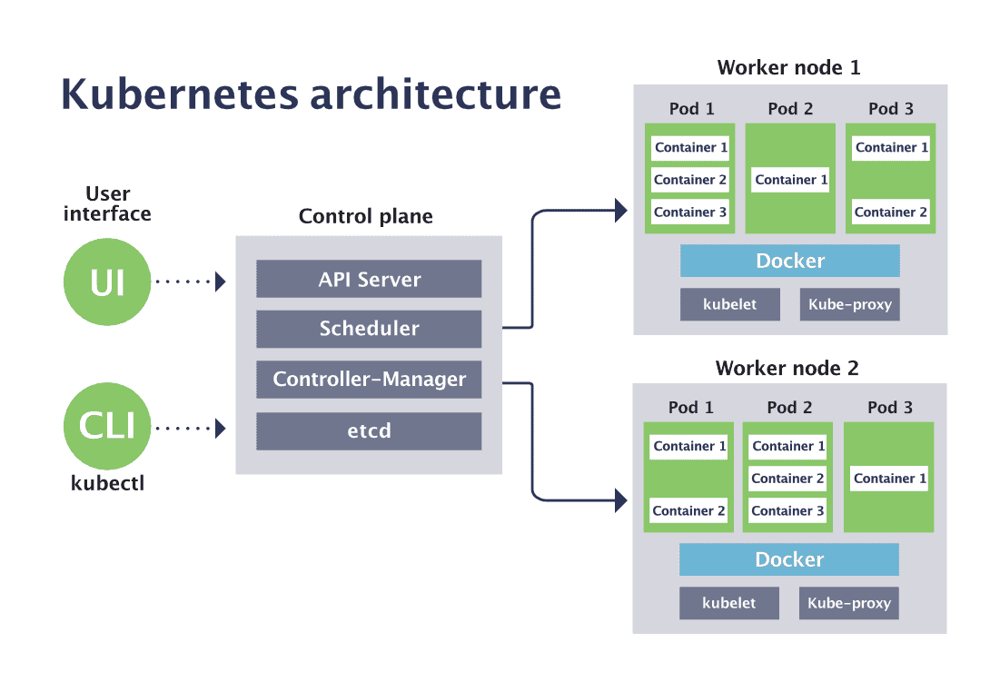

# Chapter 9: Kubernetes Scheduling and the Control Plane

> **Learning objectives**
>
> After completing this chapter and its lab, you will be able to:
>
> - Describe the Kubernetes control plane architecture (API
>   server, etcd, controller manager, scheduler, kubelet)
> - Explain the scheduler pipeline: Filter, Score, Bind
> - Use taints, tolerations, and node affinity to influence
>   placement
> - Compare packing vs spreading strategies and their tradeoffs
> - Connect scheduler decisions to etcd persistence (Chapter 8)

Run `kubectl get pods` on any production-sized Kubernetes
cluster, and you almost always see at least one Pod with status
`Pending`. Ask `kubectl describe`:

```text
Events:
  Type     Reason            From               Message
  ----     ------            ----               -------
  Warning  FailedScheduling  default-scheduler  0/47 nodes are available:
           3 node(s) had untolerated taint {dedicated: gpu},
           14 Insufficient memory,
           30 Insufficient cpu.
```

Three numbers, one cluster, three reasons a Pod did not get
placed. Behind every one of those numbers is a *plugin* in the
`kube-scheduler`'s pipeline that voted "no". Behind that pipeline
is a 60-year tradition of cluster-resource management running
from CTSS time-sharing through Mesos and Borg into the algorithm
that just told this Pod to wait.

Chapter 7 showed Kubernetes enforcing resources on a single node
by turning Pod specs into cgroup writes. Chapter 8 showed etcd
using Raft to keep cluster state consistent. This chapter puts
them together. The question it answers is: **given a new Pod,
who decides which node runs it, and how?** The answer is the
`kube-scheduler`, a user-space component that solves a classical
problem — scheduling — through a watch-and-reconcile loop sitting
on top of a Raft-backed log.

## 9.1 Why is Kubernetes an operating system?

A single-machine kernel schedules *threads* onto *CPUs*; Kubernetes
schedules *Pods* onto *nodes*. The abstractions line up almost
one-to-one:

| Single-kernel concept | Kubernetes analogue | Enforced by |
|---|---|---|
| Process | Pod (group of containers) | `task_struct` + `nsproxy` |
| CPU scheduler (`pick_next_task`) | kube-scheduler | User-space decision |
| `nice` / priority | QoS classes + PriorityClass | `cpu.weight` in cgroup |
| `ulimit` / `cgroup cpu.max` | Pod `limits.cpu` | kubelet writes `cpu.max` |
| OOM killer | cgroup OOM + kubelet eviction | kernel + kubelet |
| `/proc` + `ps` | `kubectl top`, metrics-server | reads cgroup stats |

The differences are instructive. A kernel schedules microsecond-
granularity tasks with direct memory access to every structure it
touches; a cluster scheduler schedules second- or minute-grained
tasks using a watched, eventually-consistent view of state. The
algorithmic problem — "which runnable unit goes where?" — is the
same. The cost of a wrong answer is different: a bad CFS decision
costs a few microseconds of latency; a bad Kubernetes decision can
leave a node full of fragmented capacity that no new Pod can use.

One sentence to carry through the chapter: **Kubernetes is an
operating system for a cluster, and `kube-scheduler` is its CPU
scheduler with extra dimensions.**

## 9.2 What does the control plane look like?

A Kubernetes cluster has a **control plane** and a pool of
**worker nodes**. The control plane makes decisions; the workers
execute them. Every component communicates *through the API
server* — there is no direct channel between, for example,
scheduler and kubelet.

```text
                    kubectl / CI / human
                          │
                          ▼ gRPC / REST
                   ┌──────────────┐
                   │ API server   │──────► etcd  (Raft-backed store)
                   └──────┬───────┘
                          │ watch / write
    ┌─────────────────────┼───────────────────────────────┐
    │                     │                               │
    ▼                     ▼                               ▼
  controller-manager   kube-scheduler                   kubelet (per node)
  (reconciles)         (places Pods)                   (enforces via cgroups)
```


*Figure 9.1: Kubernetes control plane and worker node architecture. All components communicate through the API server; etcd provides the durable, consistent backing store.*

### Who does what

- **API server.** The only component that talks to etcd. Validates
  incoming requests, authenticates, serializes objects into etcd,
  and serves watch streams to every other component. Analogous to
  the system-call interface.
- **etcd.** The durable replicated store (Chapter 8). Every Pod,
  Deployment, ConfigMap, and Secret lives here. Access is
  linearizable by default.
- **controller manager.** A collection of reconciliation loops.
  The Deployment controller ensures N Pods exist; the ReplicaSet
  controller ensures a set of labeled Pods match a template; the
  Node controller watches for unresponsive nodes. Each loop is a
  small program: read desired state, observe actual state, take
  an action if they differ, repeat. The OS analogue is a kernel
  thread that maintains an invariant.
- **kube-scheduler.** The focus of this chapter. Watches for Pods
  without a `nodeName`, picks a node for each, writes the binding
  back through the API server.
- **kubelet** (one per node). Watches the API server for Pods
  bound to its node; calls into the container runtime
  (containerd/runc) and writes cgroup files to make the Pod real.
- **kube-proxy** (one per node). Maintains iptables/ipvs rules
  implementing the Service virtual IPs.

### The reconciliation loop

Every controller follows the same pattern:

```python
while True:
    desired = read_from_api_server()
    actual  = observe_cluster()
    if actual != desired:
        take_action()
    sleep(tick)
```

This is a feedback control system. If a node dies at 3 AM, desired
state has not changed — the controllers notice that Pods on the
dead node are gone, and create replacements elsewhere. The human
operator did not do anything.

### Everything flows through etcd

Without Chapter 8, the story in this chapter does not work. Every
scheduler decision, every controller action, every kubectl command
is a write to etcd via the API server. Quorum intersection
prevents split-brain scheduling. Leader election means the control
plane survives failures. Linearizable reads mean the scheduler
acts on a consistent view. Raft is the silent foundation
underneath the pipeline in §9.3.

## 9.3 How does the scheduler decide?

The `kube-scheduler` design is the latest in a lineage of
cluster-resource managers, each of which solved a piece of the
problem the next one inherited. Mesos (Hindman et al., 2011)
introduced a two-level model where a central allocator offered
resources to per-framework schedulers. YARN (Vavilapalli et al.,
2013) brought the same idea to Hadoop and added per-application
masters. Omega (Schwarzkopf et al., 2013) replaced offers with
shared state and optimistic concurrency — the design that became
Kubernetes' reconciler pattern. The Borg paper (Verma et al.,
2015) consolidated a decade of Google practice into the
request-vs-limit and QoS-class taxonomy that Kubernetes adopted
wholesale. Burns et al. (2016) is the lessons-learned
retrospective.

With that lineage in mind: when a user runs `kubectl apply -f
deployment.yaml`, the Pods it creates land in etcd with no
`nodeName`. The scheduler watches for exactly this condition. For
each unscheduled Pod, three stages run in order:

![Worked example of the Filter → Score → Bind pipeline. An unscheduled Pod requesting 4 CPU, 2 GiB, with a `gpu` toleration and a `zone=us-east` node affinity is matched against six cluster nodes. Filter rejects three of them on hard predicates (NodeResourcesFit, TaintToleration, NodeAffinity, VolumeBinding); Score ranks the three survivors using weighted plugins (LeastAllocated, NodeResourcesBalancedAllocation w=1, InterPodAffinity w=2) and picks Node 4 with score 82; Bind writes `spec.nodeName = Node 4` through the API server, persisting the decision through etcd Raft; the kubelet on Node 4 then watches and starts the containers.](figures/scheduler-pipeline.png)

In pseudocode:

```text
1. FILTER — which nodes can LEGALLY run this Pod?
   (NodeResourcesFit, TaintToleration, NodeAffinity, HostPorts, …)

2. SCORE  — among the survivors, which node is BEST?
   (LeastAllocated, NodeResourcesBalanced, InterPodAffinity, …)

3. BIND   — write pod.spec.nodeName = winner back to the API server.
```

The kubelet on the winning node watches for "Pods bound to me",
picks this one up, and starts the containers. The decision is
persisted in etcd before the kubelet sees it — that is what makes
scheduling idempotent and recoverable: if the scheduler crashes
after the bind, nothing has to be undone.

### Filter: hard constraints

Each node is tested against a list of predicates; the node is
filtered out if any predicate fails. The critical one for capacity
planning is **NodeResourcesFit**:

```text
node.allocatable - Σ(pod_requests on node) ≥ new_pod.requests
```

If this fails, `kubectl describe pod` reports
`Insufficient cpu` or `Insufficient memory`. That is an *accounting*
failure, not an enforcement failure: the node might have idle CPU
*right now*, but its remaining *request* budget is not enough to
promise the new Pod what it asked for. Raising `limits` does not
help; only lowering `requests` or freeing capacity does.

Other common filters:

- **TaintToleration.** A tainted node is skipped unless the Pod
  tolerates the taint.
- **NodeAffinity.** `required` affinity rules act as filters. A
  Pod that requires `disktype=ssd` is not eligible for a node
  without that label.
- **PodFitsHostPorts.** If the Pod requests a host port already
  in use, skip the node.
- **VolumeBinding.** The persistent volumes the Pod needs must be
  reachable from the node (same zone, for zone-local storage).

### Score: soft preferences

Feasible nodes are then ranked. Each scoring plugin returns a
value in 0–100; the weighted sum picks the winner. Two
philosophically opposed default plugins:

- **LeastAllocated** — prefer nodes with *more* free resources.
  This **spreads** load across the cluster. Default choice.
- **MostAllocated** — prefer nodes with *less* free resources.
  This **packs** Pods onto fewer nodes, allowing idle nodes to
  sleep or be removed. Used for bin-packing at low utilization.

Other useful scorers:

- **NodeResourcesBalancedAllocation** — prefer nodes where
  CPU% and memory% are similar, avoiding "lopsided" utilization.
- **InterPodAffinity / AntiAffinity** — prefer or avoid nodes
  that already run Pods with certain labels.
- **TaintToleration** — penalize nodes with more untolerated
  taints.

### Bind

The final step writes `spec.nodeName` through the API server.
Everything we said in Chapter 8 about etcd writes applies here:
the binding is persisted through Raft before it becomes visible.
Kubelet watch streams on the winning node see the change and
start the Pod.

## 9.4 How do users steer the scheduler?

The filter and score plugins are parameterized by declarative
constraints in the Pod spec.

### Taints and tolerations

Taints are applied to **nodes** to repel Pods. Tolerations are
declared in **Pods** to accept the taint:

```bash
kubectl taint nodes worker-1 gpu=true:NoSchedule
```

```yaml
spec:
  tolerations:
  - key: gpu
    operator: Equal
    value: "true"
    effect: NoSchedule
```

Three taint effects:

| Effect | Behavior |
|---|---|
| `NoSchedule` | New Pods without a matching toleration cannot land here |
| `PreferNoSchedule` | Scheduler avoids this node but may still use it |
| `NoExecute` | Existing Pods without toleration are **evicted** |

Typical use: reserve GPU nodes for GPU workloads by tainting them
and making only GPU Pods tolerate the taint. Or mark a node
"unsuitable for general use" during draining.

### Node affinity

Where taints *repel*, node affinity *attracts*. It comes in two
flavors:

```yaml
spec:
  affinity:
    nodeAffinity:
      requiredDuringSchedulingIgnoredDuringExecution:
        nodeSelectorTerms:
        - matchExpressions:
          - key: topology.kubernetes.io/zone
            operator: In
            values: ["us-east-1a", "us-east-1b"]
      preferredDuringSchedulingIgnoredDuringExecution:
      - weight: 80
        preference:
          matchExpressions:
          - key: disktype
            operator: In
            values: ["ssd"]
```

- **`required`** is a hard constraint (acts during Filter). The
  Pod stays Pending if no node matches.
- **`preferred`** is a soft constraint (acts during Score). It
  biases the ranking but does not block placement.

### Inter-pod affinity and anti-affinity

Unlike node affinity (which reads node labels), inter-pod affinity
reads the labels of *Pods already running on the node*:

```yaml
spec:
  affinity:
    podAffinity:                 # schedule me near these Pods
      requiredDuringSchedulingIgnoredDuringExecution:
      - labelSelector:
          matchExpressions:
          - key: app
            operator: In
            values: [redis]
        topologyKey: kubernetes.io/hostname     # "near" = same node
    podAntiAffinity:             # schedule me away from these Pods
      preferredDuringSchedulingIgnoredDuringExecution:
      - weight: 100
        podAffinityTerm:
          labelSelector:
            matchExpressions:
            - key: app
              operator: In
              values: [web]
          topologyKey: topology.kubernetes.io/zone  # "away" = different zone
```

The `topologyKey` determines the granularity of "near" and "away":
hostname (same node), zone (same AZ), rack, or any custom label.
Two canonical use cases:

- **Co-locate** a web frontend and its Redis cache on the same
  node for low-latency communication (`podAffinity` with
  `topologyKey: hostname`).
- **Spread** replicas of a service across zones so a zone failure
  does not take them all out (`podAntiAffinity` with
  `topologyKey: topology.kubernetes.io/zone`).

### Topology spread constraints

A higher-level primitive that expresses "distribute this set of
Pods evenly across these topology domains":

```yaml
topologySpreadConstraints:
- maxSkew: 1
  topologyKey: topology.kubernetes.io/zone
  whenUnsatisfiable: DoNotSchedule
  labelSelector:
    matchLabels:
      app: web
```

This is cleaner than expressing the same idea with anti-affinity,
and it is what most production deployments use today.

## 9.5 Should I pack tightly or spread loosely?

Every cluster scheduler has to pick a default orientation: pack
Pods tightly to save money, or spread them loosely for
availability.

| Strategy | Pro | Con |
|---|---|---|
| **Pack** (MostAllocated) | Fewer nodes running; lower cost | No headroom for traffic bursts; cascading failures more likely |
| **Spread** (LeastAllocated) | Headroom absorbs bursts; better p99 | More nodes idle; higher cost |

Kubernetes defaults to spread, because the failure modes of
packing are worse when they occur. At steady state with stable
traffic, spreading is the right call.

### Fragmentation

The hidden enemy of cluster scheduling is **fragmentation**. The
cluster has enough total resources for a new Pod, but those
resources are scattered across nodes in unusable shapes:

```text
Cluster: 3 nodes, each 8 CPU total.
  Node A:  used 5 → free 3 (has GPU, tainted "team=ml")
  Node B:  used 2 → free 6 (no GPU)
  Node C:  used 7 → free 1 (has GPU)

New Pod:  wants 4 CPU + 1 GPU, tolerates "team=ml"
  Node A:  3 CPU free < 4       → filtered
  Node B:  no GPU               → filtered
  Node C:  1 CPU free < 4       → filtered

Total free CPU: 10.  Total free GPUs: 2.  Pod stays Pending.
```

Fragmentation appears because scheduling is a *per-Pod* decision;
there is no global bin-packing optimizer. The symptom is a growing
backlog of Pending Pods while `kubectl describe node` shows free
capacity in aggregate. Fixes are tactical (preempt lower-priority
Pods to coalesce free capacity) and strategic (cluster autoscaler
adds a node, descheduler migrates Pods to defrag).

### Backfilling: a classical response

HPC schedulers have dealt with a cousin of this problem for
decades. **Backfilling**, introduced as the EASY scheduler on
the Argonne IBM SP/2 (Lifka, 1995) and refined by Mu'alem and
Feitelson (2001), allows the scheduler to run a smaller job
earlier *as long as it does not delay the reserved start time of
a head-of-line blocked job*. The reservation keeps the big job on
track; small jobs fill the gaps. EASY backfill is still the
default on Slurm, the workload manager that runs almost every
large HPC cluster in 2024 (Yoo, Jette, & Grondona, 2003).

More recent multi-resource cluster schedulers — Tetris (Grandl et
al., 2014) and Quasar (Delimitrou & Kozyrakis, 2014) — generalize
backfill into multi-dimensional bin-packing with online demand
estimation. Sparrow (Ousterhout et al., 2013) takes the opposite
tack: distribute the scheduling decision itself across many
workers for sub-second latency on short jobs.

The lab in this chapter has you implement FIFO and Backfill in a
Python simulator to see the mechanism directly. Kubernetes does
not schedule Pods exactly this way (it does not have explicit job
reservations), but the intuition — "do not let a big pending
request starve small feasible ones" — appears throughout real
schedulers in the form of priority and preemption (§9.6).

## 9.6 How does priority change the picture?

### PriorityClass and preemption

Kubernetes supports **cluster-level priorities**:

```yaml
apiVersion: scheduling.k8s.io/v1
kind: PriorityClass
metadata: { name: high-priority }
value: 1000000
```

A Pod referencing `priorityClassName: high-priority` sorts earlier
in the scheduling queue. If no feasible node exists, the scheduler
may **preempt** lower-priority Pods on a node that would otherwise
fit the high-priority Pod: it evicts them gracefully, reschedules
the high-priority Pod there, and lets the evicted Pods return to
the queue.

This is directly analogous to real-time priority preemption in
the Linux kernel: a `SCHED_FIFO` task can kick a normal task off
the CPU.

### The Scheduling Framework

Since Kubernetes 1.19 the scheduler has been plugin-based. Every
decision passes through a pipeline of **extension points**:

```text
Sort → PreFilter → Filter → PostFilter → PreScore → Score
     → NormalizeScore → Reserve → Permit → PreBind → Bind → PostBind
```

Custom plugins can register at any point. ByteDance, Alibaba,
Apple, and many others run custom scheduler plugins to encode
workload-specific policies (gang scheduling for ML, interference-
aware placement, co-locating "coupled" services, etc.). For this
book, the default plugins are enough to reason about; the
framework matters mainly because it tells you the scheduler is
not a monolith.

### The scheduling queue

Pods waiting to be scheduled sit in one of three queues inside
the scheduler:

- **ActiveQ.** Ready to schedule. Sorted by priority, then
  creation time.
- **BackoffQ.** Scheduling failed; retry after exponential
  backoff (1 → 2 → 4 → … → 60 s). Prevents hot-looping on an
  unschedulable Pod.
- **Unschedulable.** Repeated failures. Parked until a cluster
  event — new node, Pod deletion, toleration change — triggers
  re-evaluation.

Cluster events move Pods back to ActiveQ. This design is why the
scheduler stays responsive even when one Pod is permanently
unschedulable: it is not pinned to the bad Pod's retry loop.

## Summary

Key takeaways from this chapter:

- Kubernetes is an operating system for a cluster. The scheduler
  is its CPU scheduler, extended to multiple resources, multiple
  nodes, and richer constraints.
- The control plane has five components (API server, etcd,
  controller manager, scheduler, kubelet). They communicate
  exclusively through the API server, and every state change is
  persisted in etcd via Raft.
- The scheduler pipeline is **Filter → Score → Bind**. Filter
  enforces hard constraints; Score ranks feasible nodes; Bind
  writes the decision.
- Constraints come in four flavors: taints/tolerations
  (repulsion), node affinity (attraction), inter-pod
  affinity/anti-affinity (topology-aware placement), and
  topology spread constraints (declarative distribution).
- The fundamental tradeoff is **pack vs spread**. Kubernetes
  defaults to spread; packing trades headroom for cost.
  **Fragmentation** is the cluster-scheduling bug that looks
  like "Pending Pods with plenty of free resources".
- Priority and preemption let high-priority Pods evict lower-
  priority ones. The Scheduling Framework makes every stage of
  the pipeline pluggable.

## Further Reading

### Cluster scheduler lineage

- Hindman, B., et al. (2011). "Mesos: A Platform for Fine-Grained
  Resource Sharing in the Data Center." *NSDI.*
  (Two-level scheduling with resource offers.)
- Vavilapalli, V. K., et al. (2013). "Apache Hadoop YARN: Yet
  Another Resource Negotiator." *SoCC.*
- Schwarzkopf, M., Konwinski, A., Abd-El-Malek, M., & Wilkes, J.
  (2013). "Omega: flexible, scalable schedulers for large compute
  clusters." *EuroSys.*
- Verma, A., et al. (2015). "Large-scale cluster management at
  Google with Borg." *EuroSys.*
  <https://doi.org/10.1145/2741948.2741964>
- Burns, B., Grant, B., Oppenheimer, D., Brewer, E., & Wilkes, J.
  (2016). "Borg, Omega, and Kubernetes: Lessons learned from
  three container-management systems over a decade." *CACM,*
  59(5).
- Isard, M., et al. (2009). "Quincy: Fair Scheduling for
  Distributed Computing Clusters." *SOSP.*
  (Min-cost-flow scheduling under multiple constraints.)

### Fairness and multi-resource scheduling

- Ghodsi, A., Zaharia, M., Hindman, B., Konwinski, A., Shenker,
  S., & Stoica, I. (2011). "Dominant Resource Fairness: Fair
  Allocation of Multiple Resource Types." *NSDI.*
- Grandl, R., Ananthanarayanan, G., Kandula, S., Rao, S., &
  Akella, A. (2014). "Multi-resource Packing for Cluster
  Schedulers (Tetris)." *SIGCOMM.*
- Delimitrou, C., & Kozyrakis, C. (2014). "Quasar:
  Resource-Efficient and QoS-Aware Cluster Management."
  *ASPLOS.*

### Backfill and HPC scheduling

- Lifka, D. (1995). "The ANL/IBM SP Scheduling System." *Workshop
  on Job Scheduling Strategies for Parallel Processing (JSSPP).*
  (The original EASY backfill paper.)
- Mu'alem, A. W., & Feitelson, D. G. (2001). "Utilization,
  Predictability, Workloads, and User Runtime Estimates in
  Scheduling the IBM SP2 with Backfilling." *IEEE TPDS.*
- Yoo, A. B., Jette, M. A., & Grondona, M. (2003). "SLURM: Simple
  Linux Utility for Resource Management." *JSSPP.*

### Distributed scheduling

- Ousterhout, K., Wendell, P., Zaharia, M., & Stoica, I. (2013).
  "Sparrow: Distributed, Low Latency Scheduling." *SOSP.*
  (Decentralized scheduling for sub-second tasks.)
- Karanasos, K., et al. (2015). "Mercury: Hybrid Centralized and
  Distributed Scheduling in Large Shared Clusters." *USENIX
  ATC.*

### Kubernetes-specific

- Kubernetes documentation: *Scheduling and Eviction.*
  <https://kubernetes.io/docs/concepts/scheduling-eviction/>
- Kubernetes documentation: *Scheduling Framework.*
  <https://kubernetes.io/docs/concepts/scheduling-eviction/scheduling-framework/>
- Kubernetes source tree, `pkg/scheduler/` — the actual code is
  surprisingly readable. Start at `pkg/scheduler/schedule_one.go`
  and follow the framework extension points.
