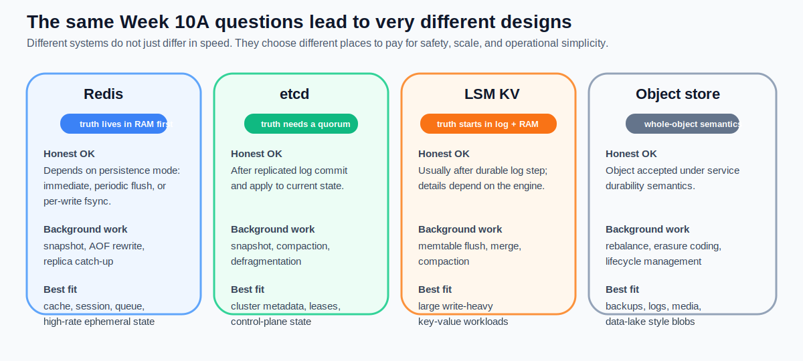
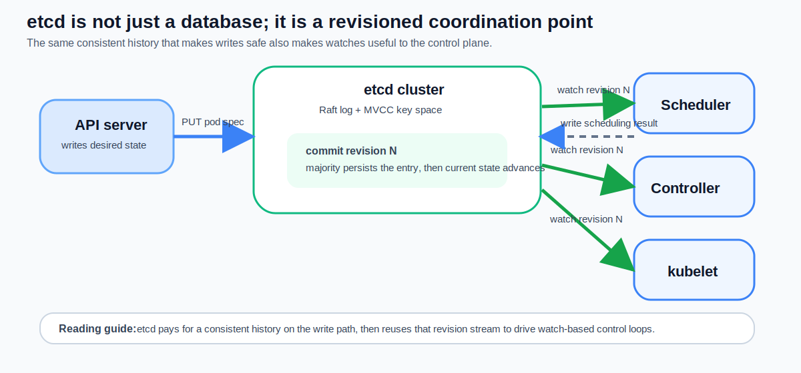
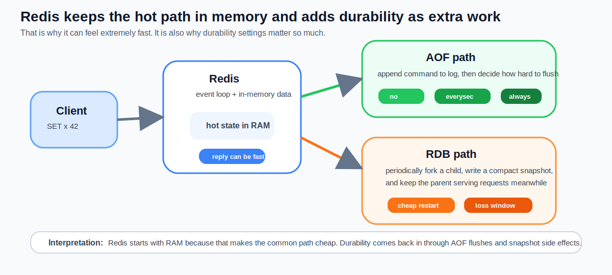
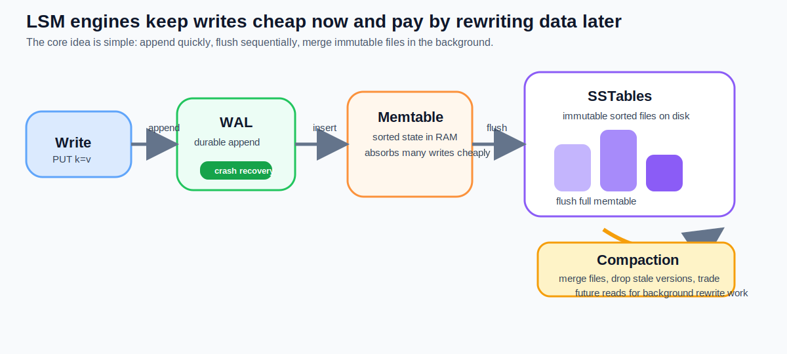

# Chapter 11: Distributed Storage — From KV Store to Object Store

> **Learning objectives**
>
> After completing this chapter and its lab, you will be able to:
>
> - Place storage systems on a spectrum from in-memory caches to
>   durable object stores, and explain the tradeoffs at each point
> - State the CAP theorem and reason about when each of the three
>   properties is actually being sacrificed in production
> - Describe etcd's on-disk format: the WAL, bbolt, and how Raft
>   (Chapter 8) lands on ext4 (Chapter 10)
> - Compare Redis's RDB snapshots and AOF logging as durability
>   mechanisms
> - Explain object-storage design: immutable objects, flat
>   keyspaces, and erasure coding for space-efficient durability

A team is shipping a feature that needs to remember a user's
shopping cart across sessions. Three engineers walk in with three
answers: "put it in Redis with AOF every-second", "give it its
own 3-node etcd", "write each cart as an object to S3". All
three work. They differ by a factor of 10 000× in latency,
10 000× in cost per GB, and produce three completely different
failure modes when the network breaks. The decision is real,
the tradeoffs are real, and the fact that all three engineers
are correct *somewhere* is the topic of this chapter.

Chapter 10 made a single machine's storage stack concrete —
`write()` into the page cache, `fsync()` to disk, ext4 journal
underneath. Chapter 11 stretches that stack across machines. The
unifying question is the one those three engineers were
implicitly answering: **given an application that needs to
persist data, where on the storage spectrum does it belong?**
Different answers sit at different points on the same axes
(latency, durability, consistency, cost per GB), and the systems
in this chapter — etcd, Redis, S3/MinIO, and the LSM-based stores
that sit between them — are carefully placed landmarks.

## 11.1 Where on the spectrum does each system sit?

Storage systems span many orders of magnitude across every
relevant dimension:

| Layer | Typical latency | Durability | Scalability | Cost / GB |
|---|---|---|---|---|
| Local RAM (`malloc`) | ~10 ns | None (volatile) | One process | "free" |
| Redis cache | ~1 µs (RAM) | Configurable | Horizontal (cluster) | RAM-priced |
| Local ext4 + SSD | 10 µs–10 ms | Single disk | One node | SSD-priced |
| etcd (3-node) | 2–10 ms | Replicated (Raft) | Limited (CP) | SSD-priced |
| Networked DB (Postgres) | 1–10 ms | Replicated (2PC/log ship) | Limited | SSD-priced |
| Object store (S3) | 50–200 ms | 11 nines (erasure coded) | Effectively unlimited | Cheap |

No system wins on every dimension. **The tradeoffs are the
lesson.**


*Figure 11.1: The storage design landscape. Each system occupies a different region of the latency–durability–consistency–cost space. No single design wins everywhere.* A cache is fast and lossy; an object store is slow and
nearly indestructible; everything in between is a negotiation.

A recurring pattern: every layer above local ext4 is built *on
top of* local ext4. etcd persists its WAL through ext4; MinIO
writes each object fragment through ext4; Postgres writes its
log through ext4. Every chapter of this book has been preparing
for this one — if you want to know why etcd's write latency is 2–
10 ms, you need all of Chapters 8 (Raft), 10 (fsync + journal),
and the numbers from Chapter 2 (SSD vs DRAM).

## 11.2 What does CAP actually mean during a partition?

In a distributed system, you cannot simultaneously guarantee all
three of:

- **C**onsistency — every read sees the latest write.
- **A**vailability — every request gets a response (not a timeout
  or error).
- **P**artition tolerance — the system still works while part of
  the network is unreachable.

Because network partitions *do happen* in any real deployment,
partition tolerance is effectively mandatory. The real design
choice is **C vs A during a partition**:

| System | Choice | What happens during a partition |
|---|---|---|
| etcd | **CP** | Minority side refuses writes; returns errors until quorum recovers |
| Redis replicas | AP (by default) | Replicas keep serving, possibly with stale data |
| S3 (post-2020) | AP + strong per-key consistency | Always available; every key linearizable |
| DynamoDB | AP (eventually consistent) | Always available; reads may be stale |

CAP is not a menu — it is a pair of observations about what
*cannot* coexist under partition. Consistency also comes in
levels: **linearizable** (every op appears to take effect
atomically at some moment between call and return),
**sequential** (ops appear in some total order, not tied to wall
clock), and **eventual** (replicas agree *eventually* if no new
writes arrive). Chapter 8's etcd is linearizable by default;
Redis's replicas are typically sequential; S3 and DynamoDB are
eventual, with some strong-consistency knobs.

> **Key insight:** When someone says "this system is CP" or
> "this system is AP," the only useful question is **what
> specifically breaks during a partition?** The answer is always
> "writes on the minority side" or "reads may be stale" — but
> which one depends entirely on the design.

### A worked partition: same event, four storage backends

The abstract framing above is easier to keep straight if you trace
one partition through several systems. Setup: a 5-node cluster
spread across two datacenter zones; a switch failure cuts the
link such that **3 nodes are in zone A**, **2 nodes in zone B**;
a client in zone B issues two operations during the partition:
`PUT k=1` followed by `GET k`.

| Backend | What zone B sees on `PUT k=1` | What zone B sees on `GET k` | What zone A sees | What recovery looks like |
|---|---|---|---|---|
| **etcd (CP, Raft)** | **Error / timeout.** Zone B has 2 nodes; quorum is 3. The leader is in zone A or has stepped down. No write possible. | If a stale follower is in zone B and serializable reads are allowed, returns the *pre-partition* value; default linearizable read fails. | Continues serving reads and writes normally (it has quorum). | When the partition heals, zone B's nodes catch up via Raft AppendEntries; zone B sees nothing it did during the partition because nothing happened. |
| **Redis async replication (AP)** | Returns OK locally if zone B contains a replica configured as a primary (or after a Sentinel-driven failover). Otherwise the client retries against zone A's primary, depending on the proxy. | Returns 1 — zone B's local replica saw the write. | Zone A's primary still has the *old* value; Sentinel may promote a zone-B replica, creating a split-brain. | After heal, one side's writes must be **dropped** (typically the smaller side's). "Cluster nodes do not agree" is logged; data loss is silent unless you instrument it. |
| **DynamoDB / Cassandra (AP, quorum-tunable)** | Returns OK if write-quorum is `LOCAL_ONE` or `LOCAL_QUORUM`; fails if `QUORUM` or `EACH_QUORUM` and zone B does not have enough replicas. | Returns 1 with `LOCAL_ONE`; returns the older value (or nothing) with `QUORUM` if it cannot reach a majority. | Continues with its own view; both sides accept writes if `LOCAL_*` consistency. | Anti-entropy / read-repair / hinted-handoff merge the two histories on heal; **last-write-wins by timestamp** is the default conflict resolution — which means the side with the slightly later wall clock wins, regardless of intent. |
| **S3 (AP, strong per-key)** | If the client routes to a region where its account is hosted, returns OK; if cross-region replication is on, the write is local and propagates async. | Returns 1, because S3's 2020-onward strong-per-key consistency guarantees a read of the *most recent* write the client itself made. | Sees the write only after asynchronous replication completes; cross-region reads can lag. | No reconciliation needed inside a region. Cross-region replication just resumes; objects are independent (no shared keys). |

Three consequences worth saying out loud:

- **etcd lost availability on the minority side, kept consistency.**
  That is what "CP" means in this row of the table; it is also why
  etcd is the right place for cluster metadata and the wrong place
  for high-throughput user data.
- **Redis kept availability, lost a write durably.** A failover
  during partition is a *real* split-brain. The "AP" choice has a
  bill, paid in lost user data, that the system does not always
  surface.
- **"Strong per-key consistency" (S3) is not the same as
  linearizability across keys.** A multi-key transaction that
  spans a partition can still observe inconsistent ordering; the
  guarantee is per-object, not global. Most people get this wrong
  on a whiteboard.

The lab's etcd benchmarks (Lab 11 Part C) and Redis benchmarks
(Lab 11 Part A) measure the *cost* of these choices in normal
operation: etcd pays the latency of Raft commit on every write,
Redis pays nothing extra in the steady state but pays the
table-row above when the network breaks. The CAP theorem is the
framework; the partition trace is the price tag.

## 11.3 How does etcd land Raft on ext4?

You already know etcd's replication layer from Chapter 8. Its
on-disk format is the other half.

```text
Client Put
   │
   ▼
Raft module (Chapter 8)
   │  proposal committed when majority acks
   ▼
Write-Ahead Log (WAL)                 ← sequential append + fdatasync
   │
   ▼
bbolt B+ tree                          ← apply committed entry
   │
   ▼
ACK to client
```


*Figure 11.2: The etcd write and watch path. Writes flow through Raft consensus to the WAL and then to bbolt. Watch streams revisions to controllers — this is the mechanism behind Kubernetes's reconciliation loops.*

Two persistence layers:

- **WAL.** Sequential append-only log of Raft entries. `fdatasync`
  on every commit. This is the durability bottleneck.
- **bbolt.** A B+ tree stored in a single file, optimized for KV
  lookups. Holds the applied state; survives restarts by
  replaying the WAL after the last snapshot.

The parallels to Chapter 10 are deliberate. etcd's WAL is to its
bbolt store what ext4's journal is to its on-disk data: a
write-ahead log that makes recovery a matter of replay, not
scanning. `fdatasync` on the WAL is the same syscall you
measured in Chapter 10's lab — and dominates etcd's end-to-end
latency for exactly the same reasons.

### Compaction

etcd uses MVCC: every Put creates a new revision. Without
cleanup, the database grows forever. Two compaction mechanisms:

- **MVCC compaction.** `etcdctl compact <rev>` deletes revisions
  older than `<rev>`. After this, a `get --rev=old` returns an
  error; Watches from old revisions fail.
- **Defrag.** `etcdctl defragment` reclaims disk space left in
  bbolt by compaction. This is an offline-ish operation — it
  briefly blocks reads on the node being defragged.

### Why etcd fsync latency dominates K8s control-plane latency

Every `kubectl apply` travels: kubectl → API server → etcd
leader → WAL fsync → AppendEntries → follower WAL fsyncs →
commit → bbolt apply → reply. The fsyncs dominate; network is in
the noise on same-region clusters. That is why Kubernetes
production guidance calls for dedicated fast SSDs for etcd and
warns against running etcd on congested disks.

## 11.4 How does Redis trade durability for throughput?

Redis occupies a different point on the spectrum: primary
storage is RAM, and durability is *optional*. Two complementary
mechanisms.


*Figure 11.3: Redis architecture. Primary data lives in RAM for sub-millisecond access. RDB and AOF provide two orthogonal durability paths — one snapshot-based, one log-based.*

### RDB: periodic snapshots via fork + COW

```text
fork()                    ← child inherits parent's pages via COW
   │
 ┌─┴──────────┐
 │            │
parent       child
serves       writes RDB file
requests     (sequential dump)
```

Redis's parent process keeps serving while the child writes a
point-in-time snapshot to disk. The mechanism uses classical OS
primitives straight out of Chapter 4:

- `fork()` duplicates the page tables; no data is actually
  copied.
- Child reads through its page tables to dump the dataset.
- If the parent writes during the snapshot, the kernel
  **copies-on-write** the modified page, so the child still sees
  the original.

Consequences: during a snapshot, memory usage can spike to
~2× the dataset size in the worst case (every page written at
least once). Redis's official guidance — "set `maxmemory` ≤ 50 %
of RAM" — is specifically to leave room for the COW expansion.

### AOF: append-only log with tunable fsync

AOF records every mutating command to a log file:

```text
*3\r\n$3\r\nSET\r\n$5\r\nmykey\r\n$7\r\nmyvalue\r\n
```

Recovery replays the log. The interesting choice is *when* to
`fsync`:

| `appendfsync` | When fsync runs | Durability | Throughput |
|---|---|---|---|
| `always` | After every command | Lose nothing | ~1k ops/s |
| `everysec` | Once per second | Lose ≤ 1 s of data | ~100k ops/s |
| `no` | OS decides (writeback) | Lose up to 30 s | Highest |

This is the *exact* tradeoff from Chapter 10, exposed as a
configuration option. With `appendfsync always`, Redis is ~100×
slower than with `everysec` on the same hardware — one fsync per
write vs one batched fsync per second. The lab has you measure
this directly.

### RDB vs AOF

- RDB is faster to reload on startup (one big sequential read).
- AOF is more precise on recovery (you lose at most one second).
- Most production Redis runs **both**: AOF for precision, RDB
  for fast startup and external backup.

## 11.5 What is different about object storage?

A third, different design point: **object storage**.

| | Filesystem | Object store |
|---|---|---|
| Namespace | Hierarchical paths (`/a/b/c`) | Flat (bucket + key) |
| Operations | `open`, `read`, `write`, `seek`, `close` | `PUT`, `GET`, `DELETE` (HTTP) |
| Mutability | In-place update | **Immutable** — replace the whole object |
| Metadata | Fixed inode fields | Arbitrary key/value tags |
| Consistency | Strong (local) | Originally eventual; S3 is now strong per-key |

The canonical example is Amazon S3. For local development and
labs, MinIO implements the same API on your machine:

```bash
docker run -p 9000:9000 -p 9001:9001 \
  -e MINIO_ROOT_USER=admin -e MINIO_ROOT_PASSWORD=password \
  minio/minio server /data --console-address ":9001"

mc alias set local http://localhost:9000 admin password
mc mb local/test-bucket
mc cp myfile.dat local/test-bucket/
```

### Why flat namespaces?

Hierarchical filesystems pay for directory updates: create a
file, add an entry to the parent directory, update the inode,
commit the journal. A flat namespace avoids all of that. An
object PUT is (conceptually) "write these bytes, remember the
key". There is no parent directory to update; listing a
"prefix" is just a filtered scan of the key index.

That flatness is what makes S3 scale to billions of objects per
bucket. The cost: no rename, no partial-update semantics, no
POSIX locks.

### Why immutability?

Immutability simplifies replication. A replica either has the
full object or it does not; there is no "partial write" state to
reconcile. It also makes caching trivial: once you have the
object, it never changes.

Updates are expressed as replacement: upload a new object with
the same key; the old object is logically gone (and physically
reclaimed by garbage collection). **Versioning** is implemented
by keeping all old versions around and indexing them separately.

### Multipart upload and large objects

A single 5 TB object cannot be uploaded as one HTTP request.
S3/MinIO support *multipart upload*: start a session, upload N
parts in parallel, submit a manifest that assembles them.
Clients use this for every large file; the API hides it.

### Economic model

S3 Standard is ~$0.023/GB/month as of 2026. That price is only
possible because:

- No POSIX overhead (no locks, no inode tables to maintain).
- Large sequential I/O — no small random writes.
- Tiered storage (hot / warm / cold / glacier) with the system
  migrating objects based on access patterns.
- Erasure coding (§11.7) for space-efficient durability.

## 11.6 LSM trees: write everything sequentially, sort it later

Between the in-memory world of Redis and the replicated
metadata store of etcd sits another major design family:
**Log-Structured Merge trees (LSM)** (O'Neil, Cheng, Gawlick, &
O'Neil, 1996). Systems like RocksDB, LevelDB, Cassandra
(Lakshman & Malik, 2010), and TiKV use this pattern. Bigtable
(Chang et al., 2006) and HBase brought it into the
distributed-systems mainstream; CockroachDB and TiKV layer
Raft on top of RocksDB to combine LSM throughput with strong
consistency.

The idea: writes go first to an in-memory buffer (the
**memtable**). When the memtable fills, it is flushed to disk
as a sorted, immutable file (an **SSTable**, the format Bigtable
introduced). Background **compaction** merges overlapping
SSTables to reclaim space and keep read amplification bounded.


*Figure 11.4: The LSM lifecycle. Writes are always sequential (append to memtable, flush to SSTable). Reads may check multiple levels. Compaction is the background tax that keeps the system healthy — and is the primary source of write amplification and tail-latency spikes in LSM-based stores.*

LSM trees trade read amplification (checking multiple levels)
for write throughput (all writes are sequential). Compaction
is the ongoing cost: it rewrites data that has not changed,
consuming I/O bandwidth and CPU. Heavy compaction under load
is the LSM equivalent of ext4 journal contention — it inflates
p99 for the same reason. The Lab 11 etcd-compaction experiment
in Part C is the chapter's compact (so to speak) way to
reproduce this on real production code.

The lineage that brought LSM to mainstream production is
worth knowing. Rosenblum & Ousterhout's LFS (Chapter 10
Further Reading) was the operating-systems precursor:
append-only, sort-as-you-go, compact in the background. The
O'Neil paper showed that the same idea could give a
database a constant number of writes per insert regardless of
working-set size. Bigtable shipped it at planet scale; LevelDB
(Google's open-source clone) and RocksDB (Facebook's high-write
fork) made it the default choice for a generation of databases.

## 11.7 How does erasure coding beat replication?

Replication is the obvious durability strategy: store three
copies on three nodes, tolerate any one failure. Cost: 3× the
raw storage.

**Erasure coding** gets the same fault tolerance for less space.
A Reed-Solomon (k, m) code splits an object into k data shards
and m parity shards; any k of the (k+m) shards can reconstruct
the object.

```text
Original:   [A] [B] [C] [D]                     (4 data shards)
Encoded:    [A] [B] [C] [D] [P1] [P2]           (+2 parity)

Any 4 of 6 shards suffice → tolerates 2 simultaneous failures.
Storage overhead: 6/4 = 1.5× instead of 3×.
```

Configurations like (10, 4) tolerate 4 failures at 1.4× overhead;
(17, 3) is common for cold storage at 1.18× overhead. The
tradeoff is read and repair traffic: reconstructing a lost shard
requires reading k other shards, whereas replication requires
reading only one. Production object stores place shards across
failure domains (rack, zone, region) and tune (k, m) based on
how quickly they need to repair.

### Placement

A write of one object becomes k+m writes to k+m different
storage nodes; a read can be served from the first k shards to
return. Smart placement policies put shards on distinct racks or
distinct zones so that correlated failures (a rack power loss)
do not wipe out more than m shards.

This is the reason S3's durability quote is "11 nines" — erasure
coding plus multi-zone placement means the expected annual loss
is vanishingly small even at exabyte scale.

## 11.8 Putting the stack back together

A single Kubernetes write trace, from keyboard to SSD:

```text
kubectl apply -f pod.yaml
  │
  ▼
API server  (validation, authz)
  │
  ▼
etcd leader  (Raft proposal)
  │
  ├──▶ WAL file on ext4      — append + fdatasync
  │     │
  │     └──▶ ext4 journal    — data=ordered metadata commit
  │           │
  │           └──▶ SSD FTL   — write amplification, GC
  │
  └──▶ AppendEntries to followers
       │
       ├──▶ Follower WAL on ext4 — append + fdatasync
       ▼
  Majority ack → commit → apply to bbolt
  │
  ▼
API server returns → kubectl prints success
```

Every layer from Chapter 4 (processes) up through Chapter 10
(fsync) is visible in that path. This is the view of the stack
that makes the book cohere: "a distributed write" is not a
primitive, it is a composition of classical mechanisms.

### Choosing a system for a workload

A compressed decision table, by problem:

| Need | Choose |
|---|---|
| "Sub-millisecond latency, data small, loss tolerable" | Redis |
| "Strong consistency across a few KB" | etcd |
| "A durable WAL for my own database" | Local FS + `fsync` |
| "Relational queries with ACID" | Postgres (replicated) |
| "Terabytes of immutable blobs" | S3 / MinIO |
| "Kubernetes cluster state" | etcd (no other option) |

## Summary

Key takeaways from this chapter:

- The storage spectrum spans six orders of magnitude in latency
  and many orders of magnitude in cost per GB. No one system
  wins everywhere — choose by constraint.
- CAP during a partition is C vs A, not C vs A vs P. Know what
  your system does when the network splits.
- etcd combines a Raft WAL (chapter 8) with a bbolt B+ tree
  (chapter 10) into the canonical strongly-consistent KV store.
  Its latency is dominated by `fsync` on the WAL.
- Redis places primary storage in RAM and offers two durability
  mechanisms — RDB (fork+COW snapshot) and AOF (command log with
  tunable fsync). The AOF knob exposes Chapter 10's fsync
  tradeoff directly.
- Object storage wins on scale and cost via flat namespaces,
  immutability, and erasure coding. It loses on latency and on
  the absence of in-place updates.
- Every distributed write composes Chapter 4–10 mechanisms.
  "Modern storage" is not new; it is the classical mechanisms at
  scale.

## Further Reading

### Foundational distributed-storage papers

- Ghemawat, S., Gobioff, H., & Leung, S.-T. (2003). "The Google
  File System." *SOSP.* (The paper S3 and MinIO descend from.)
- Chang, F., et al. (2006). "Bigtable: A Distributed Storage
  System for Structured Data." *OSDI.* (The SSTable format and
  the LSM-on-GFS pattern.)
- DeCandia, G., et al. (2007). "Dynamo: Amazon's Highly Available
  Key-Value Store." *SOSP.* (Eventual consistency, consistent
  hashing, vector clocks.)
- Lakshman, A., & Malik, P. (2010). "Cassandra: A Decentralized
  Structured Storage System." *ACM SIGOPS OSR.*
- Calder, B., et al. (2011). "Windows Azure Storage: A Highly
  Available Cloud Storage Service with Strong Consistency."
  *SOSP.*
- Brewer, E. (2012). "CAP Twelve Years Later: How the 'Rules'
  Have Changed." *IEEE Computer,* 45(2).

### LSM trees and write-optimized storage

- O'Neil, P., Cheng, E., Gawlick, D., & O'Neil, E. (1996). "The
  Log-Structured Merge-Tree (LSM-Tree)." *Acta Informatica,*
  33(4). (The original LSM paper.)
- Sears, R., & Ramakrishnan, R. (2012). "bLSM: A General Purpose
  Log Structured Merge Tree." *SIGMOD.*
- Dong, S., et al. (2017). "Optimizing Space Amplification in
  RocksDB." *CIDR.* (Facebook's published RocksDB tuning notes.)
- Luo, C., & Carey, M. J. (2020). "LSM-based storage techniques:
  a survey." *VLDB Journal.*

### Consensus and replication

- Ongaro, D., & Ousterhout, J. (2014). "In Search of an
  Understandable Consensus Algorithm." *USENIX ATC.* (Raft;
  cross-reference Chapter 8.)
- Lamport, L. (1998). "The Part-Time Parliament." *ACM TOCS,*
  16(2).

### Erasure coding

- Reed, I. S., & Solomon, G. (1960). "Polynomial codes over
  certain finite fields." *Journal of SIAM,* 8(2). (The
  original Reed-Solomon paper.)
- Rashmi, K. V., et al. (2014). "A 'Hitchhiker's' Guide to Fast
  and Efficient Data Reconstruction in Erasure-Coded Data
  Centers." *SIGCOMM.*
- Plank, J. S. (2013). "Erasure Codes for Storage Systems: A
  Brief Primer." *USENIX ;login:.*

### System documentation

- Redis documentation: *Persistence.*
  <https://redis.io/docs/management/persistence/>
- etcd documentation: <https://etcd.io/docs/>
- MinIO documentation: <https://min.io/docs/>
- AWS S3 documentation: *Strong consistency for read-after-write.*
  <https://aws.amazon.com/s3/consistency/>
